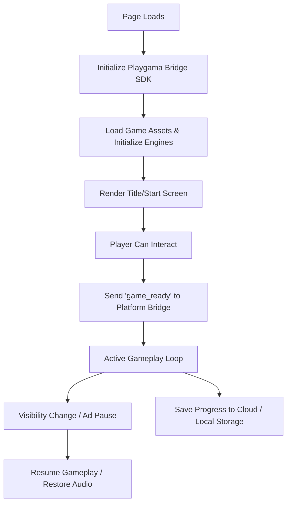

# Playgama Platform Overview & Architecture

## 1. Platform Ecosystem
Playgama is a cross-platform HTML5 game publishing and distribution platform.
Games submitted to Playgama are hosted on Playgama's CDN and embedded across web portals, mobile browsers, super-apps, and partner distribution networks.

## 2. Distinction of Deployment Tiers
The AI Game Factory strictly distinguishes between three distinct quality states:
- **LOCAL_READY**: Game runs cleanly in local developer tooling and studio iframes.
- **HTML5_READY**: Game is verified as a standalone, zero-dependency HTML5 distribution.
- **PLAYGAMA_READY**: Game satisfies all official Playgama technical, UX, SDK, metadata, packaging, and content compliance requirements and is verified via `validate-playgama.js`.

A game must NEVER jump directly from `DEVELOPMENT` to `PLAYGAMA_READY` without passing all preceding quality gates.

## 3. Platform Execution Lifecycle

## 4. Supported Formats & Devices
- **Engines Supported**: HTML5 / Plain JavaScript, WebGL, 2D Canvas.
- **Supported Viewports**:
  - Desktop Landscape ($16:9$, $16:10$, $4:3$)
  - Mobile Portrait ($9:16$, $480 \times 800$, $360 \times 640$)
  - Mobile Landscape ($16:9$, $800 \times 480$)
- **Orientation Declaration**: Every game must declare its primary orientation (`landscape` or `portrait`) in `metadata.json` and `publication-manifest.json`. Games must scale responsively to window dimensions without distortion or page scrollbars.
