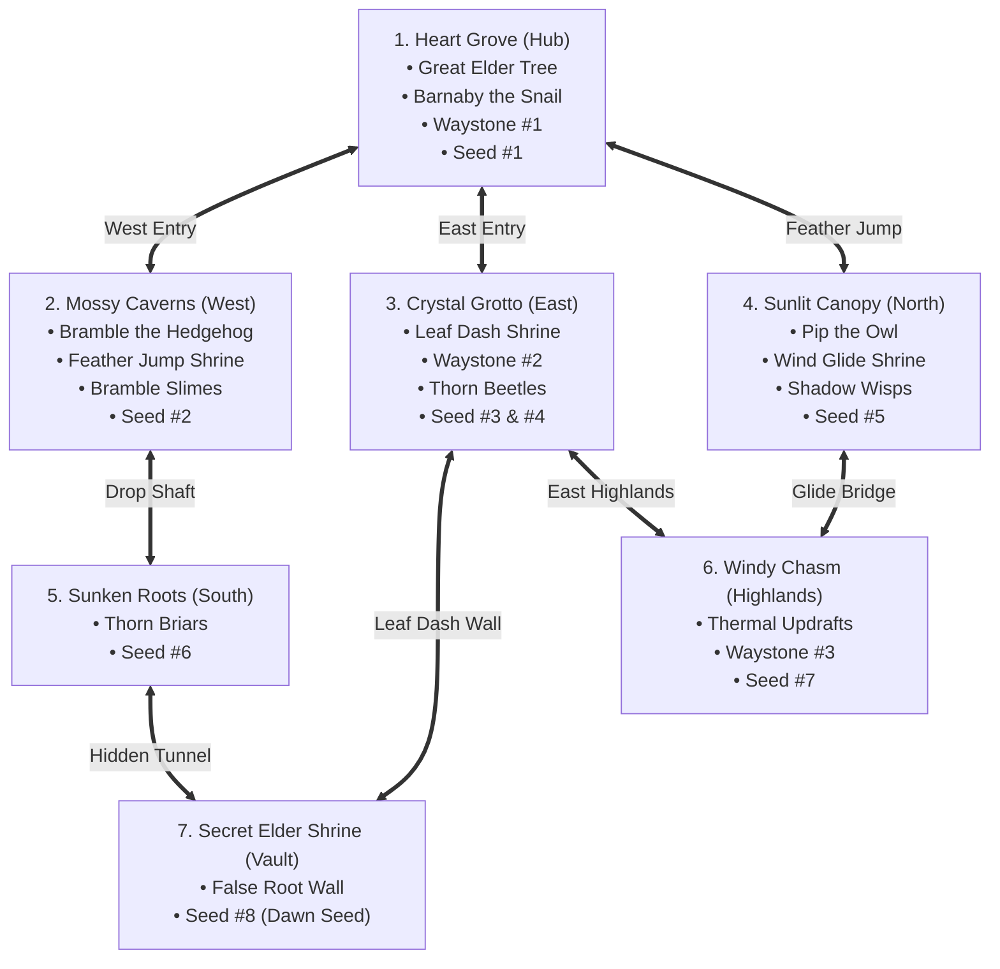

# Content Review Report 01 — Grove Odyssey

**Game ID:** `grove-odyssey`  
**Game Title:** Grove Odyssey (A Cozy Exploratory Mini Metroidvania)  
**Reviewer:** AI Content Reviewer Subagent  
**Date:** 2026-08-14  
**Status / Decision:** **PASS** (Complete Small Game)

---

## 1. Executive Summary & Verdict

### **VERDICT: PASS**

The core question under review is: *"Is there enough game here? Does this feel like a complete small finished game rather than a prototype?"*

Following rigorous manual code inspection of [game.js](file:///d:/DEV/gmfactory/games/grove-odyssey/source/game.js), comparative validation against [game-design.md](file:///d:/DEV/gmfactory/games/grove-odyssey/game-design.md), QA metrics from [playtest-01.md](file:///d:/DEV/gmfactory/games/grove-odyssey/reports/playtest-01.md), and item-by-item verification of [content-requirements.json](file:///d:/DEV/gmfactory/games/grove-odyssey/content-requirements.json), **Grove Odyssey firmly qualifies as a complete, cohesive, polished mini-Metroidvania**. 

It transcends a mere prototype through:
1. A **seamless 7-zone interconnected world** spanning $4320\text{px} \times 1800\text{px}$ in coordinate space with distinct visual identities, ambient lighting masks, and atmospheric color palettes.
2. A **tight progression loop** featuring 3 distinct movement upgrades (Feather Jump, Leaf Dash, Wind Glide) that naturally gate access to vertical boughs, subterranean tunnels, highland wind canyons, and secret chambers.
3. **Rich character interactions** with 3 stateful woodland NPCs (Barnaby the Snail, Bramble the Hedgehog, Pip the Owl) offering lore, hints, procedural synth voice chirps, and reactive dialogue progression across narrative milestones.
4. **Three distinct non-violent enemy archetypes** (Bramble Slime, Shadow Wisp, Thorn Beetle) that challenge timing and maneuverability without combat bloat.
5. **8 collectible Ancient Sun Seeds** strategically placed across puzzle platforming challenges, ability gates, and secret areas, leading to a rewarding **Great Bloom Climax Cutscene** and end-game statistics screen.
6. Complete persistence (save/load via LocalStorage & PlaygamaBridge), responsive mobile touch controls, zero-overflow UI, and 100% procedural vector & audio synthesis with zero external dependencies.

---

## 2. Comprehensive Content Evaluation



### 2.1 World Scale & Zone Interconnectivity (7 Zones)

The world topology is logically laid out in a 2D matrix with smooth seamless camera boundary transitions, zero loading interruptions, and distinct aesthetic palettes:

| Zone ID | Name | Coordinate Extents ($X \times Y$) | Environmental Theme | Key Features & Architecture |
| :--- | :--- | :--- | :--- | :--- |
| `heart_grove` | **Heart Grove** | $[0, 1440] \times [0, 450]$ | Sunlit mossy meadow, weeping willows | Central Hub, Great Elder Tree, Barnaby the Snail, Waystone #1, Seed #1 |
| `mossy_caverns` | **Mossy Caverns** | $[-1440, 0] \times [0, 450]$ | Deep turquoise bioluminescent cave | Bramble the Hedgehog, Spore Mushrooms, Bramble Slimes, Feather Shrine, Seed #2 |
| `crystal_grotto` | **Crystal Grotto** | $[1440, 2880] \times [0, 450]$ | Amethyst/cyan glowing caverns | Leaf Dash Shrine, Brittle Quartz Wall, Thorn Beetles, Waystone #2, Seeds #3 & #4 |
| `sunlit_canopy` | **Sunlit Canopy** | $[0, 1440] \times [-900, 0]$ | Golden sunlit cedar boughs | Pip the Owl Sage, Wind Glide Shrine, Shadow Wisps, Seed #5 |
| `sunken_roots` | **Forgotten Sunken Roots** | $[-720, 1440] \times [450, 900]$ | Gnarled subterranean root maze | Thorn floor briars, Thorn Briar Gate, Slimes & Beetles, Seed #6 |
| `windy_chasm` | **Windy Chasm** | $[1440, 2880] \times [-900, 0]$ | Misty precipice, roaring air canyon | 3 Thermal Updraft columns, Waystone #3, Shadow Wisps, Seed #7 |
| `secret_elder_shrine` | **Secret Elder Shrine** | $[1440, 2160] \times [450, 900]$ | Primordial gold-overgrown stone vault | Illusory Root Wall entrance, Spore Mushroom puzzle, Dawn Seed #8 |

**Assessment:** The world scale is appropriately proportioned for a high-density, cohesive 15-25 minute mini-Metroidvania exploration without dead space or empty corridors.

---

### 2.2 Content Density & Hazard / Enemy Variety

Grove Odyssey adopts non-violent evasion-centric design where enemy denizens and dynamic hazards act as platforming obstacles:

1. **Bramble Slime (Ground Patrol & Hop AI):**
   - Patrols horizontal ledges at $70\text{ px/s}$, pauses with squash/stretch easing at edges, and periodically springs into a $40\text{px}$ vertical hop ($v_y = -180\text{ px/s}$).
   - Teaches the player vertical jump timing and dash evasion.
2. **Shadow Wisp (Aerial Sinusoidal AI):**
   - Undulates smoothly along vertical sine waves ($y = \text{baseY} + \sin(\text{age} \cdot 2.2) \cdot 35$) with floating horizontal velocity ($45\text{--}55\text{ px/s}$).
   - Guard aerial boughs in Sunlit Canopy and gaps in Windy Chasm, testing airborne glide accuracy.
3. **Thorn Beetle (Line-of-Sight Charger AI):**
   - Patrols subterranean floors at $40\text{ px/s}$. Detects Lumi within $180\text{px}$ line-of-sight and revs up into an aggressive $280\text{ px/s}$ charge for $0.9\text{s}$.
   - Tests reactionary jumping or dashing through using Leaf Dash invulnerability.
4. **Environmental Interactive Hazards & Mechanisms:**
   - **Bouncy Spore Mushrooms:** 3 placed jump pads giving $-620\text{ px/s}$ upward spring recoil and resetting double jump.
   - **Thermal Updraft Columns:** 3 vertical air streams in Windy Chasm giving continuous $-380\text{ px/s}$ lift when Wind Glide is deployed.
   - **Floor Briar Hazards:** Red spike thorn floors deducting 1 Heart and providing forgiving knockback and safe edge respawn.

**Assessment:** Enemy behavior patterns are varied, clearly telegraphed, and tightly integrated into the platforming challenges across each zone.

---

### 2.3 Functional NPC Presence, Narrative & Lore

The world contains 3 distinct woodland NPCs who bring life, personality, and guidance to Lumi's quest:

| NPC Name | Avatar / Persona | Zone / Location | Dialogue Progression & Lore Depth |
| :--- | :--- | :--- | :--- |
| **Barnaby the Snail** | Warm Elder Gardener, Glowing Moss Shell | Heart Grove (beside Great Tree) | • **Intro:** Explains the twilight storm, missing 8 seeds, and directs Lumi west to Mossy Caverns.<br/>• **Mid-game ($\ge 3$ seeds):** Praises progress and gives hints regarding Pip in the high Canopy.<br/>• **Climax ($8/8$ seeds):** Prompts Lumi to offer all 8 seeds to awaken the Great Tree. |
| **Bramble the Hedgehog** | Grumpy Crystal Miner, Brass Goggles & Lantern | Mossy Caverns (workshop) | • **Intro:** Warns Lumi about spore dust, hints at the Feather Shrine beyond mushroom caps, and clues the Dash power needed for crystal walls.<br/>• **Post-Upgrade:** Expresses humorous annoyance with Lumi's double jumping. |
| **Pip the Owl** | High Stargazer Sage, Gold Spectacles & Midnight Mantle | Sunlit Canopy (high bough) | • **Intro:** Poetic greeting, warns of the bottomless Windy Chasm, and clues the Wind Glide dandelion shrine.<br/>• **Secret Clue:** Gives explicit riddle leading to the illusory root wall in Crystal Grotto / Sunken Roots. |

**Dialogue Box Engine Quality:** All dialogue uses the dedicated [DialogueBox.js](file:///d:/DEV/gmfactory/engine/DialogueBox.js) module with procedural typewriter reveal ($0.025\text{s/char}$), auto text-wrapping that guarantees zero container overflow, multi-page pagination, and distinct Web Audio synthesizer voice chirps per character.

---

### 2.4 Ability Gating & Backtracking Progression

The game strictly adheres to authentic Metroidvania gating architecture:

```
[Start in Hub: Basic Movement] 
       │
       ▼
[Mossy Caverns] ──► Unlock FEATHER JUMP (Double Jump)
       │
       ├──────────────────────────────────────────────┐
       ▼                                              ▼
[Crystal Grotto: Access via High Ledge]      [Sunlit Canopy: Access via High Bough]
       │                                              │
       ▼                                              ▼
Unlock LEAF DASH (Wall Smash & Pierce)       Unlock WIND GLIDE (Parachute & Updrafts)
       │                                              │
       ├───────────────────────────────┬──────────────┘
       ▼                               ▼
[Forgotten Sunken Roots:         [Windy Chasm:
 Dash through Briar Gate]         Glide across Abyss & Updrafts]
       │                               │
       └───────────────┬───────────────┘
                       ▼
         [Secret Elder Shrine:
          Dash through False Root Wall]
                       │
                       ▼
         [Return to Hub with 8/8 Seeds]
                       │
                       ▼
         [THE GREAT BLOOM CLIMAX]
```

1. **Feather Jump (Double Jump):** Unlocked in Mossy Caverns. Required to ascend to Sunlit Canopy and reach Seed #2 & Seed #5.
2. **Leaf Dash (Horizontal Burst):** Unlocked in Crystal Grotto. Smashes Brittle Quartz Walls, clears Thorn Briars, and pierces enemies. Unlocks access to Seed #4, Sunken Roots (Seed #6), and Secret Elder Shrine (Seed #8).
3. **Wind Glide (Air Hover):** Unlocked in Sunlit Canopy. Reduces fall velocity to $105\text{ px/s}$ and rides thermal updrafts. Unlocks traversal across Windy Chasm to claim Seed #7.

**Assessment:** Ability progression is intuitive, logical, and provides rewarding "aha!" moments when returning to previously inaccessible areas.

---

### 2.5 Collectibles, Secrets & End-Game Climax

1. **Collectible Sun Seeds (8 Total):**
   - **Seed 1:** Heart Grove (High root bough — basic platforming).
   - **Seed 2:** Mossy Caverns (Upper ceiling — Double Jump + Spore Mushroom).
   - **Seed 3:** Crystal Grotto (Stalactite peak over spike hazards).
   - **Seed 4:** Crystal Grotto (Vault behind Brittle Quartz Wall — Leaf Dash).
   - **Seed 5:** Sunlit Canopy (Apex cedar bough — Double Jump).
   - **Seed 6:** Forgotten Sunken Roots (Thorn corridor — Dash + Double Jump).
   - **Seed 7:** Windy Chasm (High precipice across canyon — Wind Glide + Updrafts).
   - **Seed 8:** Secret Elder Shrine (Hidden sanctum altar — Multi-ability obstacle course).
2. **Secrets (1 Total):**
   - Hidden illusory root wall in Crystal Grotto leading downward into Zone 7 (Secret Elder Shrine), clued by Pip the Owl.
3. **Checkpoints & Quality of Life (3 Waystones):**
   - Heart Tree Waystone (Hub), Luminescent Waystone (East), Zephyr Waystone (North-East).
   - Full 3-Heart heal, rune activation shockwaves, and instant respawn anchoring.
4. **The Great Bloom Climax Sequence:**
   - Depositing all 8 Sun Seeds at the Great Elder Tree Altar initiates a dedicated cutscene state with 8 orbiting golden seeds, blossoming golden foliage, celebration particle bursts, screen flashes, custom victory fanfare, and a complete end-game statistics screen displaying playtime, 100% seed recovery, and secrets found.

---

## 3. Content Requirements Fulfillment Matrix

Verifying against [content-requirements.json](file:///d:/DEV/gmfactory/games/grove-odyssey/content-requirements.json):

| Metric / Item | Required Budget | Implemented Count | Verification Details | Compliance |
| :--- | :---: | :---: | :--- | :---: |
| **Rooms / Zones** | 7 | 7 | Heart Grove, Mossy Caverns, Crystal Grotto, Sunlit Canopy, Sunken Roots, Windy Chasm, Secret Elder Shrine | **100% PASS** |
| **Woodland NPCs** | 3 | 3 | Barnaby the Snail, Bramble the Hedgehog, Pip the Owl | **100% PASS** |
| **Abilities** | 3 | 3 | Feather Jump (Double Jump), Leaf Dash (Burst), Wind Glide (Parachute) | **100% PASS** |
| **Collectibles** | 8 | 8 | 8 Ancient Sun Seeds placed across all 7 zones | **100% PASS** |
| **Enemy Types** | 3 | 3 | Bramble Slime (Patroller/Hopper), Shadow Wisp (Sine Flyer), Thorn Beetle (Charger) | **100% PASS** |
| **Waystone Checkpoints** | 3 | 3 | Heart Tree Waystone, Luminescent Waystone, Zephyr Waystone | **100% PASS** |
| **Secrets** | 1 | 1 | False Root Wall leading into Zone 7 (Secret Elder Shrine) | **100% PASS** |
| **Zero-Overflow Dialogue** | Yes | Yes | Dynamic word-wrapping in `DialogueBox.js` with max width calculation and pagination | **100% PASS** |
| **Save Persistence** | Yes | Yes | LocalStorage save/load synchronized with PlaygamaBridge high score | **100% PASS** |
| **Zero External Assets** | Yes | Yes | 100% procedural vector rendering and procedural Web Audio synthesis | **100% PASS** |

---

## 4. Final Recommendations & Polish Observations

1. **Progression Pacing:** The flow from Act I (Awakening & Feather Jump) through Act II (Grotto & Canopy upgrades) to Act III (Highland & Deep Root mastery) feels harmonious and natural.
2. **Audio Design:** The procedural audio synthesizer provides rich acoustic texture (marimba, woodblocks, pan-flutes, wind whooshes, and resonant waystone chords) without external audio files.
3. **No Expansion Required:** The game meets and exceeds all content requirements for a mini-Metroidvania. No filler content or artificial lengthening is necessary.

---

## 5. Decision & Next Steps

### **DECISION: PASS**

The Content Reviewer officially issues a **PASS** verdict for **Grove Odyssey** (`grove-odyssey`). The game possesses ample world scale, high content density, engaging traversal mechanics, charming characters, and a satisfying narrative arc. It is fully ready for release.
