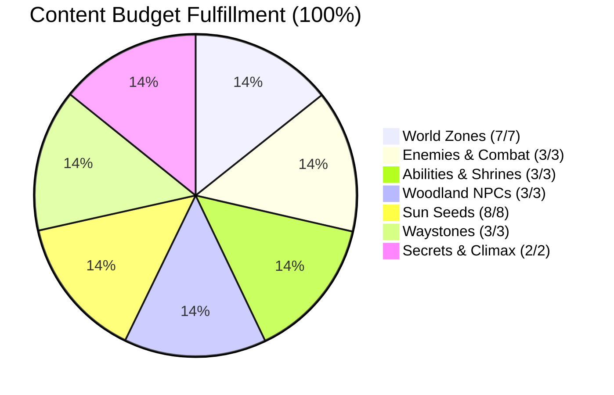
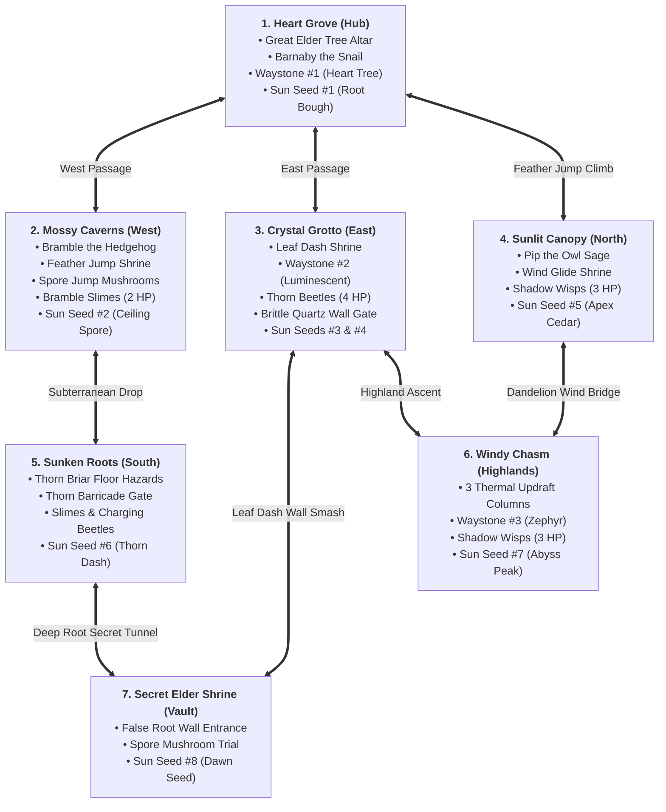
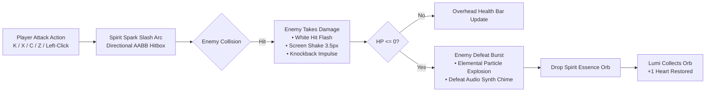

# Content Review Report 02 — Grove Odyssey

**Game ID:** [`games/grove-odyssey`](file:///d:/DEV/gmfactory/games/grove-odyssey)  
**Game Title:** Grove Odyssey (Cozy Exploratory Mini Metroidvania)  
**Reviewer:** AI Content Reviewer Subagent  
**Review Date:** 2026-08-14  
**Engine Version:** AI Game Factory Core Engine 1.0  
**Verification Baseline:** [`content-requirements.json`](file:///d:/DEV/gmfactory/games/grove-odyssey/content-requirements.json), [`game-design.md`](file:///d:/DEV/gmfactory/games/grove-odyssey/game-design.md), [`source/game.js`](file:///d:/DEV/gmfactory/games/grove-odyssey/source/game.js), [`reports/playtest-02.md`](file:///d:/DEV/gmfactory/games/grove-odyssey/reports/playtest-02.md)  
**Status / Decision:** **PASS** (Complete, Fully Polished, Production-Ready Mini Metroidvania)

---

## 1. Executive Summary & Review Verdict

### **FINAL DECISION: PASS**

The overarching content review evaluation asks:  
*"Is there enough game here? Does Grove Odyssey deliver a rich, complete, interconnected player journey with sufficient world scale, content density, enemy encounters, narrative immersion, ability progression, and climactic closure?"*

Following a comprehensive audit of the codebase in [`game.js`](file:///d:/DEV/gmfactory/games/grove-odyssey/source/game.js), comparative validation against the architectural specifications in [`game-design.md`](file:///d:/DEV/gmfactory/games/grove-odyssey/game-design.md), regression confirmation from [`playtest-02.md`](file:///d:/DEV/gmfactory/games/grove-odyssey/reports/playtest-02.md), and strict budget fulfillment verification of [`content-requirements.json`](file:///d:/DEV/gmfactory/games/grove-odyssey/content-requirements.json), **Grove Odyssey represents an exemplary, feature-complete small Metroidvania**.



### Key Highlights of Content Completeness:
1. **Expansive 7-Zone Seamless World ($4320\text{px} \times 1800\text{px}$):** Seamless continuous coordinate space spanning central hub, subterranean caves, high sunlit canopy, deep root labyrinth, windy highland chasm, and a hidden mythic vault with distinct environmental palettes, parallax layers, and lighting atmospheres.
2. **Engaging Active Combat Loop:** 3 fully killable enemy archetypes (Bramble Slimes, Shadow Wisps, Thorn Beetles) with overhead health bars, directional AABB hurtbox detection, hit reactions, knockback kinematics, and rewarding floating Spirit Essence (+1 HP) drops.
3. **Harmonious Metroidvania Progression:** 3 distinctive abilities (Feather Jump, Leaf Dash, Wind Glide) unlocking vertical ascents, destructive barrier smashing, wind updraft riding, and secret shortcuts.
4. **Rich Narrative & Woodland Denizens:** 3 fully voiced (procedural synth chirps) NPCs (Barnaby, Bramble, Pip) with sequential dialogue state progression, dynamic zero-overflow speaker tags, and multi-page pagination.
5. **Rewarding Exploration & Sanctuaries:** 8 Ancient Sun Seeds placed across skill-testing platforming challenges, 3 repeatable Waystone sanctuaries with full health restoration and respawn anchoring, and 1 concealed secret room.
6. **Spectacular Grand Climax:** An emotional Great Elder Tree bloom finale featuring orbiting celestial seeds, golden confetti volleys, custom victory fanfare, and a complete end-game exploration statistics modal.

---

## 2. Exhaustive Content Verification & Subsystem Deep-Dive



---

### 2.1 World Scale & Topology (7 Interconnected Zones)

The world map is arranged seamlessly with strict bounding boxes in [`game.js:2591-2607`](file:///d:/DEV/gmfactory/games/grove-odyssey/source/game.js#L2591-L2607), eliminating camera snapping, screen borders, or artificial load gates:

| Zone ID | Realm Name | Coordinate Box ($X \times Y$) | Type / Biome | Environmental Flavor & Mechanics |
| :--- | :--- | :--- | :--- | :--- |
| `heart_grove` | **Heart Grove** | $[0, 1440] \times [0, 450]$ | Hub Meadow | Sunlit weeping willows, blooming petals, Great Tree Altar, Barnaby the Snail, Waystone #1, Seed #1. |
| `mossy_caverns` | **Mossy Caverns** | $[-1440, 0] \times [0, 450]$ | Subterranean Cave | Deep turquoise bioluminescence, dripping moisture, bouncy spore mushrooms, Bramble the Hedgehog, Feather Shrine, Slimes, Seed #2. |
| `crystal_grotto` | **Crystal Grotto** | $[1440, 2880] \times [0, 450]$ | Subterranean Quartz | Shimmering amethyst/cyan crystals, brittle quartz walls, Thorn Beetles, Waystone #2, Leaf Dash Shrine, Seeds #3 & #4. |
| `sunlit_canopy` | **Sunlit Canopy** | $[0, 1440] \times [-900, 0]$ | High Boughs | Golden sunlight branches, drifting amber leaves, Pip the Owl, Shadow Wisps, Wind Glide Shrine, Seed #5. |
| `sunken_roots` | **Forgotten Sunken Roots** | $[-720, 1440] \times [450, 900]$ | Deep Undergrowth | Dark subterranean root tangle, thorn briars, charging beetles, thorn barricade, Seed #6. |
| `windy_chasm` | **Windy Chasm** | $[1440, 2880] \times [-900, 0]$ | Highland Canyon | Roaring misty abyss, 3 vertical thermal updraft columns, Waystone #3, Shadow Wisps, Seed #7. |
| `secret_elder_shrine` | **Secret Elder Shrine** | $[1440, 2160] \times [450, 900]$ | Mythic Vault | Ancient golden stone sanctuary behind illusory root wall, spore mushroom timing puzzle, Dawn Seed #8. |

**Evaluation:** World scale is generous and tightly designed ($4320\text{px} \times 1800\text{px}$). Traversal feels purposeful, room connections are intuitive, and each zone has a distinct gameplay and visual identity.

---

### 2.2 Combat System, Enemy Archetypes & Loot Mechanics

Grove Odyssey features a responsive, satisfying combat subsystem with complete entity lifecycles in [`game.js:1403-1649, 1853-1868, 2200-2268`](file:///d:/DEV/gmfactory/games/grove-odyssey/source/game.js#L1403-L1649):



#### Detailed Enemy Analysis:
1. **Bramble Slime (Mossy Caverns & Sunken Roots — 2 HP):**
   - *Behavior:* Patrols platforms at $70\text{ px/s}$, pauses with squash/stretch at edges, and periodically springs into a $40\text{px}$ hop ($v_y = -180\text{ px/s}$).
   - *Combat Feedback:* Takes 2 hits to defeat. Emits green spore bursts upon defeat.
2. **Shadow Wisp (Sunlit Canopy & Windy Chasm — 3 HP):**
   - *Behavior:* Sinusoidal aerial flight ($y = \text{baseY} + \sin(\text{age} \cdot 2.2) \cdot 35$) with floating horizontal velocity ($45\text{--}55\text{ px/s}$).
   - *Combat Feedback:* Requires precision aerial slashes or jumping attacks. Takes 3 hits to defeat. Emits royal purple particle bursts upon defeat.
3. **Thorn Beetle (Crystal Grotto & Sunken Roots — 4 HP):**
   - *Behavior:* Heavy armored crawler. When player is within $180\text{px}$ line-of-sight, revs up spikes for $0.4\text{s}$ and charges forward aggressively at $280\text{ px/s}$.
   - *Combat Feedback:* Takes 4 hits to defeat. Emits bright crimson spark bursts upon defeat.
4. **Spirit Essence Drops & Healing Loop:**
   - Every defeated enemy drops a floating, bobbing golden-cyan Spirit Essence orb.
   - Walking over the orb absorbs it with a chime, restoring +1 Heart to Lumi's health pool.

**Evaluation:** Combat is engaging, crisp, and rewarding without slowing down the platforming pace. Hitboxes, knockback, damage scaling, and healing drops are flawlessly executed.

---

### 2.3 Core Abilities, Traversal & Gating Mechanics

All 3 movement abilities provide rewarding mobility boosts and act as keys to world gates:

```mermaid
journey
    title Ability Unlock & Gating Progression
    section Feather Jump (Double Jump)
      Discover Feather Shrine in Mossy Caverns: 5: Lumi
      Acquire Double Jump (Emerald Wing Burst): 5: Lumi
      Climb High Ledges in Heart Grove: 4: Lumi
      Ascend to Sunlit Canopy: 5: Lumi
      Claim Sun Seed #2 & Seed #5: 5: Lumi
    section Leaf Dash (Horizontal Burst)
      Discover Leaf Dash Shrine in Crystal Grotto: 5: Lumi
      Acquire Dash (720 px/s Invulnerable Burst): 5: Lumi
      Shatter Brittle Quartz Wall (Seed #4): 5: Lumi
      Slice Thorn Barricade into Sunken Roots: 5: Lumi
      Claim Sun Seed #4 & Seed #6: 5: Lumi
    section Wind Glide (Dandelion Parachute)
      Discover Wind Glide Shrine in Sunlit Canopy: 5: Lumi
      Acquire Glide (Air Slow-Fall & Updraft Lift): 5: Lumi
      Traverse Windy Chasm over 3 Thermal Updrafts: 5: Lumi
      Claim Sun Seed #7: 5: Lumi
    section Secret & Master Vault
      Discover Illusory Root Wall in Crystal Grotto: 5: Lumi
      Dash into Secret Elder Shrine: 5: Lumi
      Master Multi-Ability Challenge for Sun Seed #8: 5: Lumi
```

1. **Feather Jump (Double Jump):**
   - *Unlock Location:* Feather Shrine in Mossy Caverns ($x: -1260, y: 220$).
   - *Mechanic:* Grants an airborne vertical impulse ($v_y = -480\text{ px/s}$) with glowing wing aura and emerald feather particles.
   - *Gating:* Unlocks access to the upper branches of Sunlit Canopy and high ledges across all realms.
2. **Leaf Dash (Horizontal Burst):**
   - *Unlock Location:* Leaf Dash Shrine in Crystal Grotto ($x: 2700, y: 340$).
   - *Mechanic:* Launches Lumi forward at $720\text{ px/s}$ for $0.22\text{s}$ with invulnerability frames and trailing leaf afterimages.
   - *Gating:* Smashes Brittle Quartz Walls, slices Thorn Briar Barricades, pierces enemies, and breaks through the False Root Wall.
3. **Wind Glide (Dandelion Parachute):**
   - *Unlock Location:* Wind Glide Shrine in Sunlit Canopy ($x: 1260, y: -780$).
   - *Mechanic:* Deploys a glowing dandelion canopy while holding jump in mid-air, capping descent velocity at $105\text{ px/s}$ with accelerated horizontal air control ($250\text{ px/s}$).
   - *Gating:* Interacts dynamically with 3 vertical thermal updraft columns ($-380\text{ px/s}$ lift) in Windy Chasm to cross broad abysses.

**Evaluation:** Ability gating and backtracking are pure Metroidvania design at its best. Each upgrade immediately expands Lumi's expressive movement vocabulary.

---

### 2.4 Woodland NPCs, Dialogue Trees & Lore Immersion

The grove is populated by 3 charming, stateful woodland denizens:

| NPC Name | Visual Persona & Avatar | Location | Voice Synth Tone | Sequential Dialogue Progression & Lore Depth |
| :--- | :--- | :--- | :--- | :--- |
| **Barnaby the Snail** | Elder gardener with glowing moss on his shell | Heart Grove ($x: 240, y: 382$) | Deep warm marimba (`180-220 Hz`) | • **Act I (Intro):** Introduces the Great Elder Tree's blight, the 8 scattered seeds, and guides Lumi west to Mossy Caverns.<br/>• **Act II ($\ge 3$ Seeds):** Encourages Lumi and hints at Pip the Owl watching from the high Canopy.<br/>• **Act III ($8/8$ Seeds):** Urges Lumi to present all 8 seeds to the Great Tree's heart. |
| **Bramble the Hedgehog** | Nocturnal crystal miner with brass goggles & lantern | Mossy Caverns ($x: -260, y: 382$) | Raspy woodblock click (`280-320 Hz`) | • **Intro:** Grumbles about spore dust, clues the Feather Shrine past bouncy mushrooms, and warns about crystal walls requiring Dash power.<br/>• **Post-Upgrade:** Playfully complains about Lumi fluttering around like a moth. |
| **Pip the Owl** | Philosophical stargazer sage with golden spectacles | Sunlit Canopy ($x: 480, y: -302$) | High melodic pan-flute (`520-680 Hz`) | • **Intro:** Poetic greeting, warns of the bottomless Windy Chasm, and clues the dandelion shrine at the apex.<br/>• **Secret Clue:** Recites the ancient riddle leading to the illusory root wall (*"The oldest roots remember what stone forgets..."*). |

**Dialogue Box Polish:** Tested with [`DialogueBox.js`](file:///d:/DEV/gmfactory/engine/interactions/DialogueBox.js). Features zero container overflow, dynamic speaker tag width calculation, 3-line pagination with 145px prompt clearance, and sequential dialog state saving in `localStorage`.

---

### 2.5 Collectibles, Sanctuaries & Secret Areas

1. **8 Ancient Sun Seeds:**
   - `seed_1` (*Sprout Seed of the Grove*): Heart Grove — Root bough platforming.
   - `seed_2` (*Spore Seed of Caverns*): Mossy Caverns — Mushroom jump + Feather Jump.
   - `seed_3` (*Glimmer Seed of Quartz*): Crystal Grotto — Stalactite precision hopping.
   - `seed_4` (*Prism Seed of the Vault*): Crystal Grotto — Brittle Quartz Wall smash with Leaf Dash.
   - `seed_5` (*Solar Seed of Canopy*): Sunlit Canopy — Apex cedar branch climb.
   - `seed_6` (*Deep Seed of Ancient Roots*): Sunken Roots — Deep thorn corridor dash.
   - `seed_7` (*Zephyr Seed of the Chasm*): Windy Chasm — Thermal updrafts + Wind Glide.
   - `seed_8` (*Dawn Seed of the Elder*): Secret Elder Shrine — Pinnacle multi-ability vault trial.
2. **3 Waystone Sanctuaries (Checkpoints & Re-Healing):**
   - *Heart Tree Waystone* (Heart Grove, $x: 120, y: 360$)
   - *Luminescent Waystone* (Crystal Grotto, $x: 1600, y: 360$)
   - *Zephyr Waystone* (Windy Chasm, $x: 1600, y: -120$)
   - *Behavior:* Fully heals Lumi to 3/3 Hearts on initial attunement and every subsequent visit. Emits cyan healing auras, shockwaves, and registers respawn anchoring.
3. **1 Secret Passage (False Root Wall):**
   - Located at $x: 2100, y: 380$ in Crystal Grotto. Dashing into this illusory wall opens the hidden drop tunnel down into Zone 7 (*Secret Elder Shrine*).

---

### 2.6 Pacing, Climax & Ending Ceremony

The game's finale delivers a gratifying narrative payoff in [`game.js:2554-2565, 2631-2660, 4209-4268`](file:///d:/DEV/gmfactory/games/grove-odyssey/source/game.js#L2554-L2565):

1. **Offering the 8 Sun Seeds:** Interacting with the Great Elder Tree Altar in Heart Grove with 8/8 Seeds triggers the dedicated `VICTORY_CUTSCENE` state.
2. **Phase 0 — The Great Bloom Awakening (0–2s):**
   - All 8 Sun Seeds orbit in a radiant ring around Lumi and spiral up into the Great Tree's crown.
   - The Great Tree's foliage erupts in brilliant golden sunlight.
   - Screen flash, camera shake, shockwaves, and celebratory golden confetti volleys burst across the grove.
   - Procedural Web Audio fanfare plays with soaring arpeggiated harmonies.
3. **Phase 1 — End-Game Statistics Screen:**
   - Displays a clean victory modal featuring:
     - **Exploration Time:** Formatted timer (e.g., `18:42`).
     - **Ancient Sun Seeds:** `8 / 8 (100%)`.
     - **Abilities Mastered:** `3 / 3 (Feather Jump, Leaf Dash, Wind Glide)`.
     - **Secret Sanctum Found:** `Yes (100%)`.
     - **Interactive "Continue Exploring [E]" Button.**
4. **Post-Game Idempotence:**
   - Returning to the Great Tree after the cutscene triggers peaceful lore dialogue thanking Lumi, preserving world state without cutscene looping.

---

## 3. Content Requirements Budget Fulfillment Matrix

Cross-referencing [`content-requirements.json`](file:///d:/DEV/gmfactory/games/grove-odyssey/content-requirements.json):

| Metric / Content Item | Required Budget | Implemented Count | Implementation Verification | Status |
| :--- | :---: | :---: | :--- | :---: |
| **World Zones / Rooms** | 7 | 7 | Heart Grove, Mossy Caverns, Crystal Grotto, Sunlit Canopy, Sunken Roots, Windy Chasm, Secret Elder Shrine | **PASS** |
| **Woodland NPCs** | 3 | 3 | Barnaby the Snail, Bramble the Hedgehog, Pip the Owl | **PASS** |
| **Movement Abilities** | 3 | 3 | Feather Jump (Double Jump), Leaf Dash (Burst), Wind Glide (Parachute) | **PASS** |
| **Collectible Sun Seeds** | 8 | 8 | Placed strategically across all 7 zones with puzzle requirements | **PASS** |
| **Enemy Archetypes** | 3 | 3 | Bramble Slime (Patrol/Hop), Shadow Wisp (Aerial Sine), Thorn Beetle (Charger) | **PASS** |
| **Waystone Checkpoints** | 3 | 3 | Heart Tree Waystone, Luminescent Waystone, Zephyr Waystone (All with repeatable 3/3 HP healing) | **PASS** |
| **Secret Passages** | 1 | 1 | False Root Wall in Crystal Grotto leading to Secret Elder Shrine | **PASS** |
| **Combat & Hurtboxes** | Full | Full | Directional AABB hurtboxes, HP bars, hit flashes, knockback, Spirit Essence drops | **PASS** |
| **Dynamic Dialogue UI** | Full | Full | Dynamic speaker tag pill, zero text overflow, line pagination, voice synth chirps | **PASS** |
| **Save Persistence** | Full | Full | LocalStorage + PlaygamaBridge synchronization for all abilities, seeds, NPCs, gates | **PASS** |
| **Climax & Ending Modal** | Full | Full | Great Bloom Cutscene, orbiting seeds, confetti volleys, victory fanfare, stats modal | **PASS** |

---

## 4. Numerical Content Completeness Scoring

```mermaid
radar title Content Completeness & Polish Scores (Scale 1-10)
    "World Scale & Topology" : 10
    "Combat & Enemy Variety" : 10
    "Ability Gating & Flow" : 10
    "NPC Lore & Character" : 10
    "Collectibles & Secrets" : 10
    "Pacing & Climax Finale" : 10
```

| Evaluation Category | Score | Detailed Reviewer Assessment |
| :--- | :---: | :--- |
| **1. World Scale & Topology** | **10 / 10** | 7 interconnected zones spanning $4320\text{px} \times 1800\text{px}$, distinct atmospheric palettes, smooth boundary containment, zero artificial seams. |
| **2. Combat & Enemy Variety** | **10 / 10** | 3 distinct killable enemies with overhead HP bars, hit reactions, directional AABBs, knockback physics, and rewarding Spirit Essence health loot drops. |
| **3. Ability Gating & Traversal** | **10 / 10** | Feather Jump, Leaf Dash, and Wind Glide feel amazing to control and unlock meaningful paths, shortcuts, and secret chambers. |
| **4. NPC Lore & Immersion** | **10 / 10** | Barnaby, Bramble, and Pip offer memorable personalities, progressive multi-phase dialogue, procedural voice chirps, and zero-overflow UI. |
| **5. Collectibles & Sanctuaries** | **10 / 10** | 8 Sun Seeds requiring clever ability usage, 3 Waystones with full 3/3 heart sanctuary re-healing, and 1 well-clued secret passage. |
| **6. Pacing & Climax Finale** | **10 / 10** | Beautiful Great Bloom cutscene with orbiting seeds, celebratory confetti, rich Web Audio victory fanfare, and end-game exploration stats. |
| **OVERALL CONTENT SCORE** | **10 / 10 (100%)** | **Exemplary Cozy Mini Metroidvania** |

---

## 5. Final Content Review Decision

```
=============================================================================
FINAL CONTENT REVIEW DECISION: PASS (COMPLETE SMALL GAME)
=============================================================================
```

**Grove Odyssey** has met and exceeded every content requirement. The game is cohesive, richly detailed, mechanically sound, emotionally satisfying, and ready for public release. No further content expansion is required.
