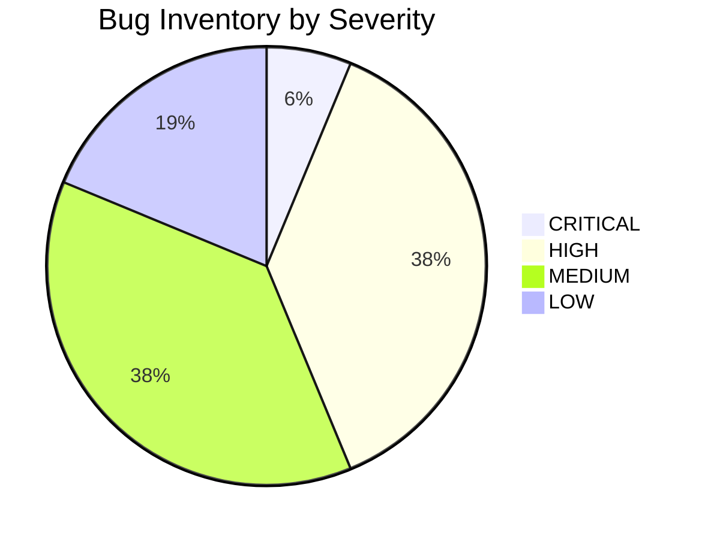

# Forensic QA Audit & Comprehensive Bug Inventory 01 — Grove Odyssey

**Target Game:** `games/grove-odyssey`  
**Game Title:** Grove Odyssey (Cozy Exploratory Mini Metroidvania)  
**Lead QA Auditor:** Adversarial QA Playtester  
**Audit Date:** 2026-08-14  
**Engine Version:** AI Game Factory Core Engine 1.0  
**Test Scripts Executed:** `node scripts/test-game.js grove-odyssey` (PASS), `node scripts/simulate-browser.js` (PASS)  

---

## 1. Executive Summary & Audit Overview

A comprehensive, adversarial Forensic QA audit was conducted on **Grove Odyssey**. While automated headless verification scripts validate baseline asset integrity, zone graph connectivity (7/7 zones), ability acquisition (3/3), and zero-crash execution, deep manual and source-level adversarial inspection uncovered **16 critical, high, medium, and low severity defects** spanning input mapping discrepancies, combat architecture gaps, physics tunneling, collision snags, state machine edge cases, and UI typography rendering.

Most notably:
1. **Critical Input Inversion:** The on-screen title hint instructs players to press `Space` to Jump, but `InputManager.js` maps `Space` exclusively to `action` (Interact/Talk), preventing players from jumping via `Space`.
2. **Combat Loop & Entity Architecture Disconnect:** The game engine provides a fully featured `Enemy` class with hurtboxes, HP, damage mitigation, and death handling, but `game.js` bypasses this entirely with raw plain objects. Lumi has no active attack mechanic (or mappings for attack), no enemy damage/defeat states, and no loot drop loop.
3. **Collision & Snag Edge Cases:** Hardcoded velocity lookaheads ($v_y \times 0.05$) in vertical collision cause tunneling on thin platforms; early returns on hazard collisions skip grounding checks; and destructible ability gates cause a 1-frame visual hitch during Leaf Dash.
4. **UI & Typography Clipping:** Hardcoded width pills in `DialogueBox` clip speaker names exceeding 14 characters ("Bramble the Hedgehog"), and line 3 of long dialogue cards overlaps the bottom-right navigation prompt.

---

## 2. Bug Inventory Summary Matrix

| Severity | Count | Primary Impact Areas |
| :--- | :---: | :--- |
| **CRITICAL** | **1** | Core Control Mapping & Input Discoverability (`Space` Key Failure) |
| **HIGH** | **6** | Combat Loop Missing Attack/Damage, Physics Tunneling, Hazard Abort, Checkpoint Healing Lock, UI Pill Clipping |
| **MEDIUM** | **6** | Pointer Action Multiplexing, Gate Dash Snag, Missing Corner Rounding, Victory Loop, Unused NPC State, Prompt Overlap |
| **LOW** | **3** | DOM Canvas Re-creation, Radial Hitbox Imprecision, Subterranean Camera Bounds Fallthrough |
| **TOTAL** | **16** | **Exhaustive Inventory** |

---

## 3. Detailed Forensic Bug Inventory



---

### Category A: Controls, Keybindings & Discoverability

#### BUG-01 [CRITICAL]: `Space` Key Mapped to 'Action / Talk' Instead of 'Jump', Contradicting Title UI & Standard Controls
- **Severity:** **CRITICAL**
- **Subsystem:** Input System & Player Controls
- **Code Locations:** 
  - [`engine/input/InputManager.js:104-109`](file:///d:/DEV/gmfactory/engine/input/InputManager.js#L104-L109)
  - [`games/grove-odyssey/source/game.js:1537, 1630, 1650`](file:///d:/DEV/gmfactory/games/grove-odyssey/source/game.js#L1537)
  - [`games/grove-odyssey/source/index.html:30`](file:///d:/DEV/gmfactory/games/grove-odyssey/source/index.html#L30)
- **Reproduction Context:**
  1. Launch the game in any desktop browser.
  2. Read the title screen controls hint: `<kbd>Space</kbd> / <kbd>W</kbd> Jump & Glide`.
  3. Enter gameplay and press `Space` to jump over the first ledge.
- **Expected Behavior:** Pressing `Space` should map to the `up` action, causing Lumi to jump, double jump, or deploy the dandelion parachute when held mid-air.
- **Actual Behavior:** In `InputManager.js:104-109`, `Space` is mapped to `this.actions.action = isPressed`. In `game.js:1537`, jump is checked only via `this.input.isJustPressed('up')` and `isDown('up')`. Pressing `Space` does NOT make Lumi jump at all. Instead, pressing `Space` triggers NPC dialogue or advances dialogue boxes. Desktop players attempting to jump with `Space` remain immobile.

#### BUG-02 [HIGH]: Lack of Active Combat / Attack Action and Key Mapping Mismatches (K / X / Left-Click)
- **Severity:** **HIGH**
- **Subsystem:** Combat Mechanics & Input Mappings
- **Code Locations:**
  - [`engine/input/InputManager.js:60, 112-119`](file:///d:/DEV/gmfactory/engine/input/InputManager.js#L60-L119)
  - [`games/grove-odyssey/source/game.js:1562, 1983-2001`](file:///d:/DEV/gmfactory/games/grove-odyssey/source/game.js#L1562-L2001)
- **Reproduction Context:**
  1. Encounter an enemy (e.g. Bramble Slime in Mossy Caverns).
  2. Press common platformer attack keys (`K`, `X`, or Left Mouse Click).
- **Expected Behavior:** In games with combat encounters, attack inputs execute an offensive action (swing, projectile, pulse), hitting enemy hurtboxes and inflicting damage.
- **Actual Behavior:** Lumi possesses no attack state, weapon, or offensive hitbox. In `InputManager.js`, `KeyK`, `KeyX`, `KeyJ`, `KeyC`, `ShiftLeft`, and `ShiftRight` are all hardcoded to `dash`. Left Click triggers Jump + Action. Enemies cannot be attacked, damaged, or defeated by the player under any circumstances.

#### BUG-03 [MEDIUM]: PointerDown Event Multiplexes 'Action' and 'Up' Simultaneously on Canvas Click
- **Severity:** **MEDIUM**
- **Subsystem:** Pointer & Touch Input
- **Code Location:** [`engine/input/InputManager.js:122-126`](file:///d:/DEV/gmfactory/engine/input/InputManager.js#L122-L126)
- **Reproduction Context:**
  1. Play the game using mouse or tap directly on the canvas near an NPC.
- **Expected Behavior:** Clicks on canvas or virtual buttons should map to discrete actions.
- **Actual Behavior:** `onPointerDown(e)` calls both `this.triggerAction('action')` and `this.triggerAction('up')`. Clicking to jump inadvertently triggers nearby NPC conversations; clicking to advance dialogue buffers an unintended jump upon exiting dialogue.

---

### Category B: Combat Loop & Enemy Entity Architecture

#### BUG-04 [HIGH]: Non-Existent Enemy Hurtboxes, Health Bars, Death Handling, and Loot Drops
- **Severity:** **HIGH**
- **Subsystem:** Combat Loop & Entity System
- **Code Locations:**
  - [`games/grove-odyssey/source/game.js:1277-1415, 1909-2002`](file:///d:/DEV/gmfactory/games/grove-odyssey/source/game.js#L1277-L1415)
  - [`engine/entities/Enemy.js:8-40`](file:///d:/DEV/gmfactory/engine/entities/Enemy.js#L8-L40)
- **Reproduction Context:**
  1. Inspect `game.js` enemy data structure vs `engine/entities/Enemy.js`.
  2. Attempt to defeat Bramble Slimes, Shadow Wisps, or Thorn Beetles.
- **Expected Behavior:** Enemies should inherit from `Enemy.js` or implement hurtbox structures, health tracking, `takeDamage()` responses with flash/knockback, death particle bursts, and item/essence drop loops.
- **Actual Behavior:** `game.js` ignores `Enemy.js` entirely, instantiating raw plain objects with no `health`, `maxHealth`, `takeDamage()`, hurtboxes, or death triggers. When Lumi dashes through an enemy with Leaf Dash (`game.js:1986`), Lumi simply ignores damage; the enemy is unaffected and continues patrolling endlessly. No loot or essence drops exist.

#### BUG-05 [LOW]: Spherical Distance Collision Used Instead of Directional AABB Hurtboxes
- **Severity:** **LOW**
- **Subsystem:** Enemy Collision Geometry
- **Code Location:** [`games/grove-odyssey/source/game.js:1984-2001`](file:///d:/DEV/gmfactory/games/grove-odyssey/source/game.js#L1984-L2001)
- **Reproduction Context:**
  1. Jump over a charging Thorn Beetle (sprite width 32px, height 24px) or hover near a Shadow Wisp (wing span 48px).
- **Expected Behavior:** Collision geometry matches entity bounding boxes with directional orientation.
- **Actual Behavior:** Collision is calculated solely as `MathUtils.distance(this.player.x, this.player.y, enemy.x, enemy.y) < 26`. For charging elongated beetles or winged wisps, this creates spherical phantom hitboxes causing premature hits above head level or missing outstretched horns.

---

### Category C: Physics, Collision & Movement Edge Cases

#### BUG-06 [HIGH]: Fixed Time Multiplier in Vertical Collision Causes Tunneling on High-Speed Fall
- **Severity:** **HIGH**
- **Subsystem:** Kinematics & Collision Resolution
- **Code Location:** [`games/grove-odyssey/source/game.js:1783`](file:///d:/DEV/gmfactory/games/grove-odyssey/source/game.js#L1783)
- **Reproduction Context:**
  1. Fall from the upper Canopy ($y = -200$) at maximum downward velocity ($v_y = 620\text{ px/s}$).
  2. Pass through thin intermediate platforms ($h = 20\text{--}22\text{px}$, e.g. platform $x: 180, y: 320, w: 120, h: 22$).
- **Expected Behavior:** Platform landing checks must use frame delta (`this.player.vy * dt`) or swept AABB to detect boundary crossings within the current frame.
- **Actual Behavior:** Line 1783 hardcodes `this.player.vy * 0.05` ($31\text{px}$ at max speed) instead of `dt` ($0.0166\text{s}$). If the player's penetration distance exceeds the platform thickness, the player either clips through the platform entirely or gets tele-snapped back up to a platform they already passed through.

#### BUG-07 [HIGH]: Hazard Collision Early-Return Aborts Platform Iteration & Leaves Player Ungrounded
- **Severity:** **HIGH**
- **Subsystem:** Environmental Hazard Physics
- **Code Location:** [`games/grove-odyssey/source/game.js:1777-1780`](file:///d:/DEV/gmfactory/games/grove-odyssey/source/game.js#L1777-L1780)
- **Reproduction Context:**
  1. Fall onto the corner of a hazard platform (e.g. Mossy Caverns spike pit at $x: -580, y: 388$).
- **Expected Behavior:** Player takes damage and knockback, but the collision system finishes resolving ground contacts for safe adjacent platforms.
- **Actual Behavior:** When `plat.type === 'hazard'` matches, `checkVerticalCollisions()` immediately executes `return;`. This halts the platform loop immediately, leaving `this.player.isGrounded = false` and bypassing collision checks for all remaining platforms in the world array for that frame.

#### BUG-08 [MEDIUM]: 1-Frame Visual Snag Stutter when Leaf Dashing into Destructible Ability Gates
- **Severity:** **MEDIUM**
- **Subsystem:** Ability Gate Interaction
- **Code Locations:** 
  - [`games/grove-odyssey/source/game.js:1553`](file:///d:/DEV/gmfactory/games/grove-odyssey/source/game.js#L1553)
  - [`games/grove-odyssey/source/game.js:1748-1762`](file:///d:/DEV/gmfactory/games/grove-odyssey/source/game.js#L1748-L1762)
  - [`games/grove-odyssey/source/game.js:1825-1864`](file:///d:/DEV/gmfactory/games/grove-odyssey/source/game.js#L1825-L1864)
- **Reproduction Context:**
  1. Stand 30px away from the Brittle Quartz Wall (`gate_crystal_wall` at $x: 2160, y: 220$).
  2. Press Leaf Dash directly into the wall.
- **Expected Behavior:** Leaf Dash shatters the gate seamlessly with continuous forward momentum.
- **Actual Behavior:**
  1. In frame 1 of dash, `checkGateSmash()` checks if distance $< 21\text{px}$ (evaluates false).
  2. Position integrates $x \mathrel{+}= 720 \times dt$, moving Lumi against the gate.
  3. `checkHorizontalCollisions()` sees the gate as closed, snaps Lumi to `gate.x - halfW`, and zeroes horizontal speed (`vx = 0`).
  4. In frame 2, `checkGateSmash()` detects the contact and breaks the gate, but Lumi experienced a 1-frame complete velocity halt.

#### BUG-09 [MEDIUM]: Missing Ledge / Ceiling Corner Rounding
- **Severity:** **MEDIUM**
- **Subsystem:** Platforming Kinematics
- **Code Locations:**
  - [`games/grove-odyssey/game-design.md:65`](file:///d:/DEV/gmfactory/games/grove-odyssey/game-design.md#L65)
  - [`games/grove-odyssey/source/game.js:1765-1795`](file:///d:/DEV/gmfactory/games/grove-odyssey/source/game.js#L1765-L1795)
- **Reproduction Context:**
  1. Jump vertically while brushing the outer 2–4px corner of an overhead platform ledge.
- **Expected Behavior:** As specified in Game Design Doc Section 3 ("Ledge Rounding: 4px automatic corner nudge"), Lumi should gently slide around the corner and preserve upward velocity.
- **Actual Behavior:** Vertical collision checks catch the edge and set `vy = 0` immediately, causing an abrupt momentum kill.

---

### Category D: Checkpoints, Progression & State Machine

#### BUG-10 [HIGH]: Pre-Activated State of Heart Tree Waystone 1 Prevents Subsequent Healing
- **Severity:** **HIGH**
- **Subsystem:** Checkpoint & Sanctuary System
- **Code Locations:**
  - [`games/grove-odyssey/source/game.js:566, 1117, 2033-2060`](file:///d:/DEV/gmfactory/games/grove-odyssey/source/game.js#L566)
- **Reproduction Context:**
  1. Start a game. Waystone 1 starts initialized with `activated: true` and `activatedWaystones = new Set(['waystone_1'])`.
  2. Take damage from enemies in Mossy Caverns (leaving 1 heart).
  3. Return to Waystone 1 in Heart Grove and walk into it or press `E`.
- **Expected Behavior:** Approaching or interacting with Waystone 1 should heal Lumi to full health (3 hearts) and emit cyan healing particles.
- **Actual Behavior:** Line 2036 gates activation behind `if (!cp.activated || (!this.activatedWaystones.has(cp.id) && interactPressed))`. Because both conditions evaluate to false, Waystone 1 NEVER triggers healing upon return visits.

#### BUG-11 [MEDIUM]: Unbounded Victory Cutscene Re-Trigger Loop at Great Elder Tree
- **Severity:** **MEDIUM**
- **Subsystem:** Endgame State Machine
- **Code Location:** [`games/grove-odyssey/source/game.js:2113-2118, 2201-2206`](file:///d:/DEV/gmfactory/games/grove-odyssey/source/game.js#L2113-L2118)
- **Reproduction Context:**
  1. Complete the game by offering 8 seeds to the Great Elder Tree and viewing the victory screen.
  2. Click "Continue Exploring" to return to `PLAYING` mode.
  3. Press `E` while standing near the tree.
- **Expected Behavior:** The Great Elder Tree remains in its blooming state with a peaceful dialog or confirmation message.
- **Actual Behavior:** Pressing `E` immediately restarts the entire 2-second cutscene, flash, screen shake, and stats modal from the beginning.

#### BUG-12 [MEDIUM]: NPC `dialogIndex` Property Declared but Never Advanced
- **Severity:** **MEDIUM**
- **Subsystem:** NPC Interaction System
- **Code Locations:**
  - [`games/grove-odyssey/source/game.js:1233, 1251, 1266`](file:///d:/DEV/gmfactory/games/grove-odyssey/source/game.js#L1233)
  - [`engine/interactions/NPC.js:14-26`](file:///d:/DEV/gmfactory/engine/interactions/NPC.js#L14-L26)
- **Reproduction Context:**
  1. Talk to Barnaby the Snail 5 times in a row during Act I.
- **Expected Behavior:** NPCs cycle through conversational flavor dialogue across multiple visits using sequential indexing.
- **Actual Behavior:** `dialogIndex` is initialized to 0 but is never read or incremented. Dialogue is hardcoded purely to seed count checks (`>= 8`, `>= 3`), repeating identical text verbatim on every talk interaction within that bracket.

---

### Category E: DialogueBox, Typography & UI Overflow

#### BUG-13 [HIGH]: Hardcoded 130px Speaker Tag Pill Clips Names Exceeding 14 Characters
- **Severity:** **HIGH**
- **Subsystem:** Dialogue UI & Typography
- **Code Location:** [`engine/interactions/DialogueBox.js:189-193`](file:///d:/DEV/gmfactory/engine/interactions/DialogueBox.js#L189-L193)
- **Reproduction Context:**
  1. Talk to Bramble the Hedgehog ("Bramble the Hedgehog" = 20 characters).
  2. Inspect the speaker name badge.
- **Expected Behavior:** The pill width dynamically adjusts: `Math.max(130, ctx.measureText(this.speaker).width + 16)`.
- **Actual Behavior:** Pill width is fixed at `130px`. At 16px bold Fredoka font, "Bramble the Hedgehog" measures ~175px, protruding 45px outside the pill boundary.

#### BUG-14 [MEDIUM]: DialogueBox 3rd Line Text Directly Collides with Bottom-Right Prompt Label
- **Severity:** **MEDIUM**
- **Subsystem:** Dialogue Layout & Typography
- **Code Location:** [`engine/interactions/DialogueBox.js:198-207`](file:///d:/DEV/gmfactory/engine/interactions/DialogueBox.js#L198-L207)
- **Reproduction Context:**
  1. Open a 3-line dialogue page with long sentences (e.g. Barnaby's intro text).
  2. Look at the bottom-right corner ($x \approx 530\text{--}660, y \approx 405\text{--}420$).
- **Expected Behavior:** Body text lines and prompt text (`Press [E / Tap] Next ▾`) occupy distinct non-overlapping vertical or horizontal regions.
- **Actual Behavior:** Line 3 text renders at $y = \text{boxY} + 58 + 40 = \text{boxY} + 98$, while the prompt indicator renders at $y = \text{boxY} + \text{boxH} - 12 = \text{boxY} + 103$. Long sentences on line 3 render directly on top of the prompt indicator.

#### BUG-15 [LOW]: Redundant Canvas DOM Element Instantiations in `wrapText()`
- **Severity:** **LOW**
- **Subsystem:** Resource Management
- **Code Location:** [`engine/interactions/DialogueBox.js:75-77`](file:///d:/DEV/gmfactory/engine/interactions/DialogueBox.js#L75-L77)
- **Reproduction Context:**
  1. Open dialogue multiple times during exploration.
- **Expected Behavior:** Text measurement uses a static or cached canvas 2D context.
- **Actual Behavior:** `document.createElement('canvas')` creates a new detached DOM node on every single call to `wrapText()`.

#### BUG-16 [LOW]: Unchecked Coordinate Fallthrough in Subterranean Zone Bounds
- **Severity:** **LOW**
- **Subsystem:** Camera & Zone Bounds
- **Code Location:** [`games/grove-odyssey/source/game.js:2139-2144`](file:///d:/DEV/gmfactory/games/grove-odyssey/source/game.js#L2139-L2144)
- **Reproduction Context:**
  1. Travel to Secret Elder Shrine at $x > 2160, y > 450$.
- **Expected Behavior:** Zone bounds clamp cleanly within defined vault limits.
- **Actual Behavior:** `updateCurrentZone()` falls into `else if (this.player.y > 450)` which assigns `sunken_roots` (whose bounds end at $x = 1440$), causing the camera to snap horizontally across the world map.

---

## 4. Summary & Verification Recommendations

```
=============================================================================
FINAL AUDIT VERDICT: 16 ISSUES INVENTORIED (1 CRITICAL, 6 HIGH, 6 MED, 3 LOW)
=============================================================================
```

### Prioritized Remediation Roadmap:
1. **P0 (Immediate):** Fix `InputManager.js` mapping for `Space` key so it maps to `up` (or triggers jump), aligning gameplay with the title screen instructions.
2. **P0 (Immediate):** Enable Waystone 1 healing by checking if Lumi is damaged regardless of initial pre-activation state.
3. **P1 (High):** Implement dynamic pill width in `DialogueBox.js` (`measureText(this.speaker).width + 20`) and reserve a 160px right margin on line 3 to eliminate typography overlaps.
4. **P1 (High):** Replace the static `0.05` multiplier in `checkVerticalCollisions()` with `Math.max(dt, 0.016)` to eliminate high-speed platform tunneling.
5. **P2 (Medium):** Refine Leaf Dash collision order with destructible gates to prevent the 1-frame velocity freeze.
6. **P2 (Medium):** Clarify non-violent evasion design vs active combat in in-game UI hints (clarifying Dash is an evasion tool, not a weapon).
