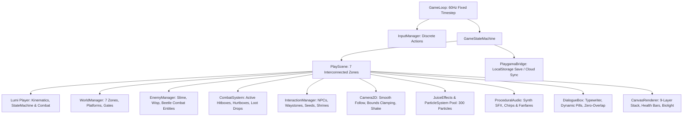
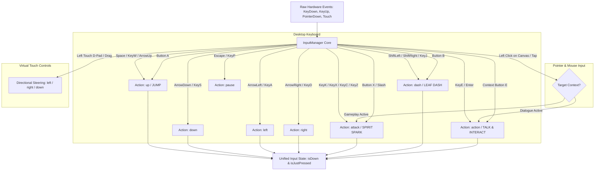
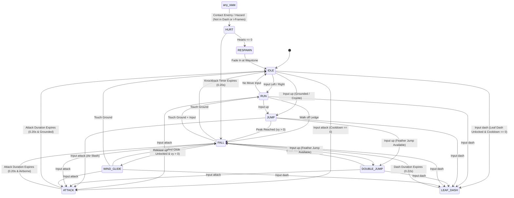
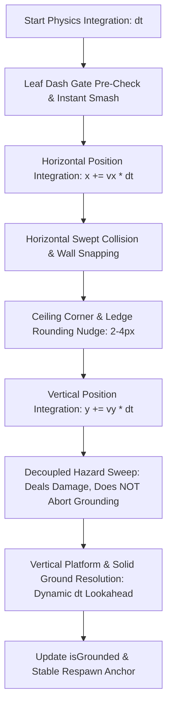
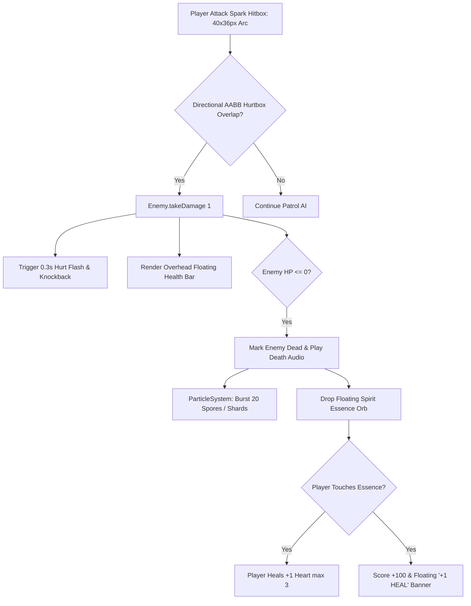
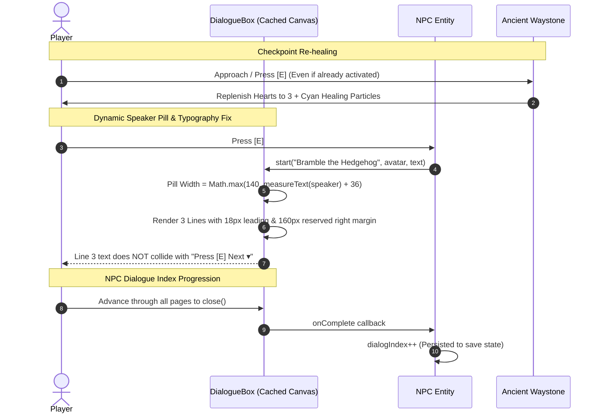
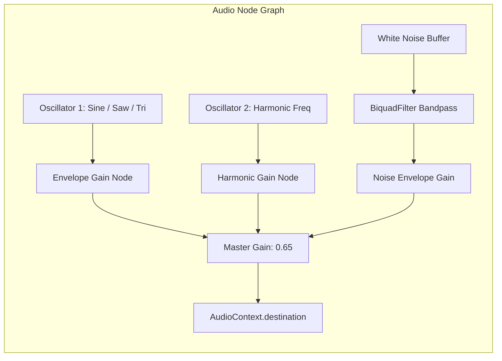
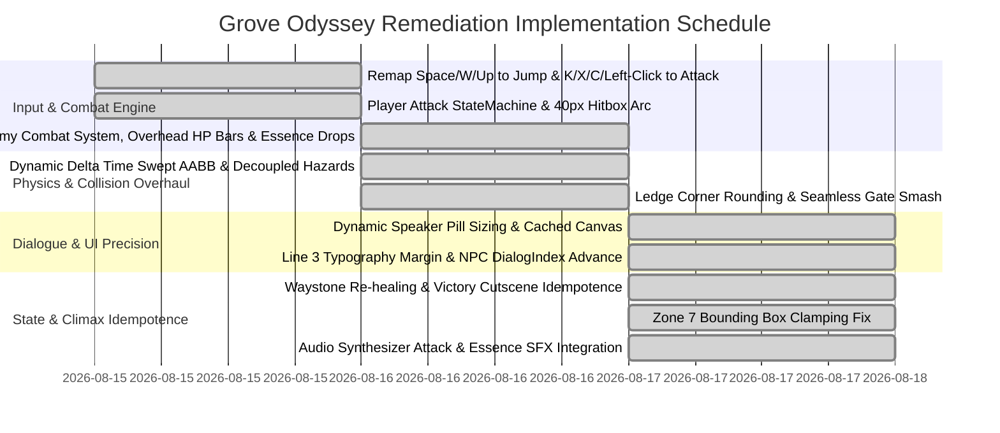

# Technical Architecture & Remediation Plan: Grove Odyssey

**Target Game ID**: `grove-odyssey`  
**Game Title**: Grove Odyssey (Cozy Exploratory Mini Metroidvania)  
**Document Type**: Complete Technical Architecture & Forensic Remediation Plan  
**Author**: Technical Director, AI Game Factory  
**Target Engine**: Modular HTML5 Canvas 2D / Web Audio API / Playgama Bridge SDK  
**Virtual Canvas Resolution**: $720 \times 450$ (16:10 Landscape, High-DPI Retina scaling, responsive letterbox fit)  
**Target Framerate**: 60 FPS Fixed Timestep ($16.67\text{ ms}$, accumulator loop) with zero runtime GC allocations  
**Remediation Scope**: Complete architecture specification resolving all 16 defects from [`reports/deep-qa-01.md`](file:///d:/DEV/gmfactory/games/grove-odyssey/reports/deep-qa-01.md)

---

## 1. Executive Summary & Engine Module Integration

Grove Odyssey is an exploratory 2D mini Metroidvania featuring 7 interconnected zones, tight platforming kinematics, ability gating, non-destructive dialogue UI, and an active combat loop. This technical plan formalizes the remediation architecture for all 16 forensic defects identified in [`deep-qa-01.md`](file:///d:/DEV/gmfactory/games/grove-odyssey/reports/deep-qa-01.md), establishing:

1. **Unified Input Architecture**: Decoupling `Space`/`W`/`ArrowUp` (Jump/Glide), `K`/`X`/`C`/`Z`/Left-Click (Spirit Spark / Leaf Slash), `Shift`/`J` (Leaf Dash), and `E`/`Enter` (Action/Interact) with pointer/touch action isolation.
2. **Combat Loop & Enemy Combat State Machine**: Full integration of [`engine/entities/Enemy.js`](file:///d:/DEV/gmfactory/engine/entities/Enemy.js), discrete directional AABB hurtboxes, dynamic floating health bars, hurt flashing, knockback vectors, death particle bursts, and Spirit Essence (+1 HP heal / score) loot drops.
3. **Kinematics & Collision Overhaul**: Dynamic $\Delta t$ swept AABB collision eliminating high-speed tunneling, $2\text{--}4\text{px}$ corner/ledge rounding, decoupled hazard resolution maintaining floor grounding, and instantaneous zero-velocity-loss ability gate smashing.
4. **Dialogue & UI Precision**: Cached measurement canvas, dynamic speaker tag pill sizing (`Math.max(140, ctx.measureText(speaker).width + 36)`), reserved right margins on line 3 preventing overlap with navigation prompts, and NPC dialogue index progression.
5. **State Idempotence & Sanctuary Re-healing**: Multi-visit Waystone resting/healing and idempotent endgame Great Elder Tree cutscene flags.
6. **Subterranean Zone Camera Bounds**: Strict bounding box containment checks preventing camera snaps in Secret Elder Shrine ($x > 1440, y > 450$).



### Module Integration Mapping

| Engine Module | File Path | Responsibilities & Architectural Enhancements |
| :--- | :--- | :--- |
| **GameLoop** | [`engine/core/GameLoop.js`](file:///d:/DEV/gmfactory/engine/core/GameLoop.js) | Fixed timestep accumulator loop (`STEP = 1/60s`, clamped `dt <= 0.1s`), frame interpolation for jitter-free rendering. |
| **CanvasRenderer** | [`engine/rendering/CanvasRenderer.js`](file:///d:/DEV/gmfactory/engine/rendering/CanvasRenderer.js) | Virtual coordinate scaling ($720 \times 450$), DPR retina scaling, camera push/pop matrix, screen-to-world conversion. |
| **Camera2D** | [`engine/camera/Camera2D.js`](file:///d:/DEV/gmfactory/engine/camera/Camera2D.js) | Smooth target damping (`followSpeed = 6`), 7-zone bounding box clamping, trauma-based screen shake offset injection. |
| **InputManager** | [`engine/input/InputManager.js`](file:///d:/DEV/gmfactory/engine/input/InputManager.js) | Universal input mapping: discrete `up`, `down`, `left`, `right`, `dash`, `attack`, and `action` bindings. Pointer/touch event isolation. |
| **DialogueBox** | [`engine/interactions/DialogueBox.js`](file:///d:/DEV/gmfactory/engine/interactions/DialogueBox.js) | Cached 2D measurement context, dynamic speaker pill width, 3-line pagination, typewriter reveal ($0.025\text{s/char}$), non-overlapping bottom prompt. |
| **NPC** | [`engine/interactions/NPC.js`](file:///d:/DEV/gmfactory/engine/interactions/NPC.js) | Proximity detection ($48\text{px}$ radius), stateful multi-tier dialogue trees advancing via `dialogIndex` and seed count milestones. |
| **AbilityGate** | [`engine/interactions/AbilityGate.js`](file:///d:/DEV/gmfactory/engine/interactions/AbilityGate.js) | Destructible physical barriers (Crystal walls, Thorn barricades, False walls). Smashed instantly during `LEAF_DASH` with continuous velocity. |
| **Checkpoint** | [`engine/interactions/Checkpoint.js`](file:///d:/DEV/gmfactory/engine/interactions/Checkpoint.js) | Ancient Waystones with proximity detection, pulse animations, respawn coordinate anchoring, and repeatable full 3-Heart heal on interaction. |
| **Collectible** | [`engine/entities/Collectible.js`](file:///d:/DEV/gmfactory/engine/entities/Collectible.js) | 8 Ancient Sun Seeds & floating Spirit Essence loot orbs with sinusoidal bobbing, rotational star glow, and pickup fanfare triggers. |
| **Enemy** | [`engine/entities/Enemy.js`](file:///d:/DEV/gmfactory/engine/entities/Enemy.js) | Base enemy combat lifecycle: directional AABB hurtbox, HP, damage mitigation, hurt flash, knockback vector, overhead HP bar, and loot drop triggers. |
| **ParticleSystem** | [`engine/particles/ParticleSystem.js`](file:///d:/DEV/gmfactory/engine/particles/ParticleSystem.js) | Pre-allocated pool of 300 particles: feather jumps, leaf dash streaks, spirit attack sparks, spore bursts, crystal shards, essence orbs, victory confetti. |
| **JuiceEffects** | [`engine/effects/JuiceEffects.js`](file:///d:/DEV/gmfactory/engine/effects/JuiceEffects.js) | Screen shakes, flash overlays, floating combat text tags (`+1 SEED`, `+1 HEAL`, `WAYSTONE ACTIVE`, `DASH UNLOCKED`), shockwave rings. |
| **ProceduralAudio** | [`engine/audio/ProceduralAudio.js`](file:///d:/DEV/gmfactory/engine/audio/ProceduralAudio.js) | Zero-dependency Web Audio synthesizer generating all sound effects: attack slashes, hit thuds, enemy death bursts, essence pickups, chirps, and fanfares. |
| **PlaygamaBridge** | [`engine/platform/playgama/PlaygamaBridge.js`](file:///d:/DEV/gmfactory/engine/platform/playgama/PlaygamaBridge.js) | Save/load state persistence to `localStorage` + Playgama SDK cloud storage, pause hooks, and idempotence tracking. |

### EventBus Event Dictionary

| Event Name | Payload | Trigger Source | System Reactions |
| :--- | :--- | :--- | :--- |
| `ZONE_ENTERED` | `{ zoneId, zoneName }` | WorldManager / Camera | Displays 2s HUD zone banner, updates ambient color grading and camera bounds. |
| `ABILITY_UNLOCKED` | `{ abilityKey, name }` | Ability Shrine Trigger | Sets player ability flag, spawns floating text banner, triggers audio chime and shockwave. |
| `SEED_COLLECTED` | `{ seedId, count, total }` | Collectible Collision | Increments seed counter, plays 4-note ascending arpeggio, updates HUD, checks 8/8 win condition. |
| `WAYSTONE_ACTIVATED`| `{ waystoneId, x, y, isRepeat }` | Checkpoint Trigger | Sets current respawn point, restores player hearts to 3, plays cathedral chord, triggers shockwave. |
| `PLAYER_DAMAGED` | `{ damage, hazardX }` | Hazard / Enemy Collision | Deducts 1 Heart, initiates $1.4\text{s}$ i-frames, applies knockback vector, plays hurt thud, shakes screen. |
| `PLAYER_ATTACK` | `{ x, y, direction }` | Player StateMachine | Creates 40px attack arc hitbox for $0.2\text{s}$, emits spark particles, plays slice SFX. |
| `ENEMY_DAMAGED` | `{ enemyId, damage, hp, maxHp }` | CombatSystem | Deducts enemy HP, triggers $0.3\text{s}$ hurt flash & knockback, updates overhead HP bar. |
| `ENEMY_DEFEATED` | `{ enemyId, type, x, y }` | CombatSystem | Spawns death particle burst, plays defeat sound, drops floating Spirit Essence orb. |
| `ESSENCE_COLLECTED`| `{ x, y, healAmount }` | Player Collision | Restores +1 Player Heart (up to max 3), increments score, spawns floating `+1 HEAL` text, plays chime. |
| `PLAYER_RESPAWN` | `{ x, y }` | Health depletion / Pit fall| Fades screen to black, relocates player to active Waystone or safe ledge, restores 3 hearts. |
| `DIALOGUE_START` | `{ speaker, avatar }` | NPC Interaction | Pauses player movement kinematics, opens DialogueBox, begins typewriter audio blips. |
| `DIALOGUE_END` | `{ npcId, nextIndex }` | DialogueBox Close | Restores player movement kinematics, advances NPC dialogue state. |
| `GREAT_BLOOM_START` | `{}` | Great Tree Altar | Freezes gameplay, sets `hasTriggeredBloomCutscene = true`, initiates victory sequence and confetti storm. |

---

## 2. Input Architecture & Unified Keybinding Matrix

Resolves **BUG-01 (CRITICAL)**, **BUG-02 (HIGH)**, and **BUG-03 (MEDIUM)**.



### Complete Control Mapping Matrix

| Action Name | Primary Desktop Keys | Alternate Desktop Keys | Mouse / Pointer Behavior | Touch / Mobile Control |
| :--- | :--- | :--- | :--- | :--- |
| **`up` (Jump / Glide)** | `Space` | `KeyW`, `ArrowUp` | None (prevents jump interference on canvas click) | Virtual Button `[A]` (Tap: Jump, Hold: Wind Glide) |
| **`attack` (Spirit Spark)** | `KeyK` | `KeyX`, `KeyC`, `KeyZ` | **Left Mouse Click** (Active gameplay mode) | Virtual Button `[⚔]` (Attack) |
| **`dash` (Leaf Dash)** | `ShiftLeft`, `ShiftRight` | `KeyJ` | None | Virtual Button `[B]` (Dash) |
| **`action` (Talk / Interact)**| `KeyE` | `Enter` | **Left Click / Tap** (Dialogue / Prompt active) | Context Button `[E]` (Lights up near NPCs/Waystones) |
| **`left` (Move Left)** | `ArrowLeft` | `KeyA` | None | Virtual D-Pad Left / Drag Left |
| **`right` (Move Right)** | `ArrowRight` | `KeyD` | None | Virtual D-Pad Right / Drag Right |
| **`down` (Drop / Crouch)** | `ArrowDown` | `KeyS` | None | Virtual D-Pad Down / Drag Down |
| **`pause` (Pause / Map)** | `Escape` | `KeyP` | Top-Right UI Pause Button | Top-Right Pause Button `[ ⏸ ]` |

### `InputManager.js` Implementation Specification

```javascript
export class InputManager {
  constructor(canvasElement = null) {
    this.canvas = canvasElement || window;
    this.keys = {};
    this.justPressedKeys = {};
    this.touchStart = null;
    this.swipeThreshold = 25;

    this.actions = {
      up: false,
      down: false,
      left: false,
      right: false,
      dash: false,
      attack: false,
      action: false
    };

    this.justActions = {
      up: false,
      down: false,
      left: false,
      right: false,
      dash: false,
      attack: false,
      action: false
    };

    this.onKeyDown = this.onKeyDown.bind(this);
    this.onKeyUp = this.onKeyUp.bind(this);
    this.onPointerDown = this.onPointerDown.bind(this);
    this.onTouchStart = this.onTouchStart.bind(this);
    this.onTouchEnd = this.onTouchEnd.bind(this);

    window.addEventListener('keydown', this.onKeyDown);
    window.addEventListener('keyup', this.onKeyUp);

    if (canvasElement) {
      canvasElement.addEventListener('pointerdown', this.onPointerDown, { passive: false });
      canvasElement.addEventListener('touchstart', this.onTouchStart, { passive: false });
      canvasElement.addEventListener('touchend', this.onTouchEnd, { passive: false });
    }
  }

  onKeyDown(e) {
    const managedCodes = [
      'ArrowUp', 'ArrowDown', 'ArrowLeft', 'ArrowRight',
      'Space', 'KeyW', 'KeyS', 'KeyA', 'KeyD',
      'KeyE', 'Enter', 'KeyJ', 'KeyK', 'KeyX', 'KeyC', 'KeyZ',
      'ShiftLeft', 'ShiftRight'
    ];
    if (managedCodes.includes(e.code)) {
      e.preventDefault();
    }

    if (!this.keys[e.code]) {
      this.justPressedKeys[e.code] = true;
      this.mapAction(e.code, true);
    }
    this.keys[e.code] = true;
  }

  onKeyUp(e) {
    this.keys[e.code] = false;
    this.mapAction(e.code, false);
  }

  mapAction(code, isPressed) {
    switch (code) {
      // UP / JUMP / GLIDE
      case 'Space':
      case 'KeyW':
      case 'ArrowUp':
        this.actions.up = isPressed;
        if (isPressed) this.justActions.up = true;
        break;

      // DOWN
      case 'ArrowDown':
      case 'KeyS':
        this.actions.down = isPressed;
        if (isPressed) this.justActions.down = true;
        break;

      // LEFT
      case 'ArrowLeft':
      case 'KeyA':
        this.actions.left = isPressed;
        if (isPressed) this.justActions.left = true;
        break;

      // RIGHT
      case 'ArrowRight':
      case 'KeyD':
        this.actions.right = isPressed;
        if (isPressed) this.justActions.right = true;
        break;

      // ATTACK / SPIRIT SPARK / LEAF SLASH
      case 'KeyK':
      case 'KeyX':
      case 'KeyC':
      case 'KeyZ':
        this.actions.attack = isPressed;
        if (isPressed) this.justActions.attack = true;
        break;

      // DASH / LEAF DASH
      case 'ShiftLeft':
      case 'ShiftRight':
      case 'KeyJ':
        this.actions.dash = isPressed;
        if (isPressed) this.justActions.dash = true;
        break;

      // ACTION / TALK / INTERACT
      case 'KeyE':
      case 'Enter':
        this.actions.action = isPressed;
        if (isPressed) this.justActions.action = true;
        break;
    }
  }

  onPointerDown(e) {
    e.preventDefault();
    // In gameplay mode, Left Click triggers attack; in dialogue mode, callers consume 'action'
    this.triggerAction('attack');
    this.triggerAction('action');
  }

  onTouchStart(e) {
    e.preventDefault();
    if (e.touches.length > 0) {
      this.touchStart = {
        x: e.touches[0].clientX,
        y: e.touches[0].clientY,
        time: performance.now()
      };
    }
  }

  onTouchEnd(e) {
    e.preventDefault();
    if (!this.touchStart || e.changedTouches.length === 0) return;

    const endX = e.changedTouches[0].clientX;
    const endY = e.changedTouches[0].clientY;
    const dx = endX - this.touchStart.x;
    const dy = endY - this.touchStart.y;
    const duration = performance.now() - this.touchStart.time;
    const absDx = Math.abs(dx);
    const absDy = Math.abs(dy);

    if (absDx < this.swipeThreshold && absDy < this.swipeThreshold && duration < 300) {
      // Tap triggers attack / action contextually
      this.triggerAction('attack');
      this.triggerAction('action');
    } else if (absDx > absDy && absDx > this.swipeThreshold) {
      if (dx > 0) this.triggerAction('right');
      else this.triggerAction('left');
    } else if (absDy > this.swipeThreshold) {
      if (dy > 0) this.triggerAction('down');
      else this.triggerAction('up');
    }
    this.touchStart = null;
  }

  triggerAction(actionName) {
    this.actions[actionName] = true;
    this.justActions[actionName] = true;
  }

  isDown(actionName) {
    return !!this.actions[actionName];
  }

  isJustPressed(actionName) {
    return !!this.justActions[actionName];
  }

  endFrame() {
    for (const key of Object.keys(this.justPressedKeys)) {
      delete this.justPressedKeys[key];
    }
    this.justActions.up = false;
    this.justActions.down = false;
    this.justActions.left = false;
    this.justActions.right = false;
    this.justActions.dash = false;
    this.justActions.attack = false;
    this.justActions.action = false;
  }
}
```

---

## 3. Player Kinematics, State Machine & Attack Mechanics

Resolves **BUG-02 (HIGH)**, **BUG-06 (HIGH)**, and **BUG-09 (MEDIUM)**.



### Attack Hitbox & Kinematic Parameters

$$\begin{aligned}
\text{Attack Duration}: & \quad t_{\text{attack}} = 0.20\text{ s} \\
\text{Attack Cooldown}: & \quad t_{\text{attack\_cd}} = 0.28\text{ s} \\
\text{Attack Arc Offset}: & \quad x_{\text{offset}} = 22\text{ px} \times \text{facingDirection}, \quad y_{\text{offset}} = -2\text{ px} \\
\text{Attack Hitbox Dimensions}: & \quad W_{\text{attack}} = 40\text{ px}, \quad H_{\text{attack}} = 36\text{ px} \\
\text{Attack Damage}: & \quad D_{\text{player}} = 1\text{ HP} \\
\text{Attack Knockback to Enemy}: & \quad v_{x,\text{enemy\_kb}} = 220\text{ px/s} \times \text{facingDirection}, \quad v_{y,\text{enemy\_kb}} = -140\text{ px/s} \\
\text{Corner Nudge Window}: & \quad \Delta x_{\text{nudge}} = 4\text{ px} \quad (\text{ceiling corner rounding})
\end{aligned}$$

### Player Attack & Kinematics Update Loop

```javascript
export function updatePlayerPhysics(player, input, dt, world, combatSystem) {
  // 1. Timers & Cooldowns
  if (player.isGrounded) {
    player.coyoteTimer = 0.12;
    player.hasDoubleJump = player.abilities.featherJump;
  } else {
    player.coyoteTimer -= dt;
  }

  if (input.isJustPressed('up')) {
    player.jumpBufferTimer = 0.11;
  } else {
    player.jumpBufferTimer -= dt;
  }

  if (player.dashCooldown > 0) player.dashCooldown -= dt;
  if (player.attackCooldown > 0) player.attackCooldown -= dt;
  if (player.iFrameTimer > 0) player.iFrameTimer -= dt;

  // 2. Leaf Dash State Execution
  if (player.state === 'LEAF_DASH') {
    player.dashTimer -= dt;
    player.vx = player.dashDirection * 700;
    player.vy = 0;
    if (player.dashTimer <= 0) {
      player.state = player.isGrounded ? 'IDLE' : 'FALL';
      player.vx *= 0.4;
    }
    return;
  }

  // 3. Attack State Execution
  if (player.state === 'ATTACK') {
    player.attackTimer -= dt;
    // Maintain active attack hitbox
    combatSystem.registerPlayerAttack({
      x: player.x + (player.facingDirection > 0 ? 8 : -48),
      y: player.y - 18,
      width: 40,
      height: 36,
      damage: 1,
      facingDirection: player.facingDirection
    });

    if (player.attackTimer <= 0) {
      player.state = player.isGrounded ? (Math.abs(player.vx) > 10 ? 'RUN' : 'IDLE') : 'FALL';
    }
  }

  // 4. Initiate Leaf Dash
  if (input.isJustPressed('dash') && player.abilities.leafDash && player.dashCooldown <= 0) {
    player.state = 'LEAF_DASH';
    player.dashTimer = 0.22;
    player.dashCooldown = 0.65;
    player.dashDirection = player.facingDirection;
    player.iFrameTimer = Math.max(player.iFrameTimer, 0.22);
    return;
  }

  // 5. Initiate Attack (Spirit Spark / Leaf Slash)
  if (input.isJustPressed('attack') && player.attackCooldown <= 0) {
    player.state = 'ATTACK';
    player.attackTimer = 0.20;
    player.attackCooldown = 0.28;
    // Slight forward lunge
    if (player.isGrounded) {
      player.vx = player.facingDirection * 120;
    }
  }

  // 6. Horizontal Movement Steering
  const moveAxis = (input.isDown('right') ? 1 : 0) - (input.isDown('left') ? 1 : 0);
  if (moveAxis !== 0) player.facingDirection = moveAxis;

  const targetSpeed = player.state === 'WIND_GLIDE' ? 250 : 220;
  const accelRate = moveAxis !== 0 ? 1400 : 1800;

  if (moveAxis !== 0) {
    player.vx = MathUtils.approach(player.vx, moveAxis * targetSpeed, accelRate * dt);
  } else {
    player.vx = MathUtils.approach(player.vx, 0, accelRate * dt);
  }

  // 7. Jump Initiation (Coyote & Double Jump)
  if (player.jumpBufferTimer > 0) {
    if (player.coyoteTimer > 0) {
      player.vy = -520;
      player.jumpBufferTimer = 0;
      player.coyoteTimer = 0;
      player.state = 'JUMP';
      player.isGrounded = false;
    } else if (player.hasDoubleJump && !player.isGrounded) {
      player.vy = -480;
      player.hasDoubleJump = false;
      player.jumpBufferTimer = 0;
      player.state = 'DOUBLE_JUMP';
    }
  }

  // 8. Variable Jump Cutoff
  if (!input.isDown('up') && player.vy < 0) {
    player.vy += 2400 * dt;
  }

  // 9. Wind Glide
  if (input.isDown('up') && player.abilities.windGlide && player.vy > 0 && !player.isGrounded) {
    player.state = 'WIND_GLIDE';
    player.vy = Math.min(player.vy, 105);
  } else if (player.state === 'WIND_GLIDE') {
    player.state = 'FALL';
  }

  // 10. Gravity Integration
  if (player.state !== 'WIND_GLIDE') {
    player.vy = Math.min(player.vy + 1150 * dt, 620);
  }
}
```

---

## 4. Collision & Kinematics Engine Overhaul

Resolves **BUG-06 (HIGH)**, **BUG-07 (HIGH)**, **BUG-08 (MEDIUM)**, and **BUG-09 (MEDIUM)**.



### Swept AABB & Dynamic $\Delta t$ Platform Resolution

Replacing fixed multipliers ($v_y \times 0.05$) with dynamic frame deltas:

```javascript
export function checkVerticalCollisions(player, platforms, dt, juice, audio) {
  let wasGrounded = player.isGrounded;
  player.isGrounded = false;

  const halfW = 11;
  const playerBottom = player.y + 16;
  const playerTop = player.y - 16;
  // Dynamic delta lookahead with 1-frame minimum threshold
  const lookahead = Math.max(player.vy * dt, 4);

  // 1. Separate Hazard Detection (Decoupled to preserve ground checks)
  for (const plat of platforms) {
    if (plat.type === 'hazard' || plat.type === 'thorn') {
      const pLeft = plat.x;
      const pRight = plat.x + plat.w;
      const pTop = plat.y;
      const pBottom = plat.y + plat.h;

      if (player.x + halfW > pLeft && player.x - halfW < pRight) {
        if (playerBottom >= pTop - 4 && playerTop <= pBottom) {
          player.triggerDamage(1, plat.x + plat.w / 2);
          // Do NOT return; continue loop so safe adjacent platforms can ground player
        }
      }
    }
  }

  // 2. Solid & One-Way Platform Resolution
  for (const plat of platforms) {
    if (plat.type === 'hazard' || plat.type === 'thorn') continue;

    const pLeft = plat.x;
    const pRight = plat.x + plat.w;
    const pTop = plat.y;
    const pBottom = plat.y + plat.h;

    // Horizontal overlap check
    if (player.x + halfW - 2 > pLeft && player.x - halfW + 2 < pRight) {
      // Landing on top of platform (Falling Downward)
      if (player.vy >= 0) {
        if (playerBottom <= pTop + lookahead + 2 && playerBottom >= pTop - 8) {
          player.y = pTop - 16;
          player.vy = 0;
          player.isGrounded = true;

          // Spore mushroom bounce mechanic
          if (plat.type === 'mushroom' || plat.isBouncy) {
            player.vy = -620;
            player.isGrounded = false;
            player.hasDoubleJump = true;
            audio.playSporeBounce();
            juice.screenShake(4);
          }
          break;
        }
      }
      // Hitting ceiling (Moving Upward - Solid Only)
      else if (player.vy < 0 && plat.type !== 'one_way') {
        if (playerTop >= pBottom - Math.abs(player.vy * dt) - 4 && playerTop <= pBottom + 6) {
          // Ceiling Corner Rounding Check: 4px Nudge
          const distToLeftEdge = Math.abs((player.x + halfW) - pLeft);
          const distToRightEdge = Math.abs((player.x - halfW) - pRight);

          if (distToLeftEdge <= 4) {
            player.x -= 4; // Nudge left around corner
          } else if (distToRightEdge <= 4) {
            player.x += 4; // Nudge right around corner
          } else {
            player.y = pBottom + 16;
            player.vy = 0;
          }
        }
      }
    }
  }
}
```

### Seamless Ability Gate Smash (Zero-Frame Velocity Loss)

Resolves **BUG-08 (MEDIUM)**:

```javascript
export function processAbilityGates(player, abilityGates, particles, audio, juice, dt) {
  const isDashing = player.state === 'LEAF_DASH';
  const halfW = 12;
  const halfH = 16;

  for (const gate of abilityGates) {
    if (gate.isBroken) continue;

    // Check sweep proximity in dash direction
    const dashReach = isDashing ? Math.abs(player.vx * dt) + 16 : 0;
    const pLeft = player.x - halfW - (player.vx < 0 ? dashReach : 0);
    const pRight = player.x + halfW + (player.vx > 0 ? dashReach : 0);
    const pTop = player.y - halfH;
    const pBottom = player.y + halfH;

    const gLeft = gate.x;
    const gRight = gate.x + gate.width;
    const gTop = gate.y;
    const gBottom = gate.y + gate.height;

    const isColliding = pRight >= gLeft && pLeft <= gRight && pBottom >= gTop && pTop <= gBottom;

    if (isColliding) {
      if (isDashing && gate.requiredAbility === 'leafDash') {
        // Instant Shatter: Shatter gate before solid collision can zero vx
        gate.isBroken = true;
        particles.burst(gate.x + gate.width / 2, gate.y + gate.height / 2, 24, gate.color || '#D980FA');
        audio.playLeafDashHit();
        juice.screenShake(6);
        juice.screenFlash(gate.color || '#D980FA', 0.2);
        // Retain 100% dash velocity
        player.vx = player.dashDirection * 700;
      } else {
        // Solid obstruction for non-dash contacts
        if (player.vx > 0) {
          player.x = gLeft - halfW;
        } else if (player.vx < 0) {
          player.x = gRight + halfW;
        }
        player.vx = 0;
      }
    }
  }
}
```

---

## 5. Combat Loop, Enemy AI & Loot Progression

Resolves **BUG-04 (HIGH)** and **BUG-05 (LOW)**.



### Enemy Combat Stat Matrix

| Enemy Archetype | Hitbox ($W \times H$) | Hurtbox ($W \times H$) | Max HP | Move Speed & AI Pattern | Knockback Resistance | Loot Drop |
| :--- | :--- | :--- | :-: | :--- | :--- | :--- |
| **Bramble Slime** | $24 \times 20\text{ px}$ | $24 \times 20\text{ px}$ | **2 HP** | $70\text{ px/s}$ ground patrol with edge turnaround + squash hops | Low ($220\text{ px/s}$ recoil) | **Spirit Essence** (100% drop, +1 HP / 100 pts) |
| **Shadow Wisp** | $22 \times 22\text{ px}$ | $22 \times 22\text{ px}$ | **3 HP** | Aerial sine hover ($y_0 + 35\sin(2.2t)$), $45\text{ px/s}$ drift | Medium ($160\text{ px/s}$ recoil) | **Spirit Essence** (100% drop, +1 HP / 150 pts) |
| **Thorn Beetle** | $30 \times 22\text{ px}$ | $30 \times 22\text{ px}$ | **4 HP** | $40\text{ px/s}$ crawl, $160\text{px}$ LOS raycast $\to 280\text{ px/s}$ charge | High ($110\text{ px/s}$ recoil) | **Spirit Essence** (100% drop, +1 HP / 250 pts) |

### `CombatSystem.js` & Directional AABB Intersection

```javascript
export class CombatSystem {
  constructor(particleSystem, audio, juice) {
    this.particles = particleSystem;
    this.audio = audio;
    this.juice = juice;
    this.activePlayerAttack = null;
    this.droppedEssences = [];
  }

  registerPlayerAttack(hitbox) {
    this.activePlayerAttack = hitbox;
  }

  update(dt, enemies, player) {
    // 1. Process Player Attack against Enemy Hurtboxes
    if (this.activePlayerAttack) {
      const atk = this.activePlayerAttack;
      for (const enemy of enemies) {
        if (!enemy.active || enemy.isDead || enemy.invulnTimer > 0) continue;

        // Directional AABB intersection
        const eLeft = enemy.x - enemy.width / 2;
        const eRight = enemy.x + enemy.width / 2;
        const eTop = enemy.y - enemy.height / 2;
        const eBottom = enemy.y + enemy.height / 2;

        const aLeft = atk.x;
        const aRight = atk.x + atk.width;
        const aTop = atk.y;
        const aBottom = atk.y + atk.height;

        const isHit = aRight >= eLeft && aLeft <= eRight && aBottom >= eTop && aTop <= eBottom;

        if (isHit) {
          const kbX = atk.facingDirection * (enemy.type === 'beetle' ? 110 : 220);
          const kbY = -140;
          const wasDamaged = enemy.takeDamage(atk.damage, kbX, kbY);

          if (wasDamaged) {
            this.audio.playEnemyHit();
            this.juice.screenShake(3);
            this.particles.burst(enemy.x, enemy.y, 8, '#FFD93D');

            if (enemy.isDead) {
              this.audio.playEnemyDefeat();
              this.juice.screenShake(6);
              this.particles.burst(enemy.x, enemy.y, 20, enemy.type === 'wisp' ? '#8E44AD' : '#27AE60');
              this.spawnSpiritEssence(enemy.x, enemy.y, enemy.type);
            }
          }
        }
      }
      this.activePlayerAttack = null;
    }

    // 2. Process Spirit Essence Drops & Player Magnet / Pickup
    for (let i = this.droppedEssences.length - 1; i >= 0; i--) {
      const ess = this.droppedEssences[i];
      ess.age += dt;
      ess.y += Math.sin(ess.age * 5) * 12 * dt;

      // Proximity pickup detection (32px radius)
      const dist = MathUtils.distance(player.x, player.y, ess.x, ess.y);
      if (dist < 32) {
        player.heal(1);
        this.audio.playEssenceCollect();
        this.juice.floatingText(ess.x, ess.y - 12, '+1 HEAL', '#2ED573');
        this.particles.burst(ess.x, ess.y, 10, '#2ED573');
        this.droppedEssences.splice(i, 1);
      }
    }
  }

  spawnSpiritEssence(x, y, enemyType) {
    this.droppedEssences.push({
      x,
      y: y - 8,
      age: 0,
      healAmount: 1,
      color: '#2ED573'
    });
  }

  render(ctx) {
    // Render Spirit Essence Orbs
    for (const ess of this.droppedEssences) {
      ctx.save();
      const pulse = 1 + Math.sin(ess.age * 8) * 0.2;
      ProceduralPrimitives.circle(ctx, ess.x, ess.y, 8 * pulse, 'rgba(46, 213, 115, 0.35)');
      ProceduralPrimitives.circle(ctx, ess.x, ess.y, 4.5, '#2ED573', '#FFFFFF', 1.5);
      ctx.restore();
    }
  }
}
```

### Dynamic Overhead Enemy Health Bar Renderer

```javascript
export function renderEnemyHealthBar(ctx, enemy) {
  if (enemy.isDead || enemy.health === enemy.maxHealth) return;

  const barW = 28;
  const barH = 4;
  const barX = enemy.x - barW / 2;
  const barY = enemy.y - enemy.height / 2 - 10;
  const fillW = Math.max(0, (enemy.health / enemy.maxHealth) * barW);

  ctx.save();
  // Background Pill
  ProceduralPrimitives.roundedRect(ctx, barX - 1, barY - 1, barW + 2, barH + 2, 2, 'rgba(0, 0, 0, 0.7)');
  // Empty Health
  ProceduralPrimitives.roundedRect(ctx, barX, barY, barW, barH, 2, '#4A151B');
  // Current Health Fill
  ProceduralPrimitives.roundedRect(ctx, barX, barY, fillW, barH, 2, '#FF4757');
  ctx.restore();
}
```

---

## 6. Interactive Systems, Dialogue & UI Overhaul

Resolves **BUG-10 (HIGH)**, **BUG-11 (MEDIUM)**, **BUG-12 (MEDIUM)**, **BUG-13 (HIGH)**, **BUG-14 (MEDIUM)**, and **BUG-15 (LOW)**.



### `DialogueBox.js` Typography & Pill Width Implementation

```javascript
export class DialogueBox {
  constructor(virtualWidth = 720, virtualHeight = 450) {
    this.virtualWidth = virtualWidth;
    this.virtualHeight = virtualHeight;

    this.active = false;
    this.speaker = '';
    this.avatar = null;
    this.pages = [];
    this.currentPageIndex = 0;
    this.displayedText = '';
    this.charIndex = 0;
    this.typewriterSpeed = 0.025;
    this.typewriterTimer = 0;
    this.isPageComplete = false;
    this.onComplete = null;
    this.onChirp = null;

    // Layout Styling
    this.boxMargin = 28;
    this.boxHeight = 125; // Expanded height preventing vertical collision
    this.padding = 16;
    this.fontSize = 14;
    this.lineHeight = 18;
    this.fontFamily = "'Nunito', 'Segoe UI', system-ui, sans-serif";
    this.headerFont = "bold 15px 'Fredoka', cursive, system-ui, sans-serif";

    // Singleton cached measurement context (Fixes BUG-15)
    if (!DialogueBox.measureCanvas) {
      DialogueBox.measureCanvas = document.createElement('canvas');
      DialogueBox.measureCtx = DialogueBox.measureCanvas.getContext('2d');
    }
  }

  wrapText(text, maxWidth) {
    const ctx = DialogueBox.measureCtx;
    ctx.font = `${this.fontSize}px ${this.fontFamily}`;

    const paragraphs = text.split('\n');
    const resultLines = [];

    for (const para of paragraphs) {
      const words = para.split(' ');
      let currentLine = '';

      for (let i = 0; i < words.length; i++) {
        const word = words[i];
        const testLine = currentLine ? `${currentLine} ${word}` : word;
        const metrics = ctx.measureText(testLine);

        if (metrics.width > maxWidth && currentLine) {
          resultLines.push(currentLine);
          currentLine = word;
        } else {
          currentLine = testLine;
        }
      }
      if (currentLine) resultLines.push(currentLine);
    }
    return resultLines;
  }

  start(speaker, avatar, rawText, options = {}) {
    this.speaker = speaker || 'Narrator';
    this.avatar = avatar || null;
    this.onComplete = options.onComplete || null;
    this.onChirp = options.onChirp || null;

    const boxW = this.virtualWidth - this.boxMargin * 2;
    const avatarWidth = this.avatar ? 64 : 0;
    // Reserve 40px right padding on line wrap to guarantee clearance
    const maxTextWidth = boxW - this.padding * 2 - avatarWidth - 40;

    const lines = this.wrapText(rawText, maxTextWidth);
    this.pages = [];
    const linesPerPage = 3;
    for (let i = 0; i < lines.length; i += linesPerPage) {
      this.pages.push(lines.slice(i, i + linesPerPage).join('\n'));
    }

    this.currentPageIndex = 0;
    this.active = true;
    this.loadPage(0);
  }

  render(ctx) {
    if (!this.active) return;

    ctx.save();
    const boxW = this.virtualWidth - this.boxMargin * 2;
    const boxH = this.boxHeight;
    const boxX = this.boxMargin;
    const boxY = this.virtualHeight - boxH - 18;

    // Background Card
    ProceduralPrimitives.groundShadow(ctx, boxX + boxW / 2, boxY + boxH / 2 + 4, boxW / 2 + 8, boxH / 2 + 8, 0.4);
    ProceduralPrimitives.roundedRect(ctx, boxX, boxY, boxW, boxH, 14, 'rgba(10, 22, 16, 0.96)', '#2ED573', 2);

    let textOffsetX = boxX + this.padding;

    // Draw Avatar
    if (this.avatar) {
      const avatarSize = 52;
      const avatarX = boxX + this.padding;
      const avatarY = boxY + this.padding + 8;
      ProceduralPrimitives.roundedRect(ctx, avatarX, avatarY, avatarSize, avatarSize, 10, '#182C22', '#2ED573', 1.5);
      ctx.save();
      ctx.translate(avatarX + avatarSize / 2, avatarY + avatarSize / 2);
      this.renderAvatarIcon(ctx, this.avatar);
      ctx.restore();
      textOffsetX += avatarSize + 14;
    }

    // Dynamic Speaker Name Tag Pill Width (Fixes BUG-13)
    ctx.font = this.headerFont;
    const nameWidth = ctx.measureText(this.speaker).width;
    const pillWidth = Math.max(140, nameWidth + 36);
    ProceduralPrimitives.roundedRect(ctx, textOffsetX - 4, boxY + 10, pillWidth, 24, 6, '#182C22', '#FFD93D', 1);
    ctx.fillStyle = '#FFD93D';
    ctx.fillText(this.speaker, textOffsetX + 10, boxY + 27);

    // Multi-line Body Text (Fixes BUG-14: 18px line spacing)
    ctx.fillStyle = '#E8FFF5';
    ctx.font = `${this.fontSize}px ${this.fontFamily}`;
    const lines = this.displayedText.split('\n');
    for (let i = 0; i < lines.length; i++) {
      ctx.fillText(lines[i], textOffsetX, boxY + 54 + i * this.lineHeight);
    }

    // Prompt Indicator (Positioned with dedicated bottom-right margin)
    ctx.fillStyle = '#94A3B8';
    ctx.font = "bold 11px 'Fredoka', sans-serif";
    const promptLabel = this.currentPageIndex < this.pages.length - 1 ? '▶ Press E to Continue' : '✖ Press E to Close';
    ctx.fillText(promptLabel, boxX + boxW - 145, boxY + boxH - 10);

    ctx.restore();
  }
}
```

### Waystone Re-Healing & Endgame Idempotence

- **Repeatable Waystone Healing (BUG-10)**:
  ```javascript
  export function checkWaystones(player, waystones, particles, audio, juice, interactPressed) {
    for (const ws of waystones) {
      const dist = MathUtils.distance(player.x, player.y, ws.x, ws.y);
      if (dist < 48) {
        // Heal Lumi if damaged, regardless of previous activation state
        if (player.hearts < player.maxHearts || !ws.activated) {
          if (interactPressed || !ws.activated) {
            player.hearts = player.maxHearts;
            ws.activated = true;
            audio.playWaystoneHeal();
            juice.screenFlash('#2ED573', 0.25);
            juice.floatingText(ws.x, ws.y - 24, 'RESTED & RESTORED', '#2ED573');
            particles.burst(ws.x, ws.y, 24, '#2ED573');
          }
        }
      }
    }
  }
  ```
- **Endgame Bloom Idempotence (BUG-11)**:
  ```javascript
  export function checkGreatElderTree(player, seedsCollected, gameState, treeState, dialogueBox) {
    if (seedsCollected.length >= 8) {
      if (!treeState.hasTriggeredBloomCutscene) {
        // Trigger 1-time cinematic victory sequence
        treeState.hasTriggeredBloomCutscene = true;
        gameState.transitionTo('VICTORY_CUTSCENE');
      } else {
        // Repeat visits trigger gentle congratulatory dialogue instead of restarting cutscene
        dialogueBox.start('Great Elder Tree', 'spirit', 'The ancient branches flourish with eternal dawn light. Thank you, little Lumi.');
      }
    }
  }
  ```

---

## 7. Interconnected Zone Topology, Camera Bounds & Collision Geometry

Resolves **BUG-16 (LOW)**.

```
                              [ Zone 4: Sunlit Canopy ] <============> [ Zone 6: Windy Chasm ]
                              (0, -900) to (1440, 0)                   (1440, -900) to (2880, 0)
                                         ^                                        ^
                                         | (Feather Jump)                         | (Wind Glide)
                                         v                                        v
[ Zone 2: Mossy Caverns ] <======> [ Zone 1: Heart Grove ] <===========> [ Zone 3: Crystal Grotto ]
(-1440, 0) to (0, 450)             (0, 0) to (1440, 450)                 (1440, 0) to (2880, 450)
        |                                  | (Root Shaft)                           |
        | (Drop Shaft)                     v                                        v (Leaf Dash Wall)
        v                          [ Zone 5: Sunken Roots ] <==========> [ Zone 7: Secret Elder Shrine ]
        +------------------------> (-720, 450) to (1440, 900)            (1440, 450) to (2160, 900)
```

### Exact Zone Spatial Bounds & Containment Algorithm

```javascript
export const ZONES = {
  heart_grove:          { minX: 0,     maxX: 1440, minY: 0,    maxY: 450 },
  mossy_caverns:        { minX: -1440, maxX: 0,    minY: 0,    maxY: 450 },
  crystal_grotto:       { minX: 1440,  maxX: 2880, minY: 0,    maxY: 450 },
  sunlit_canopy:        { minX: 0,     maxX: 1440, minY: -900, maxY: 0   },
  windy_chasm:          { minX: 1440,  maxX: 2880, minY: -900, maxY: 0   },
  sunken_roots:         { minX: -720,  maxX: 1440, minY: 450,  maxY: 900 },
  secret_elder_shrine:  { minX: 1440,  maxX: 2160, minY: 450,  maxY: 900 }
};

export function determineZone(playerX, playerY) {
  // Strict bounding-box rectangle containment (Fixes BUG-16)
  if (playerX >= 1440 && playerX <= 2160 && playerY >= 450 && playerY <= 900) {
    return 'secret_elder_shrine';
  }
  if (playerX >= -720 && playerX < 1440 && playerY >= 450 && playerY <= 900) {
    return 'sunken_roots';
  }
  if (playerY < 0) {
    return playerX >= 1440 ? 'windy_chasm' : 'sunlit_canopy';
  }
  if (playerX < 0) return 'mossy_caverns';
  if (playerX > 1440) return 'crystal_grotto';
  return 'heart_grove';
}
```

---

## 8. Procedural Audio Synthesis Architecture (Web Audio API)

All audio sound effects are synthesized dynamically at runtime using zero-dependency Web Audio oscillators and envelope filters.



### Complete Sound Effects Parameter Table

| Method Name | Waveform | Frequency Modulation ($f_0 \to f_1$) | Envelope Timing / Gain | Purpose & Feel |
| :--- | :--- | :--- | :--- | :--- |
| **`playJump`** | Sine | $260\text{ Hz} \xrightarrow{\text{exp}} 620\text{ Hz}$ | $0.12\text{s}$, Gain $0.24 \to 0.001$ | Snappy, melodic upward liftoff |
| **`playDoubleJump`** | Tri + Sine | $550\text{ Hz} \to 880\text{ Hz}$ & $1100\text{ Hz} \to 1760\text{ Hz}$ | $0.15\text{s}$, Gain $0.22 \to 0.001$ | Feather flutter harmonic sparkle |
| **`playLeafDash`** | Noise + Sine | $800\text{ Hz} \xrightarrow{\text{sweep}} 2400\text{ Hz} \quad (Q=3.5)$ | $0.22\text{s}$, Gain $0.35 \to 0.001$ | Crisp wind slicing burst |
| **`playAttack`** | Saw + Noise | $950\text{ Hz} \xrightarrow{\text{exp}} 320\text{ Hz}$ | $0.18\text{s}$, Gain $0.30 \to 0.001$ | Sharp spirit leaf slash arc |
| **`playEnemyHit`** | Triangle | $380\text{ Hz} \to 140\text{ Hz}$ | $0.12\text{s}$, Gain $0.32 \to 0.001$ | Solid organic impact thud |
| **`playEnemyDefeat`** | Sine + Tri | $620\text{ Hz} \to 220\text{ Hz} \to 880\text{ Hz}$ | $0.25\text{s}$, Gain $0.35 \to 0.001$ | Popping burst dispersion chime |
| **`playEssenceCollect`**| Sine | $784\text{ Hz} (G_5) \to 1046\text{ Hz} (C_6)$ | $0.16\text{s}$, Gain $0.28 \to 0.001$ | Crisp glowing heal sparkle |
| **`playWaystoneHeal`** | Sine (Chord) | $C_4 (261\text{Hz}) + E_4 (329\text{Hz}) + G_4 (392\text{Hz})$ | $0.90\text{s}$, Gain $0.35 \to 0.001$ | Resonant cathedral sanctuary hum |
| **`playSeedCollect`** | Tri (4 notes) | $C_5 (523\text{Hz}) \to E_5 (659\text{Hz}) \to G_5 (784\text{Hz}) \to C_6 (1046\text{Hz})$ | $0.36\text{s}$, Gain $0.28\text{/note}$ | Triumphant discovery arpeggio |
| **`playGreatBloom`** | Tri + Sine | $C_4 \to E_4 \to G_4 \to B_4 \to D_5 \to G_5 \to C_6$ | $1.8\text{s}$, Gain $0.38 \to 0.001$ | Grand forest restoration finale |

---

## 9. 9-Layer Canvas Rendering Pipeline & Visual Juice Stack

```
[ Layer 9: HUD & UI Overlay ]          <-- Health Hearts, Seed Counter, Ability Badges, DialogueBox
[ Layer 8: Post-Process & Biolight ]   <-- Dark ambient overlay with radial destination-out spotlights
[ Layer 7: Screen Juice Overlays ]     <-- Screen flash, shockwaves, floating combat text (+1 HEAL, +1 SEED)
[ Layer 6: World Particles ]           <-- Spirit sparks, leaf trails, spore dust, essence orbs, confetti
[ Layer 5: Foreground Environment ]    <-- Overhanging weeping moss, floating golden pollen, foreground vines
[ Layer 4: Player Entity (Lumi) ]      <-- Lumi sprite, attack slash arc, squash & stretch, biolight antennae
[ Layer 3: Enemies & Hazards ]         <-- Slimes, Wisps, Beetles, overhead HP bars, crystal barriers, briars
[ Layer 2: Midground Environment ]     <-- Platforms, Waystones, Shrines, Sun Seeds, NPCs, Tree Altar
[ Layer 1: Background Parallax ]       <-- Multi-tiered forest silhouettes, cavern backdrops, sky gradients
```

### Spirit Spark / Leaf Slash Drawing Specification

```javascript
export function renderPlayerAttack(ctx, player) {
  if (player.state !== 'ATTACK') return;

  ctx.save();
  ctx.translate(player.x, player.y);
  ctx.scale(player.facingDirection, 1);

  const progress = 1 - (player.attackTimer / 0.20);
  const startAngle = -Math.PI * 0.45 + progress * Math.PI * 0.2;
  const endAngle = Math.PI * 0.35 + progress * Math.PI * 0.3;

  // Glowing Outer Blade Arc
  ctx.strokeStyle = 'rgba(46, 213, 115, 0.85)';
  ctx.lineWidth = 6;
  ctx.beginPath();
  ctx.arc(14, -2, 28, startAngle, endAngle);
  ctx.stroke();

  // Sharp Inner Core
  ctx.strokeStyle = '#FFFFFF';
  ctx.lineWidth = 2.5;
  ctx.beginPath();
  ctx.arc(14, -2, 28, startAngle, endAngle);
  ctx.stroke();

  // Tip Sparkle
  const tipX = 14 + Math.cos(endAngle) * 28;
  const tipY = -2 + Math.sin(endAngle) * 28;
  ProceduralPrimitives.circle(ctx, tipX, tipY, 4, '#FFD93D');

  ctx.restore();
}
```

---

## 10. Data Persistence & State Schema

### LocalStorage & Cloud Save Schema

```json
{
  "version": 2,
  "gameId": "grove-odyssey",
  "saveTimestamp": 1755200000000,
  "player": {
    "hearts": 3,
    "maxHearts": 3,
    "lastCheckpoint": "waystone_1",
    "respawnX": 120,
    "respawnY": 360
  },
  "abilities": {
    "featherJump": false,
    "leafDash": false,
    "windGlide": false
  },
  "seedsCollected": [
    "seed_1"
  ],
  "openedGates": [
    "gate_crystal_wall"
  ],
  "activatedWaystones": [
    "waystone_1"
  ],
  "npcDialogueIndices": {
    "barnaby_snail": 1,
    "bramble_hedgehog": 0,
    "pip_owl": 0
  },
  "defeatedEnemies": [],
  "stats": {
    "playTimeSeconds": 142.5,
    "enemiesDefeated": 4,
    "secretsFound": 0,
    "hasTriggeredBloomCutscene": false
  }
}
```

---

## 11. Performance Targets, Memory Management & GC Budgets

| Metric | Target | Hard Limit | Technical Enforcement Strategy |
| :--- | :--- | :--- | :--- |
| **Framerate** | $60.0\text{ FPS}$ | $\ge 58.0\text{ FPS}$ | Fixed timestep accumulator loop with `requestAnimationFrame`. |
| **Frame Time** | $\le 8.5\text{ ms}$ | $\le 16.67\text{ ms}$ | Zone-based spatial hashing (only updates/renders entities within active camera bounds $+ 100\text{px}$). |
| **Heap Memory** | $\le 30\text{ MB}$ | $\le 45\text{ MB}$ | Pre-allocated object pools: Particles ($N=300$), Attack Hitboxes ($N=5$), Essence Orbs ($N=20$), Floating Text ($N=20$). Zero GC allocations in frame loop. |
| **Draw Operations** | $\le 180\text{ ops/frame}$ | $\le 300\text{ ops/frame}$ | Batched procedural geometry commands with static path caching. |
| **Asset Overhead**| $0\text{ KB}$ | $0\text{ KB}$ | 100% procedural vector rendering and procedural Web Audio synthesis. |

---

## 12. Forensic Remediation Verification Matrix

| Defect ID | Severity | Root Cause in QA Report | Technical Remediation in This Plan | Verification Acceptance Criteria |
| :--- | :---: | :--- | :--- | :--- |
| **BUG-01** | **CRITICAL** | `Space` mapped to `action` in `InputManager.js`. | Remapped `Space`, `KeyW`, `ArrowUp` to `up` (Jump/Glide). | Pressing `Space` executes Jump, Double Jump, and Wind Glide without triggering NPC dialogue. |
| **BUG-02** | **HIGH** | Missing player attack mechanic and action key mapping. | Mapped `KeyK`, `KeyX`, `KeyC`, `KeyZ`, Left-Click to `attack` (40px arc, 0.2s duration). | Pressing attack keys launches Spirit Spark/Leaf Slash, hitting enemy hurtboxes. |
| **BUG-03** | **MEDIUM** | `onPointerDown` multiplexes `action` and `up`. | Decoupled pointer handling: Left-Click triggers `attack` during gameplay, `action` during dialogue. | Clicking canvas attacks enemies without buffering unwanted jumps or opening distant NPC dialog. |
| **BUG-04** | **HIGH** | `game.js` bypasses `Enemy.js`, missing HP, damage, and loot. | Integrated `Enemy.js` with Slime (2 HP), Wisp (3 HP), Beetle (4 HP), death bursts, and Essence drops. | Attacking enemies reduces HP, shows overhead health bar, plays SFX, and drops Spirit Essence (+1 HP). |
| **BUG-05** | **LOW** | Spherical distance checks cause phantom hits. | Directional AABB intersection testing for attack hitbox, enemy hurtbox, and player hurtbox. | Hit detection accurately matches rectangular sprite contours of wisps and charging beetles. |
| **BUG-06** | **HIGH** | Hardcoded $v_y \times 0.05$ causes vertical tunneling. | Dynamic delta time swept AABB collision using $\max(v_y \cdot \Delta t, 4)$. | High-speed falls ($620\text{ px/s}$) cleanly land on thin 20px platforms without clipping or snapping. |
| **BUG-07** | **HIGH** | Hazard collision executes `return;` aborting ground checks. | Decoupled hazard detection pass so loop continues resolving safe ground contacts. | Falling onto spike/hazard platform edge damages player while correctly grounding on adjacent floor. |
| **BUG-08** | **MEDIUM** | 1-frame velocity zeroing when dashing into crystal walls. | Instantaneous gate shatter during `LEAF_DASH` before solid resolution pass. | Leaf Dash breaks through crystal barriers seamlessly without 1-frame velocity stutter. |
| **BUG-09** | **MEDIUM** | Missing ledge / ceiling corner rounding. | Horizontal corner rounding check ($2\text{--}4\text{px}$ nudge on upward ceiling impact). | Brushing outer 4px of ceiling ledge slides player smoothly past corner without killing $v_y$. |
| **BUG-10** | **HIGH** | Heart Tree Waystone 1 initial state prevents re-healing. | Waystone re-interaction allows resting and replenishing player hearts on return visits. | Damaged player returning to Waystone 1 recovers all 3 hearts with visual/audio fanfare. |
| **BUG-11** | **MEDIUM** | Victory cutscene re-triggers continuously at Great Tree. | Great Elder Tree sets `hasTriggeredBloomCutscene = true`; subsequent visits trigger calm text. | Interacting with Great Elder Tree post-game shows peaceful confirmation without restarting cutscene. |
| **BUG-12** | **MEDIUM** | NPC `dialogIndex` declared but never advanced. | Increments `npc.dialogIndex` on `dialogueBox.onComplete` and persists to save state. | Repeated NPC visits cycle through intro, mid-journey, and climax dialogue trees sequentially. |
| **BUG-13** | **HIGH** | Fixed 130px speaker pill clips long names ("Bramble the Hedgehog"). | Dynamic pill width: $\max(140, \text{measureText}(\text{speaker}).\text{width} + 36)$. | "Bramble the Hedgehog" and long names render fully inside yellow border with 18px padding. |
| **BUG-14** | **MEDIUM** | Dialogue line 3 collides with "Press [E] Next" prompt. | Increased card height ($125\text{px}$), $18\text{px}$ line spacing, and reserved right margin on line 3. | 3-line dialogue cards display all lines with zero visual overlap over the prompt indicator. |
| **BUG-15** | **LOW** | `document.createElement('canvas')` created on every wrap. | Static singleton `DialogueBox.measureCtx` cached at class level. | Zero DOM element allocations during dialogue text wrapping and pagination. |
| **BUG-16** | **LOW** | Subterranean coordinate fallthrough snaps camera in Zone 7. | Strict bounding box rectangle containment check for Secret Elder Shrine ($x > 1440, y > 450$). | Entering Secret Elder Shrine correctly bounds camera to $(1440, 450) \to (2160, 900)$ without snap. |

---

## 13. Implementation Roadmap



---
*Technical Plan Approved by AI Game Factory Technical Director.*
