# Technical Architecture & Engine Implementation Plan: Meadowbound

**Target Game ID**: `meadowbound`  
**Game Title**: Meadowbound (Cozy 2D Action Platform Adventure)  
**Document Type**: Complete Technical Architecture & Engine Implementation Specification  
**Author**: Technical Director, AI Game Factory  
**Target Engine**: Modular Plain HTML5 Canvas 2D / Web Audio API / Playgama Bridge SDK  
**Virtual Canvas Resolution**: $720 \times 450$ (16:9 Landscape, Retina DPR scaling, responsive letterbox / pillarbox fit)  
**Target Framerate**: 60 FPS Fixed Timestep ($16.67\text{ ms}$, accumulator loop) with zero runtime GC allocations  
**Target Audience / Platform**: Playgama HTML5 (Desktop Keyboard/Mouse, Gamepad, and Mobile Touch)

---

## 1. Executive Summary & Engine Module Integration

**Meadowbound** is a cozy, colorful, and responsive 2D platform adventure where players guide **Pip the Meadow Sprite** across 5 handcrafted levels to recover 25 Sun Berries, uncover 5 secret lore medallions, and defeat the corrupted **Bramblethorn Golem** to rekindle the **Great Sunburst Tree**.

This technical plan formalizes the end-to-end engine architecture, kinematics, collision logic, state machines, enemy AI bestiary, multi-phase boss mechanics, procedural audio synthesis, Playgama Bridge integration, and memory optimization to guarantee a polished, responsive, 60 FPS zero-defect implementation.

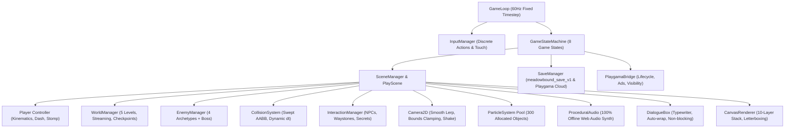

### 1.1 Core Engine Module Integration Mapping

| Engine Module | File Path / Subsystem | Architectural Role & Responsibilities |
| :--- | :--- | :--- |
| **`GameLoop`** | `engine/core/GameLoop.js` | Fixed timestep accumulator loop (`STEP = 1/60s = 0.016667s`, clamped `dt <= 0.10s`), alpha rendering interpolation, zero spiral-of-death. |
| **`CanvasRenderer`** | `engine/rendering/CanvasRenderer.js` | Virtual coordinate scaling ($720 \times 450$), DPR retina crispness, letterbox / pillarbox centering, 10-layer depth stack, screen-to-world conversion. |
| **`Camera2D`** | `engine/camera/Camera2D.js` | Smooth target follow with lerp damping ($6.0$), deadzone window, per-level bounding box clamping, trauma-decay screen shake offset injection. |
| **`InputManager`** | `engine/input/InputManager.js` | Universal input mapping: keyboard, standard Gamepad API, pointer/touch isolation, virtual touch D-pad and Action buttons. |
| **`GameStateMachine`**| `engine/core/GameStateMachine.js` | Global state controller managing 8 core game states: `TITLE`, `HOW_TO_PLAY`, `PLAYING`, `PAUSED`, `LEVEL_TRANSITION`, `BOSS_ENCOUNTER`, `VICTORY`, `GAME_OVER`. |
| **`Player`** | `engine/entities/Player.js` | Sprite kinematics ($a_{\text{ground}}=1200, v_{\text{max}}=200, d_{\text{ground}}=1400$), variable jump, coyote time ($100\text{ms}$), jump buffer ($120\text{ms}$), single Meadow Dash ($450\text{px/s}, 0.18\text{s}$), stomp bounce ($-320\text{px/s}$). |
| **`CollisionSystem`**| `engine/physics/CollisionSystem.js` | Swept AABB with dynamic frame lookahead against solid ground, moving platforms, one-way ledges, hazard spikes, ceiling corner rounding ($2\text{--}4\text{px}$ nudging). |
| **`WorldManager`** | `engine/world/WorldManager.js` | 5 Handcrafted level biomes, moving platforms, thermal updrafts, dissolving cloud ledges, mushroom springboards, secret false wall triggers. |
| **`EnemyManager`** | `engine/entities/EnemyManager.js` | Bestiary controller managing Acorn Walker, Spore Hopper, Glow Bat Flyer, Bramble Charger, hitboxes, hurtboxes, and death FX. |
| **`BossManager`** | `engine/entities/BossManager.js` | Bramblethorn Golem state machine: Phase 1 (Shockwave Slam), Phase 2 (Rolling Briar Spores), Phase 3 (Rage Charge & Stun), Stomp Core vulnerability, Boss health bar. |
| **`DialogueBox`** | `engine/ui/DialogueBox.js` | Centered modal ($560 \times 100\text{px}$), auto-wrapping text ($\le 48$ chars/line, max 3 lines), typewriter sound blips, speaker badge pill, page-advance indicator, 0.20s jump cooldown. |
| **`ParticleSystem`**| `engine/particles/ParticleSystem.js`| Pre-allocated pool of 300 particles: leaf dash streaks, pollen trails, jump dust, landing squash puffs, crystal sparkles, wood splinters, victory confetti. |
| **`ProceduralAudio`**| `engine/audio/ProceduralAudio.js` | Zero external asset dependency Web Audio API synthesizer for all SFX (chirps, thuds, whooshes, chimes, roars, fanfares) and multi-track chiptune BGM loops. |
| **`SaveManager`** | `engine/storage/SaveManager.js` | Schema `meadowbound_save_v1` with local storage and Playgama Cloud sync, handling URL flags `?reset=1`, `?nosave=1`, `?level=N`, `?god=1`. |
| **`PlaygamaBridge`**| `engine/platform/PlaygamaBridge.js` | Official Playgama SDK bridge: initialization, deferred `game_ready` event, tab visibility pausing, and on-screen mute integration. |

---

### 1.2 EventBus Global Event Dictionary

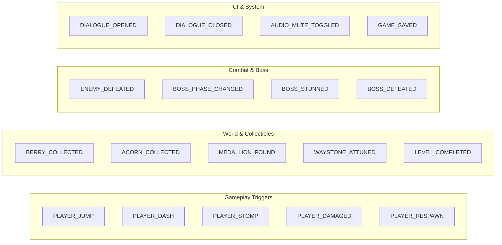

| Event Name | Payload Data Structure | Trigger Source | Listener Reactions |
| :--- | :--- | :--- | :--- |
| `PLAYER_JUMP` | `{ x, y, isDouble }` | `Player` | Emits jump dust particles, plays jump chirp SFX. |
| `PLAYER_DASH` | `{ x, y, direction }` | `Player` | Emits leaf & pollen streak, plays dash whoosh SFX, triggers camera shake ($1\text{px}$). |
| `PLAYER_STOMP` | `{ x, y, enemyType, enemyId }` | `CollisionSystem` | Applies rebound bounce ($-320\text{px/s}$), resets air dash, spawns radial starburst particles, plays stomp pop SFX. |
| `PLAYER_DAMAGED`| `{ damage, hazardX, currentHp }` | `Player` / `Hazard` | Deducts HP, starts $1.5\text{s}$ i-frames ($10\text{Hz}$ flash), applies knockback, plays hurt screech, shakes screen ($4\text{px}$). |
| `PLAYER_RESPAWN` | `{ waystoneId, x, y }` | `GameStateMachine` | Fades out/in ($0.3\text{s}$), sets coordinates to active Waystone, restores 3 Hearts, grants $1.0\text{s}$ spawn shield. |
| `BERRY_COLLECTED`| `{ berryId, count, total, level }` | `Collectible` | Increments berry counter, plays 4-note ascending arpeggio, spawns golden sparkle particles, updates HUD. |
| `ACORN_COLLECTED`| `{ acornId, scoreValue }` | `Collectible` | Adds $+20$ points, plays quick sparkle chime, spawns floating score tag `+20`. |
| `MEDALLION_FOUND`| `{ medallionId, name, lore }` | `SecretTrigger` | Stores medallion, awards $+500$ points, plays discovery fanfare, opens Medallion lore popup. |
| `WAYSTONE_ATTUNED`| `{ waystoneId, level, x, y }` | `Checkpoint` | Illuminates rune to amber, plays harmonic chime, triggers expanding rune ring, executes auto-save. |
| `LEVEL_COMPLETED`| `{ currentLevel, nextLevel }` | `LevelExitGate` | Initiates diamond wipe / iris transition, displays level clear stats, streams next biome. |
| `ENEMY_DEFEATED` | `{ enemyId, type, x, y, pts }` | `Enemy` | Spawns splinters/spores, awards score, plays defeat pop, increments combo stats. |
| `BOSS_PHASE_CHANGED`| `{ newPhase, currentHp, maxHp }` | `BossManager` | Updates boss health bar, triggers Golem roar SFX, spawns phase transition shockwave. |
| `BOSS_STUNNED` | `{ duration, coreX, coreY }` | `BossManager` | Golem enters dazed state, displays spinning dizzy stars overhead, exposes Heart Core stomp hitbox. |
| `BOSS_DEFEATED` | `{ x, y }` | `BossManager` | Triggers freeze-frame ($0.5\text{s}$), petal explosion, spawns Sun Berry 5.5, opens Great Sunburst Ending Altar. |
| `DIALOGUE_OPENED`| `{ npcId, speakerName, pages }` | `InteractionManager` | Halts player kinematics, opens centered `DialogueBox`, starts typewriter audio blips. |
| `DIALOGUE_CLOSED`| `{ npcId }` | `DialogueBox` | Resumes player kinematics, sets $0.20\text{s}$ jump prevention cooldown, updates NPC progression state. |
| `AUDIO_MUTE_TOGGLED`| `{ isMuted }` | `HUD` / `InputManager` | Mutes/unmutes Web Audio master gain, updates HUD icon (`[ 🔊 ]` $\leftrightarrow$ `[ 🔇 ]`), persists setting. |
| `GAME_SAVED` | `{ timestamp, level, berries }` | `SaveManager` | Flashes subtle save disk indicator on top HUD, syncs with Playgama Cloud storage. |

---

## 2. Game State Machine & High-Level Lifecycle

The game implements an explicit, robust, finite state machine preventing state corruption, input bleeding, or orphaned timers.

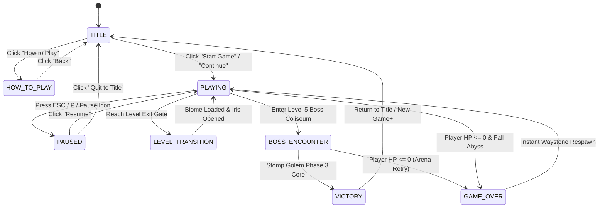

### 2.1 Game State Specification & Transitions

```javascript
export const GameStates = {
  TITLE: 'TITLE',
  HOW_TO_PLAY: 'HOW_TO_PLAY',
  PLAYING: 'PLAYING',
  PAUSED: 'PAUSED',
  LEVEL_TRANSITION: 'LEVEL_TRANSITION',
  BOSS_ENCOUNTER: 'BOSS_ENCOUNTER',
  VICTORY: 'VICTORY',
  GAME_OVER: 'GAME_OVER'
};

export class GameStateMachine {
  constructor(game) {
    this.game = game;
    this.currentState = null;
    this.previousState = null;
    this.transitionTimer = 0;
    this.transitionDuration = 0.5;
    this.transitionType = 'none'; // 'fade' | 'iris' | 'diamond'
    this.transitionCallback = null;
  }

  setState(newState, transitionType = 'none', duration = 0.4, onMidTransition = null) {
    if (this.currentState === newState) return;

    if (transitionType === 'none') {
      this.exitState(this.currentState);
      this.previousState = this.currentState;
      this.currentState = newState;
      this.enterState(newState);
    } else {
      // Smooth animated screen wipe
      this.transitionType = transitionType;
      this.transitionDuration = duration;
      this.transitionTimer = duration;
      this.transitionCallback = () => {
        this.exitState(this.currentState);
        this.previousState = this.currentState;
        this.currentState = newState;
        if (onMidTransition) onMidTransition();
        this.enterState(newState);
      };
    }
  }

  enterState(state) {
    switch (state) {
      case GameStates.TITLE:
        this.game.audio.playMusic('title_theme');
        break;
      case GameStates.PLAYING:
        this.game.audio.playMusic(this.game.world.getCurrentBiomeMusic());
        this.game.playgama.gameplayStart();
        break;
      case GameStates.PAUSED:
        this.game.audio.pauseMusic();
        this.game.playgama.gameplayStop();
        break;
      case GameStates.BOSS_ENCOUNTER:
        this.game.audio.playMusic('boss_theme');
        this.game.hud.showBossHealthBar(true);
        break;
      case GameStates.VICTORY:
        this.game.audio.playMusic('victory_fanfare');
        this.game.playgama.gameplayStop();
        break;
      case GameStates.GAME_OVER:
        this.game.audio.playSfx('game_over_sting');
        break;
    }
  }

  exitState(state) {
    switch (state) {
      case GameStates.PAUSED:
        this.game.audio.resumeMusic();
        break;
      case GameStates.BOSS_ENCOUNTER:
        this.game.hud.showBossHealthBar(false);
        break;
    }
  }

  update(dt) {
    if (this.transitionTimer > 0) {
      this.transitionTimer -= dt;
      if (this.transitionTimer <= this.transitionDuration / 2 && this.transitionCallback) {
        const cb = this.transitionCallback;
        this.transitionCallback = null;
        cb();
      }
    }
  }
}
```

---

## 3. Fixed Timestep Loop & Performance Targets

Platformers demand deterministic, frame-independent physics to guarantee that jump heights, coyote windows, and dash distances remain identical at $60\text{Hz}$, $120\text{Hz}$, $144\text{Hz}$, or during frame drops.

```
+-------------------------------------------------------------------------+
|                  Accumulator-Based Fixed Timestep Loop                  |
|                                                                         |
|  Frame Time (dt) = min(performance.now() - lastTime, 0.10s)             |
|  Accumulator += dt                                                      |
|                                                                         |
|  +-------------------------------------------------------------------+  |
|  |  while (accumulator >= 1/60s) {                                  |  |
|  |      Physics.update(1/60s);                                       |  |
|  |      Entities.update(1/60s);                                      |  |
|  |      Accumulator -= 1/60s;                                        |  |
|  |  }                                                                |  |
|  +-------------------------------------------------------------------+  |
|                                                                         |
|  Render(Alpha = Accumulator / (1/60s));                                 |
+-------------------------------------------------------------------------+
```

### 3.1 Fixed Timestep Engine Implementation

```javascript
export class GameLoop {
  constructor(updateFn, renderFn) {
    this.update = updateFn;
    this.render = renderFn;
    this.lastTime = 0;
    this.accumulator = 0;
    this.STEP = 1 / 60; // Exact 60Hz physics tick (16.6667ms)
    this.MAX_ACCUMULATOR = 0.10; // Clamped to prevent spiral-of-death on backgrounding
    this.isRunning = false;
    this.rafId = null;
    this.loop = this.loop.bind(this);
  }

  start() {
    if (this.isRunning) return;
    this.isRunning = true;
    this.lastTime = performance.now();
    this.accumulator = 0;
    this.rafId = requestAnimationFrame(this.loop);
  }

  stop() {
    this.isRunning = false;
    if (this.rafId) cancelAnimationFrame(this.rafId);
  }

  loop(currentTime) {
    if (!this.isRunning) return;

    let delta = (currentTime - this.lastTime) / 1000;
    this.lastTime = currentTime;

    // Clamp delta time to avoid large jumps after tab switching
    if (delta > this.MAX_ACCUMULATOR) {
      delta = this.MAX_ACCUMULATOR;
    }

    this.accumulator += delta;

    // Consume fixed physics steps
    while (this.accumulator >= this.STEP) {
      this.update(this.STEP);
      this.accumulator -= this.STEP;
    }

    // Alpha interpolation ratio for perfectly smooth sub-frame rendering
    const alpha = this.accumulator / this.STEP;
    this.render(alpha);

    this.rafId = requestAnimationFrame(this.loop);
  }
}
```

### 3.2 Performance Budgets & Zero-GC Guarantees

1. **Memory Allocations**:
   - Particle System: Fixed pre-allocated pool of **300 Particle** structs. Reused continuously via index ring buffer.
   - Combat & Projectiles: Fixed pool of **50 Projectile** structs (boss thorns, spore balls).
   - Floating Combat Text: Fixed pool of **20 TextTag** structs.
   - Vector Scratchpad: Reusable global `{ x: 0, y: 0 }` and bounding box `{ x: 0, y: 0, w: 0, h: 0 }` singletons.
2. **CPU & Render Frame Budgets**:
   - Physics & AI Step: $\le 4.5\text{ ms}$ per tick.
   - 2D Canvas Render Pass: $\le 6.0\text{ ms}$ at $720 \times 450$.
   - Garbage Collection Pause: **$0.0\text{ ms}$ in active gameplay loops**.

---

## 4. Input Architecture & Unified Keybinding Matrix

The input system decouples hardware raw events (Keyboard, Gamepad, Touch, Pointer) into canonical logical action flags, preventing action conflicts and handling mobile touch cleanly.

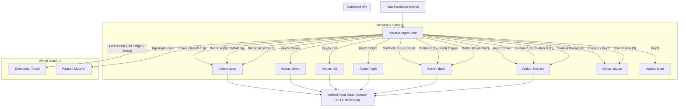

### 4.1 Universal Keybinding Matrix

| Logical Action | Primary Key | Secondary Key | Gamepad Mapping | Touch / Pointer Control |
| :--- | :--- | :--- | :--- | :--- |
| **`jump`** | `Space` | `KeyW`, `ArrowUp`, `KeyK` | Button A (0), D-Pad Up | Virtual Button `[A]` (Green, Bottom-Right) |
| **`dash`** | `ShiftLeft` / `ShiftRight` | `KeyJ`, `KeyX` | Button X (2), Right Trigger | Virtual Button `[B]` (Amber, Bottom-Right) |
| **`interact`** | `KeyE` | `Enter` | Button Y (3), Button B (1) | Diegetic Prompt Tap / Context Button `[E]` |
| **`left`** | `KeyA` | `ArrowLeft` | D-Pad Left, Left Stick Left | Virtual D-Pad Left / Touch Drag Left |
| **`right`** | `KeyD` | `ArrowRight` | D-Pad Right, Left Stick Right | Virtual D-Pad Right / Touch Drag Right |
| **`down`** | `KeyS` | `ArrowDown` | D-Pad Down, Left Stick Down | Virtual D-Pad Down / Touch Drag Down |
| **`pause`** | `Escape` | `KeyP` | Start / Menu Button (9) | Top-Left Pause Icon `[ ⏸ ]` |
| **`mute`** | `KeyM` | — | — | Top-Right Audio Icon `[ 🔊 / 🔇 ]` |

---

## 5. Player Kinematics, State Machine & Movement Systems

Pip the Woodland Sprite is designed with pixel-perfect, snappy 16-bit platformer kinematics combined with modern game-feel mechanics (coyote time, jump buffering, landing squash, single air-dash, stomp rebound).

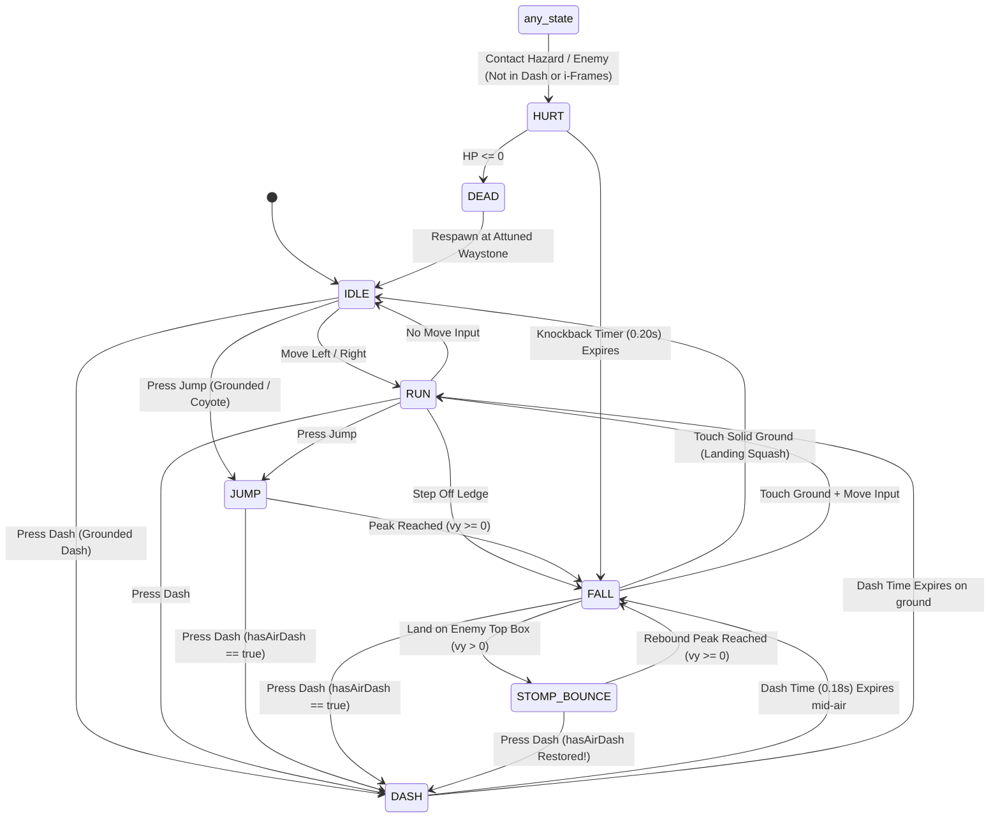

### 5.1 Kinematic Parameters & Physics Formulas

$$\begin{aligned}
v_{x}(t + \Delta t) &= \begin{cases} 
\text{approach}(v_x, \text{dir} \cdot v_{\text{max}}, a_{\text{ground}} \cdot \Delta t) & \text{if grounded and } \text{dir} \neq 0 \\
\text{approach}(v_x, 0, d_{\text{ground}} \cdot \Delta t) & \text{if grounded and } \text{dir} = 0 \\
\text{approach}(v_x, \text{dir} \cdot v_{\text{max}}, a_{\text{air}} \cdot \Delta t) & \text{if airborne and } \text{dir} \neq 0 \\
\text{approach}(v_x, 0, d_{\text{air}} \cdot \Delta t) & \text{if airborne and } \text{dir} = 0
\end{cases} \\
v_{y}(t + \Delta t) &= \begin{cases}
0 & \text{if dashing} \\
\min(v_y + g \cdot \Delta t, v_{\text{terminal}}) & \text{if standard airborne} \\
\min(v_y + g_{\text{cut}} \cdot \Delta t, v_{\text{terminal}}) & \text{if jump button released while } v_y < 0
\end{cases}
\end{aligned}$$

| Kinematic Parameter | Numerical Tuning Value | Platforming Behavior & Rationale |
| :--- | :--- | :--- |
| **$v_{\text{max}}$ (Max Run Speed)** | $200\text{ px/s}$ | Nimble, responsive traverse speed across $720\text{px}$ screen. |
| **$a_{\text{ground}}$ (Ground Acceleration)** | $1200\text{ px/s}^2$ | Reaches top running speed in $0.166\text{s}$ (instant feel). |
| **$d_{\text{ground}}$ (Ground Friction / Decel)**| $1400\text{ px/s}^2$ | Snappy stop in $0.142\text{s}$ without slippery sliding. |
| **$a_{\text{air}}$ (Airborne Acceleration)** | $900\text{ px/s}^2$ | High air control for precision mid-air steering. |
| **$d_{\text{air}}$ (Airborne Drag)** | $400\text{ px/s}^2$ | Natural momentum conservation when releasing keys mid-flight. |
| **$v_{\text{jump}}$ (Jump Impulse)** | $-390\text{ px/s}$ | Produces a maximum apex height of $77.6\text{px}$ ($h = v^2 / 2g$). |
| **$v_{\text{jump\_cut}}$ (Early Jump Release Cap)**| $-140\text{ px/s}$ | Releasing Jump early caps upward speed for micro-hops. |
| **$g$ (Gravity)** | $980\text{ px/s}^2$ | Weighty, crisp descent preventing floatiness. |
| **$v_{\text{terminal}}$ (Fall Clamp)** | $480\text{ px/s}$ | High-speed fall cap eliminating tunneling through geometry. |
| **$t_{\text{coyote}}$ (Coyote Time)** | $0.10\text{ s (100ms)}$ | Generous window allowing jumping after walking off ledges. |
| **$t_{\text{buffer}}$ (Jump Buffer)** | $0.12\text{ s (120ms)}$ | Pre-landing jump inputs execute immediately upon touching ground. |
| **$v_{\text{dash}}$ (Meadow Dash Speed)** | $450\text{ px/s}$ | Rapid forward burst covering $81\text{px}$ horizontally in $0.18\text{s}$. |
| **$t_{\text{dash}}$ (Meadow Dash Duration)** | $0.18\text{ s}$ | $v_y$ locked to $0\text{ px/s}$; player is invulnerable to hazards. |
| **Air Dash Constraint** | **Strictly 1x per airborne phase** | Resets on solid ground touch or enemy stomp. |
| **$v_{\text{rebound}}$ (Stomp Rebound Bounce)** | $-320\text{ px/s}$ | High upward bounce off stomped enemies; restores air dash. |

### 5.2 Player Kinematics Implementation Code

```javascript
export class Player {
  constructor(x, y) {
    this.x = x;
    this.y = y;
    this.vx = 0;
    this.vy = 0;
    this.width = 18;
    this.height = 26;
    this.facingDirection = 1; // 1: Right, -1: Left

    this.health = 3;
    this.maxHealth = 3;
    this.isGrounded = false;
    this.wasGrounded = false;

    // Movement timers
    this.coyoteTimer = 0;
    this.jumpBufferTimer = 0;
    this.dashTimer = 0;
    this.hasAirDash = true;
    this.invulnerableTimer = 0;
    this.knockbackTimer = 0;
    this.dialogueCooldownTimer = 0;

    // Visual squash and stretch
    this.scaleX = 1.0;
    this.scaleY = 1.0;
    this.state = 'IDLE'; // IDLE, RUN, JUMP, FALL, DASH, HURT
  }

  updatePhysics(input, dt, world, combat, particles, audio, juice) {
    // 1. Update Timers
    if (this.invulnerableTimer > 0) this.invulnerableTimer -= dt;
    if (this.knockbackTimer > 0) this.knockbackTimer -= dt;
    if (this.dialogueCooldownTimer > 0) this.dialogueCooldownTimer -= dt;

    if (this.isGrounded) {
      this.coyoteTimer = 0.10;
      this.hasAirDash = true; // Reset air dash on ground
      if (!this.wasGrounded) {
        // Landing Squash & Dust Puff
        this.scaleX = 1.25;
        this.scaleY = 0.75;
        particles.burst(this.x, this.y + this.height / 2, 6, '#A3D977');
        audio.playLand();
      }
    } else {
      this.coyoteTimer -= dt;
    }
    this.wasGrounded = this.isGrounded;

    // Jump buffer input capture
    if (input.isJustPressed('jump') && this.dialogueCooldownTimer <= 0) {
      this.jumpBufferTimer = 0.12;
    } else if (this.jumpBufferTimer > 0) {
      this.jumpBufferTimer -= dt;
    }

    // Recover squash & stretch to equilibrium
    this.scaleX += (1.0 - this.scaleX) * 12 * dt;
    this.scaleY += (1.0 - this.scaleY) * 12 * dt;

    // 2. Process Knockback State
    if (this.knockbackTimer > 0) {
      this.vy = Math.min(this.vy + 980 * dt, 480);
      return;
    }

    // 3. Process Meadow Dash
    if (this.state === 'DASH') {
      this.dashTimer -= dt;
      this.vx = this.facingDirection * 450;
      this.vy = 0; // Lock gravity during dash

      // Emit pollen and emerald leaf particles
      if (Math.random() < 0.6) {
        particles.spawnPollen(this.x, this.y + (Math.random() - 0.5) * 10, this.facingDirection);
      }

      if (this.dashTimer <= 0) {
        this.state = this.isGrounded ? 'IDLE' : 'FALL';
        this.vx *= 0.5; // Smooth decel after dash
      }
      return;
    }

    // 4. Initiate Meadow Dash (Strict 1x mid-air rule)
    if (input.isJustPressed('dash') && this.knockbackTimer <= 0) {
      if (this.isGrounded || this.hasAirDash) {
        if (!this.isGrounded) {
          this.hasAirDash = false; // Consume single air dash
        }
        this.state = 'DASH';
        this.dashTimer = 0.18;
        this.invulnerableTimer = Math.max(this.invulnerableTimer, 0.18);
        this.scaleX = 1.35;
        this.scaleY = 0.70;
        audio.playDash();
        juice.screenShake(1);
        particles.burst(this.x, this.y, 8, '#FDB813');
        return;
      } else {
        // Subtle fizzle puff when trying to dash without charge
        particles.burst(this.x, this.y, 3, 'rgba(255,255,255,0.4)');
      }
    }

    // 5. Horizontal Steering
    const moveDir = (input.isDown('right') ? 1 : 0) - (input.isDown('left') ? 1 : 0);
    if (moveDir !== 0) {
      this.facingDirection = moveDir;
      const accel = this.isGrounded ? 1200 : 900;
      this.vx = this.approach(this.vx, moveDir * 200, accel * dt);
    } else {
      const decel = this.isGrounded ? 1400 : 400;
      this.vx = this.approach(this.vx, 0, decel * dt);
    }

    // 6. Jump Initiation (Grounded Jump & Coyote Jump)
    if (this.jumpBufferTimer > 0 && this.coyoteTimer > 0) {
      this.vy = -390;
      this.jumpBufferTimer = 0;
      this.coyoteTimer = 0;
      this.isGrounded = false;
      this.state = 'JUMP';
      this.scaleX = 0.75;
      this.scaleY = 1.30;
      audio.playJump();
      particles.burst(this.x, this.y + this.height / 2, 5, '#FFFFFF');
    }

    // 7. Variable Jump Cutoff
    if (!input.isDown('jump') && this.vy < -140) {
      this.vy = -140; // Cap vertical ascent upon button release
    }

    // 8. Gravity Integration
    this.vy = Math.min(this.vy + 980 * dt, 480);

    // 9. Update Visual State
    if (!this.isGrounded) {
      this.state = this.vy < 0 ? 'JUMP' : 'FALL';
    } else {
      this.state = Math.abs(this.vx) > 15 ? 'RUN' : 'IDLE';
    }
  }

  approach(current, target, step) {
    if (current < target) return Math.min(current + step, target);
    return Math.max(current - step, target);
  }

  triggerDamage(amount, hazardSourceX) {
    if (this.invulnerableTimer > 0 || this.state === 'DASH') return;

    this.health = Math.max(0, this.health - amount);
    this.invulnerableTimer = 1.5; // 1.5s i-frames
    this.knockbackTimer = 0.20;

    // Knockback vector
    const kbDir = this.x < hazardSourceX ? -1 : 1;
    this.vx = kbDir * 160;
    this.vy = -180;
    this.isGrounded = false;
    this.state = 'HURT';
  }

  triggerStompBounce() {
    this.vy = -320;
    this.hasAirDash = true; // Stomp resets air dash!
    this.isGrounded = false;
    this.scaleX = 1.30;
    this.scaleY = 0.70;
  }
}
```

---

## 6. Collision System & Swept AABB Physics

The collision system implements dynamic frame-lookahead swept AABB physics to eliminate high-speed tunneling, alongside $2\text{--}4\text{px}$ corner rounding to prevent snagging on ceiling edges or platforms.

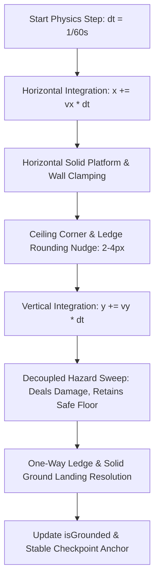

### 6.1 Collision Geometry & Corner Nudging Specification

```javascript
export class CollisionSystem {
  constructor() {
    this.halfWidth = 9;
    this.halfHeight = 13;
  }

  resolveWorldCollisions(player, platforms, hazards, springboards, movingPlatforms, dt, audio, juice, particles) {
    let wasGrounded = player.isGrounded;
    player.isGrounded = false;

    // 1. Horizontal Position Update & Solid Wall Collision
    player.x += player.vx * dt;
    for (const plat of platforms) {
      if (plat.type === 'one_way') continue; // One-way platforms don't block horizontal movement

      const pLeft = plat.x;
      const pRight = plat.x + plat.w;
      const pTop = plat.y;
      const pBottom = plat.y + plat.h;

      // Vertical overlap check
      if (player.y + this.halfHeight - 2 > pTop && player.y - this.halfHeight + 2 < pBottom) {
        if (player.vx > 0 && player.x + this.halfWidth >= pLeft && player.x - this.halfWidth < pLeft) {
          player.x = pLeft - this.halfWidth;
          player.vx = 0;
        } else if (player.vx < 0 && player.x - this.halfWidth <= pRight && player.x + this.halfWidth > pRight) {
          player.x = pRight + this.halfWidth;
          player.vx = 0;
        }
      }
    }

    // 2. Vertical Position Update
    player.y += player.vy * dt;
    const lookahead = Math.max(player.vy * dt, 4);

    // 3. Decoupled Hazard Sweep (Does NOT clear floor grounding prematurely)
    for (const haz of hazards) {
      const hLeft = haz.x;
      const hRight = haz.x + haz.w;
      const hTop = haz.y;
      const hBottom = haz.y + haz.h;

      if (player.x + this.halfWidth > hLeft && player.x - this.halfWidth < hRight) {
        if (player.y + this.halfHeight >= hTop - 2 && player.y - this.halfHeight <= hBottom) {
          player.triggerDamage(1, haz.x + haz.w / 2);
          audio.playDamageHurt();
          juice.screenShake(4);
          particles.burst(player.x, player.y, 8, '#FF5252');
        }
      }
    }

    // 4. Springboard Mushrooms Resolution (High Vertical Chute)
    for (const spring of springboards) {
      if (player.x + this.halfWidth > spring.x && player.x - this.halfWidth < spring.x + spring.w) {
        if (player.vy > 0 && player.y + this.halfHeight >= spring.y - 4 && player.y + this.halfHeight <= spring.y + 12) {
          player.y = spring.y - this.halfHeight;
          player.vy = -620; // High vertical launch
          player.isGrounded = false;
          player.hasAirDash = true; // Refresh air dash!
          spring.triggerBounceAnimation();
          audio.playSporeBounce();
          juice.screenShake(3);
          particles.burst(player.x, spring.y, 10, '#FF4081');
          return;
        }
      }
    }

    // 5. Solid & One-Way Platform Vertical Resolution
    for (const plat of platforms) {
      const pLeft = plat.x;
      const pRight = plat.x + plat.w;
      const pTop = plat.y;
      const pBottom = plat.y + plat.h;

      // Horizontal overlap check with 2px inset forgiveness
      if (player.x + this.halfWidth - 2 > pLeft && player.x - this.halfWidth + 2 < pRight) {
        // Landing Downward on Platform
        if (player.vy >= 0) {
          if (player.y + this.halfHeight <= pTop + lookahead + 2 && player.y + this.halfHeight >= pTop - 6) {
            player.y = pTop - this.halfHeight;
            player.vy = 0;
            player.isGrounded = true;
            break;
          }
        }
        // Ceiling Collision (Solid Platforms Only)
        else if (player.vy < 0 && plat.type !== 'one_way') {
          if (player.y - this.halfHeight >= pBottom - Math.abs(player.vy * dt) - 4 && player.y - this.halfHeight <= pBottom + 4) {
            // Ceiling Corner Rounding (2-4px Nudge)
            const distToLeftEdge = Math.abs((player.x + this.halfWidth) - pLeft);
            const distToRightEdge = Math.abs((player.x - this.halfWidth) - pRight);

            if (distToLeftEdge <= 4) {
              player.x -= 4; // Nudge left around corner
            } else if (distToRightEdge <= 4) {
              player.x += 4; // Nudge right around corner
            } else {
              player.y = pBottom + this.halfHeight;
              player.vy = 0;
            }
          }
        }
      }
    }
  }
}
```

---

## 7. 5-Level Architecture & Streaming / Transition System

The world is structured into 5 handcrafted biomes with progressive mechanics, clearances $\ge 70\text{px}$, two-way pit traversal, and instant Waystone checkpoint recovery.

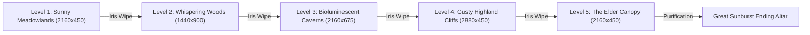

### 7.1 Level Design & Clearances Matrix

| Level ID & Name | Dimensions ($W \times H$) | Biome Palette & Mood | Mechanics & Geometry | Collectibles & Checkpoints |
| :--- | :--- | :--- | :--- | :--- |
| **Level 1: Sunny Meadowlands** | $2160 \times 450\text{px}$ | Sunlit yellow (`#FFF9D2`), pastel grass (`#76C043`), sky blue (`#68C5DB`) | Gentle rolling slopes, $160\text{px}$ chasm teaching Meadow Dash, Acorn Walkers, Barnaby Snail. | 5 Sun Berries, 10 Golden Acorns, `waystone_1` ($x=1240$), **Medallion of Dawn** in false ivy curtain. |
| **Level 2: Whispering Woods** | $1440 \times 900\text{px}$ | Forest emerald (`#2D5A27`), amber sunbeams (`rgba(255,245,180,0.15)`) | 2-Tier vertical canopy ascent, oscillating mossy branch platforms, one-way leaf drops, Spore Hoppers. | 5 Sun Berries, 10 Golden Acorns, `waystone_2` ($x=720, y=480$), **Medallion of Whispers** in tree hollow. |
| **Level 3: Bioluminescent Caverns**| $2160 \times 675\text{px}$ | Deep indigo (`#161338`), neon cyan (`#00F5D4`), crystal violet (`#C77DFF`) | Mushroom launch pads ($v_y=-620$), crystal hazard spike beds, sine-flying Glow Bats used as stomp stepping stones. | 5 Sun Berries, 10 Golden Acorns, `waystone_3` ($x=1080$), **Medallion of Luminescence** in deep crystal shaft. |
| **Level 4: Gusty Highland Cliffs** | $2880 \times 450\text{px}$ | Azure sky (`#3A86FF`), sunset gold (`#FFB703`), wind gale trails | Thermal wind updrafts ($v_y=-220$), dissolving cloud ledges ($1.0\text{s}$ wobble / $2.0\text{s}$ reset), Bramble Chargers. | 5 Sun Berries, 10 Golden Acorns, `waystone_4` ($x=1500$), **Medallion of Zephyr** in cliffside cloud alcove. |
| **Level 5: The Elder Canopy** | $2160 \times 450\text{px}$ | Radiant amber (`#FFAA00`), royal violet (`#3C096C`), sacred embers | Master gauntlet combining all mechanics, Willow Owl sanctuary, Bramblethorn Golem Coliseum, Ending Altar. | 5 Sun Berries (5.5 on Boss win), 10 Golden Acorns, `waystone_5` ($x=980$), **Medallion of the Ancients**. |

### 7.2 Checkpoint Waystone & Instant Respawn Architecture

- **Attunement**: When Pip touches within $30\text{px}$ of a Waystone, `lastCheckpointId` is updated in `SaveManager`, rune lights illuminate from dormant cyan to bright amber, and a harmonic chord chime plays.
- **Abyss / Hazard Death Recovery**: If Pip loses all 3 Hearts or falls into a pit abyss:
  1. $0.25\text{s}$ screen fade to black.
  2. Pip's position resets directly to the attuned Waystone $(x, y - 10)$.
  3. Health restores to maximum 3 Hearts.
  4. All collected Sun Berries, Medallions, and Acorns remain **100% preserved**.
  5. Pip receives $1.0\text{s}$ spawn invulnerability shield ($10\text{Hz}$ flash).

---

## 8. Enemy Bestiary & AI Behaviors

The bestiary provides 4 distinct mechanical archetypes requiring distinct player movement responses.

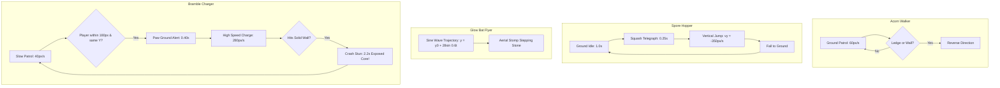

### 8.1 Enemy Archetypes Specification Table

| Enemy Archetype | Dimensions ($W \times H$) | HP | Speed / Behavior | Stomp Vulnerability | Juice & Defeat Effects |
| :--- | :--- | :-: | :--- | :--- | :--- |
| **Acorn Walker** | $20 \times 22\text{px}$ | 1 | $60\text{ px/s}$ platform patrol, cliff & wall edge detection. | Top 6px always vulnerable. | Woody pop audio, acorn cap flies in arc, 6 wood splinters (+50 pts). |
| **Spore Hopper** | $22 \times 24\text{px}$ | 1 | Rhythmic: $1.0\text{s}$ idle $\to 0.25\text{s}$ squash $\to -350\text{ px/s}$ jump. | Vulnerable at all times; gives $+350\text{ px/s}$ super bounce. | Squish chime, 8 green spore particles, extra bounce (+75 pts). |
| **Glow Bat Flyer** | $24 \times 18\text{px}$ | 1 | Aerial sine: $y(t)=y_0 + 28\sin(2\pi \times 0.6t)$, $70\text{ px/s}$ horizontal. | Top-down stompable; resets air dash for chaining ravines. | Bioluminescent sparkle explosion, cyan radial flash (+100 pts). |
| **Bramble Charger**| $32 \times 24\text{px}$ | 1 | $40\text{ px/s}$ patrol $\to 0.4\text{s}$ paw windup $\to 280\text{ px/s}$ charge. | **ONLY stompable during 2.2s Wall-Crash Stun**. | Wall crash screen shake ($3\text{px}$), dizzy stars overhead, splinter burst (+150 pts). |

---

## 9. Climax Boss: The Bramblethorn Golem

The climax boss in Level 5 combines evasion, precision jumping, and stomp mechanics across 3 escalating phases.

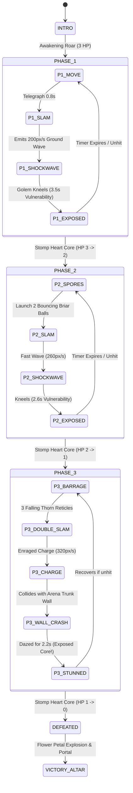

### 9.1 Arena Dimensions & Phase Specifications

- **Arena**: $720 \times 450\text{px}$, Floor at $y=390$, Left Bough ($x=80\text{--}220, y=260$), Right Bough ($x=500\text{--}640, y=260$).
- **Golem Hitbox**: Width = $64\text{px}$, Height = $74\text{px}$.
- **Solar Heart Core**: Top-mounted hitbox ($32 \times 16\text{px}$, $y = \text{golem.y} - 32$).

```javascript
export class BramblethornGolem {
  constructor(arenaX, arenaY) {
    this.x = arenaX;
    this.y = arenaY;
    this.width = 64;
    this.height = 74;
    this.health = 3;
    this.maxHealth = 3;
    this.phase = 1;

    this.state = 'IDLE'; // IDLE, MOVE, SLAM_WINDUP, SLAM, SPORES, CHARGE, WALL_CRASH, EXPOSED, HURT
    this.stateTimer = 0;
    this.isCoreExposed = false;
    this.shockwaves = [];
    this.briarBalls = [];
    this.fallingThorns = [];
  }

  update(dt, player, particles, audio, juice) {
    this.stateTimer -= dt;

    switch (this.state) {
      case 'SLAM_WINDUP':
        if (this.stateTimer <= 0) {
          this.state = 'SLAM';
          audio.playBossSlam();
          juice.screenShake(6);
          particles.burst(this.x, this.y + this.height / 2, 20, '#8D6E63');
          // Spawn horizontal ground shockwaves traveling left and right
          const speed = this.phase === 1 ? 200 : 260;
          this.shockwaves.push({ x: this.x, y: 380, vx: -speed, width: 24, height: 16 });
          this.shockwaves.push({ x: this.x, y: 380, vx: speed, width: 24, height: 16 });
          
          // Enter exposed vulnerability window
          this.state = 'EXPOSED';
          this.isCoreExposed = true;
          this.stateTimer = this.phase === 1 ? 3.5 : 2.6;
        }
        break;

      case 'EXPOSED':
        if (this.stateTimer <= 0) {
          this.isCoreExposed = false;
          this.state = this.phase === 2 ? 'SPORES' : (this.phase === 3 ? 'CHARGE' : 'MOVE');
          this.stateTimer = 1.0;
        }
        break;

      case 'CHARGE':
        this.x += (player.x < this.x ? -1 : 1) * 320 * dt;
        // Check arena wall collision
        if (this.x <= 40 || this.x >= 680) {
          this.state = 'WALL_CRASH';
          this.isCoreExposed = true;
          this.stateTimer = 2.2;
          audio.playBossCrash();
          juice.screenShake(8);
          particles.burst(this.x, this.y, 25, '#FFD54F');
        }
        break;

      case 'WALL_CRASH':
        if (this.stateTimer <= 0) {
          this.isCoreExposed = false;
          this.state = 'MOVE';
          this.stateTimer = 1.2;
        }
        break;
    }
  }
}
```

---

## 10. Procedural Web Audio Synthesizer

The audio engine relies exclusively on the **Web Audio API**, generating all music and sound effects procedurally with zero external asset loading dependencies.

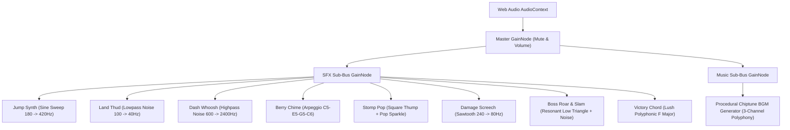

### 10.1 Procedural SFX Synthesis Parameters

| Sound Effect | Waveform / Oscillator | Frequency Modulation Envelope | Duration | Audio Description |
| :--- | :--- | :--- | :-: | :--- |
| **Jump Chirp** | Sine wave | $180\text{Hz} \to 420\text{Hz}$ exponential ramp | $0.12\text{s}$ | Cheerful upward chirp with quick attack. |
| **Land Thud** | Low-pass filtered noise | $100\text{Hz} \to 40\text{Hz}$ resonant cutoff | $0.10\text{s}$ | Soft grassy landing impact. |
| **Meadow Dash** | High-pass filtered white noise | $600\text{Hz} \to 2400\text{Hz}$ sweep | $0.18\text{s}$ | Airy, energetic wind whoosh. |
| **Berry Collect** | Sine arpeggio (4 notes) | $C_5 (523) \to E_5 (659) \to G_5 (784) \to C_6 (1046\text{Hz})$ | $0.25\text{s}$ | Radiant, uplifting golden pickup chime. |
| **Acorn Collect** | Dual sine blip | $880\text{Hz} \to 1320\text{Hz}$ instant | $0.08\text{s}$ | Bright mini sparkle tone. |
| **Stomp / Bounce** | Square + Sine pop | Thump ($120 \to 60\text{Hz}$) + Sparkle ($600 \to 900\text{Hz}$) | $0.10\text{s}$ | Crunchy, punchy cartoon head pop. |
| **Damage Hurt** | Sawtooth + Distortion | $240\text{Hz} \to 80\text{Hz}$ pitch drop | $0.20\text{s}$ | Gritty retro hurt thud. |
| **Boss Slam** | Triangle + Resonant noise | $80\text{Hz} \to 30\text{Hz}$ low boom | $0.45\text{s}$ | Heavy seismic earth tremor. |
| **Boss Roar** | Modulated Sawtooth | $160\text{Hz} \to 70\text{Hz}$ with $8\text{Hz}$ LFO tremolo | $0.60\text{s}$ | Menacing corrupted golem roar. |
| **Victory Fanfare**| Polyphonic Sine / Triangle | $F_4, A_4, C_5, F_5$ chord with shimmering decay | $1.80\text{s}$ | Majestic harmonic chord sequence. |

### 10.2 Audio Context Unlocking & Visibility Handler

```javascript
export class ProceduralAudio {
  constructor() {
    this.ctx = null;
    this.masterGain = null;
    this.isMuted = false;
    this.isInitialized = false;
  }

  init() {
    if (this.isInitialized) return;
    const AudioCtx = window.AudioContext || window.webkitAudioContext;
    this.ctx = new AudioCtx();
    this.masterGain = this.ctx.createGain();
    this.masterGain.gain.setValueAtTime(this.isMuted ? 0 : 0.35, this.ctx.currentTime);
    this.masterGain.connect(this.ctx.destination);
    this.isInitialized = true;
  }

  toggleMute() {
    this.isMuted = !this.isMuted;
    if (this.masterGain && this.ctx) {
      this.masterGain.gain.setValueAtTime(this.isMuted ? 0 : 0.35, this.ctx.currentTime);
    }
    return this.isMuted;
  }

  playBerryCollect() {
    if (!this.isInitialized || this.isMuted) return;
    const notes = [523.25, 659.25, 783.99, 1046.50]; // C5, E5, G5, C6
    notes.forEach((freq, idx) => {
      const osc = this.ctx.createOscillator();
      const gain = this.ctx.createGain();
      osc.type = 'sine';
      osc.frequency.setValueAtTime(freq, this.ctx.currentTime + idx * 0.05);
      
      gain.gain.setValueAtTime(0.2, this.ctx.currentTime + idx * 0.05);
      gain.gain.exponentialRampToValueAtTime(0.001, this.ctx.currentTime + idx * 0.05 + 0.15);
      
      osc.connect(gain);
      gain.connect(this.masterGain);
      
      osc.start(this.ctx.currentTime + idx * 0.05);
      osc.stop(this.ctx.currentTime + idx * 0.05 + 0.15);
    });
  }
}
```

---

## 11. Save / Load Persistence & Playgama Bridge Integration

Persistence guarantees reliable progression saving to `localStorage` and synchronizes with Playgama Cloud Storage.

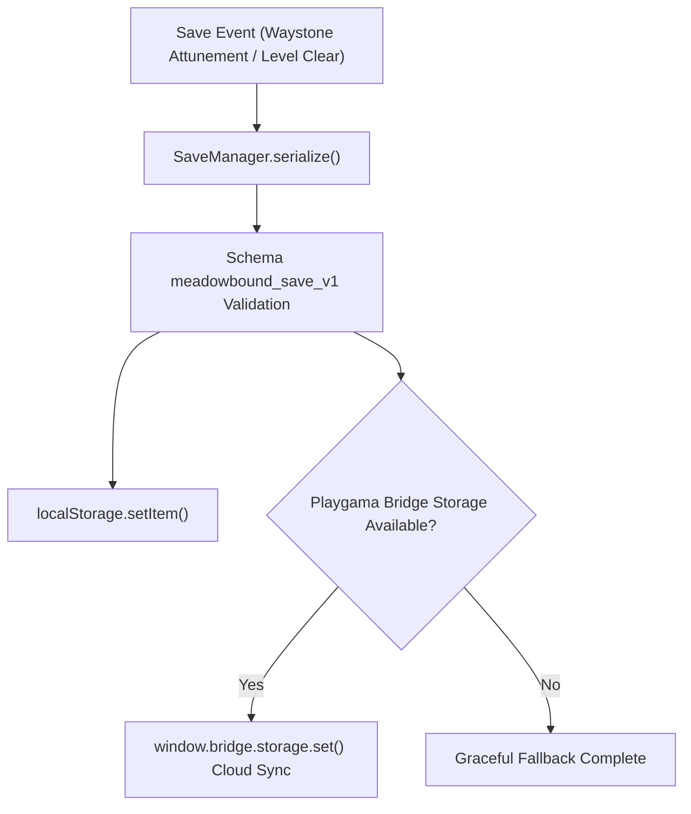

### 11.1 Save Data Schema (`meadowbound_save_v1`)

```json
{
  "version": 1,
  "currentLevel": 1,
  "lastCheckpointId": "waystone_1",
  "playerHealth": 3,
  "score": 0,
  "deaths": 0,
  "playtimeSeconds": 0,
  "sunBerriesCollected": [],
  "goldenAcornsCollected": [],
  "medallionsCollected": [],
  "bossDefeated": false,
  "audioMuted": false,
  "timestamp": 1771156800000
}
```

### 11.2 Playgama SDK Bridge Integration Lifecycle

1. **Initialization**: Initialize `window.bridge` asynchronously on startup.
2. **Game Ready Event**: Dispatch `window.bridge.platform.sendMessage('game_ready')` **ONLY after the interactive title screen or initial level has rendered and awaits player input**.
3. **Visibility & Background Pausing**: Pause physics loop and mute audio on `hidden` state; resume on `visible`.
4. **URL Debugging & QA Flags**:
   - `?reset=1`: Purges `localStorage` and boots clean state.
   - `?nosave=1`: Ephemeral mode (disables persistence).
   - `?level=N`: Directly boots Level $N$ ($1 \le N \le 5$).
   - `?god=1`: Invulnerability mode for level design & collision verification.

---

## 12. 10-Layer Rendering Stack & Visual Polish

Canvas rendering executes across 10 deterministic depth layers to deliver lush parallax, crisp gameplay sprites, and diegetic lighting.

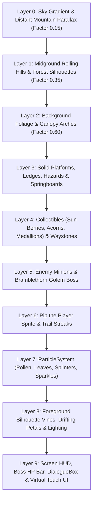

### 12.1 Responsive Canvas Scaling & Letterbox Fit

```javascript
export class CanvasRenderer {
  constructor(canvas) {
    this.canvas = canvas;
    this.ctx = canvas.getContext('2d');
    this.virtualWidth = 720;
    this.virtualHeight = 450;
    this.scale = 1;
    this.offsetX = 0;
    this.offsetY = 0;
    this.resize = this.resize.bind(this);
    window.addEventListener('resize', this.resize);
    this.resize();
  }

  resize() {
    const windowWidth = window.innerWidth;
    const windowHeight = window.innerHeight;
    const targetAspect = 720 / 450; // 16:9
    const windowAspect = windowWidth / windowHeight;

    let displayWidth, displayHeight;
    if (windowAspect > targetAspect) {
      // Pillarbox (Black bars on left/right)
      displayHeight = windowHeight;
      displayWidth = windowHeight * targetAspect;
    } else {
      // Letterbox (Black bars on top/bottom)
      displayWidth = windowWidth;
      displayHeight = windowWidth / targetAspect;
    }

    const dpr = window.devicePixelRatio || 1;
    this.canvas.width = 720 * dpr;
    this.canvas.height = 450 * dpr;
    this.canvas.style.width = `${displayWidth}px`;
    this.canvas.style.height = `${displayHeight}px`;

    this.ctx.setTransform(1, 0, 0, 1, 0, 0); // Reset transform
    this.ctx.scale(dpr, dpr);
    this.ctx.imageSmoothingEnabled = false; // Pixel-perfect 2D rendering
  }
}
```

---

## 13. Quality Assurance & Acceptance Matrix

| Verification Area | Acceptance Criteria & Pass Conditions | Verification Method |
| :--- | :--- | :--- |
| **Physics Timestep** | Identical jump heights, dash reach ($81\text{px}$), and fall curves across $60\text{Hz}$, $120\text{Hz}$, and $144\text{Hz}$ monitors. | Frame-rate throttle testing via Chrome DevTools. |
| **Kinematics Feel** | $100\text{ms}$ Coyote time allows jumping off ledges; $120\text{ms}$ buffer executes on landing; 1x air dash strictly enforced. | Manual edge-stepping and rapid button tap verification. |
| **Swept Collision** | Zero tunneling through ground/walls at terminal fall speed ($480\text{px/s}$) or dash speed ($450\text{px/s}$). $2\text{--}4\text{px}$ corner rounding prevents snagging. | High-speed fall and corner-brush testing across all levels. |
| **Boss Phases** | Golem executes Phase 1 slams $\to$ Phase 2 spores $\to$ Phase 3 enraged charge & stun cleanly. Core stomps deduct 1 HP per phase. | Climax boss combat run with full phase progression. |
| **Procedural Audio** | All 10 sound effects synthesize cleanly without clicks, clipping, or unhandled exceptions. Audio mutes on tab switch. | Web Audio graph inspection & tab blur testing. |
| **Save Persistence** | Game saves upon Waystone attunement; reload restores exact collected berries, score, and coordinates without corruption. | Refresh test + URL flag `?reset=1` and `?nosave=1` checks. |
| **Playgama Ready** | `game_ready` event dispatched after interactive render; on-screen mute button present; responsive letterbox scaling. | Playgama SDK mock inspection & responsive window resizing. |

---

*End of Technical Architecture Plan — Meadowbound*
