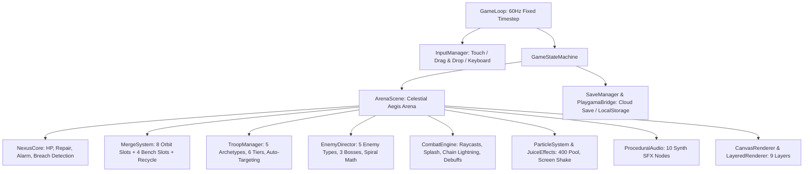
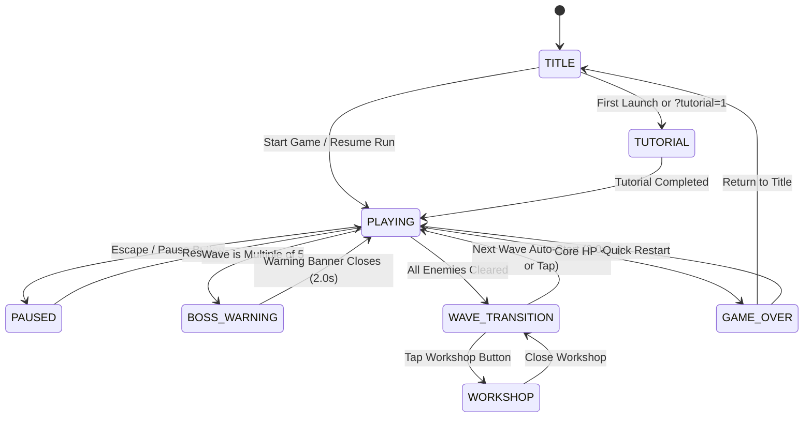
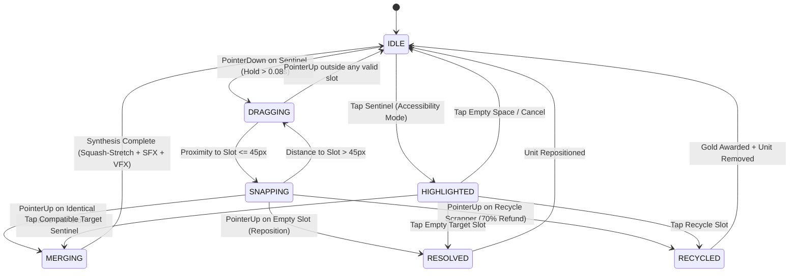
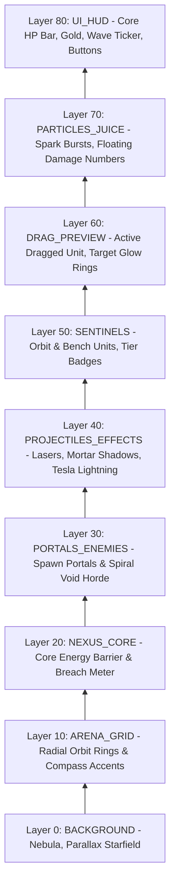

# Technical Architecture & Software Specification: Orbit Guard

**Target Game ID**: `orbit-guard`  
**Game Title**: Orbit Guard (Circular Arena Merge Tower Defense)  
**Document Type**: Complete Technical Plan & Software Architecture  
**Author**: Technical Director, AI Game Factory  
**Target Engine**: Modular HTML5 Canvas 2D / Web Audio API / Playgama Bridge SDK  
**Virtual Canvas Resolution**: $450 \times 720$ (9:16 Portrait, High-DPI Retina scaling, responsive letterbox fit)  
**Target Framerate**: 60 FPS Fixed Timestep (`STEP = 1/60s`, $16.67\text{ ms}$ accumulator loop) with zero runtime GC allocations  

---

## 1. Executive Summary & Central Engine Architecture

**Orbit Guard** is a mobile-first, high-tempo circular arena merge tower defense game. Defending the central **Nexus Core** aboard the *Celestial Aegis* orbital station, players summon, reposition, and merge defense sentinels across a rotating inner placement ring and standby bench to neutralize cosmic void invaders spiraling along concentric orbital tracks.

This technical plan establishes the formal software architecture, module integration, mathematical formulas, state machines, auto-targeting heuristics, procedural sound synthesis, and persistence layers for the game.



### Module Integration Mapping

All central systems strictly import from [`engine/index.js`](file:///d:/DEV/gmfactory/engine/index.js):

| Engine Module | Export Path in `engine/index.js` | Architectural Role in Orbit Guard |
| :--- | :--- | :--- |
| **`GameLoop`** | [`engine/core/GameLoop.js`](file:///d:/DEV/gmfactory/engine/core/GameLoop.js) | Authoritative 60Hz fixed timestep accumulator loop (`STEP = 1/60s`), frame clamping ($dt \le 0.1\text{s}$), and sub-frame render interpolation ($\alpha$). |
| **`CanvasRenderer`** | [`engine/rendering/CanvasRenderer.js`](file:///d:/DEV/gmfactory/engine/rendering/CanvasRenderer.js) | Virtual resolution management ($450 \times 720$), DPR Retina scaling, letterbox pillarboxing/letterboxing, canvas transform push/pop. |
| **`LayeredRenderer`** / **`RenderLayers`** | [`engine/render/RenderLayers.js`](file:///d:/DEV/gmfactory/engine/render/RenderLayers.js) | Strict 9-layer z-index rendering stack enforcing draw order from nebula background up to drag previews and top-level HUD. |
| **`InputManager`** | [`engine/input/InputManager.js`](file:///d:/DEV/gmfactory/engine/input/InputManager.js) | Pointer/touch coordinate normalization, tap disambiguation, drag-and-drop delta tracking, and keyboard hotkey routing. |
| **`StateMachine`** | [`engine/core/StateMachine.js`](file:///d:/DEV/gmfactory/engine/core/StateMachine.js) | High-level game state manager (`TITLE`, `PLAYING`, `WORKSHOP`, `GAME_OVER`) and unit drag-drop state manager (`IDLE` $\to$ `DRAGGING` $\to$ `SNAPPING` $\to$ `MERGING`). |
| **`EventBus`** | [`engine/core/EventBus.js`](file:///d:/DEV/gmfactory/engine/core/EventBus.js) | Decoupled event pub/sub for cross-module triggers (e.g., `ENEMY_KILLED`, `MERGE_COMPLETED`, `CORE_DAMAGED`). |
| **`ParticleSystem`** | [`engine/particles/ParticleSystem.js`](file:///d:/DEV/gmfactory/engine/particles/ParticleSystem.js) | Pre-allocated zero-GC particle pool (400 items) for merge flashes, laser impacts, plasma embers, and freeze mists. |
| **`JuiceEffects`** | [`engine/effects/JuiceEffects.js`](file:///d:/DEV/gmfactory/engine/effects/JuiceEffects.js) | Screen trauma shake, freeze frames (micro-hitstops), floating damage numbers, and UI alert pulses. |
| **`ProceduralAudio`** | [`engine/audio/ProceduralAudio.js`](file:///d:/DEV/gmfactory/engine/audio/ProceduralAudio.js) | Zero-dependency Web Audio API procedural sound synthesizer for laser zaps, mortar booms, chain tesla buzzes, and chords. |
| **`DialogueSystem`** | [`engine/interactions/DialogueSystem.js`](file:///d:/DEV/gmfactory/engine/interactions/DialogueSystem.js) | Tutorial transmission overlays, Boss warning alarms, and lore dialogue sequences. |
| **`PlaygamaBridge`** | [`engine/platform/playgama/PlaygamaBridge.js`](file:///d:/DEV/gmfactory/engine/platform/playgama/PlaygamaBridge.js) | Cloud save synchronization, game lifecycle hooks (`game_ready`), reward ads, and platform analytics. |
| **`MathUtils`** | [`engine/core/MathUtils.js`](file:///d:/DEV/gmfactory/engine/core/MathUtils.js) | Polar/Cartesian conversions, angular difference wrapping, distance checks, and smooth interpolation (`lerp`, `clamp`, `approach`). |

### Authoritative EventBus Event Dictionary

| Event Name | Payload | Trigger Source | System Reactions |
| :--- | :--- | :--- | :--- |
| `SENTINEL_SUMMONED` | `{ slotId, troopId, tier, cost }` | Economy / UI | Deducts gold, instantiates Tier 1 sentinel, triggers `sfx_summon`, emits spawn puff. |
| `SENTINEL_DRAG_START`| `{ sourceSlot, sentinel }` | InputManager | Enters `DRAGGING` state, highlights compatible target slots in gold, dims incompatible slots. |
| `SENTINEL_MERGED` | `{ targetSlot, troopId, newTier }` | MergeSystem | Synthesizes higher tier, spawns radial shockwave, plays `sfx_merge`, triggers squash-stretch animation. |
| `SENTINEL_RECYCLED` | `{ troopId, tier, refundAmount }` | MergeSystem | Refunds 70% gold value, frees slot, emits recycling sparks, plays cash chime. |
| `ENEMY_SPAWNED` | `{ enemyId, type, portalId, polarPos }`| WaveDirector | Adds enemy entity to active simulation pool, renders portal surge warp. |
| `ENEMY_DAMAGED` | `{ enemyId, damage, isCrit, damageType }`| CombatEngine | Reduces enemy HP, flashes white hurt tint, shows floating damage text, checks lethal condition. |
| `ENEMY_KILLED` | `{ enemyId, type, goldReward, score, x, y }`| CombatEngine | Adds gold/score, drops flying coin particles, plays `sfx_coin`, increments Overcharge meter. |
| `CORE_DAMAGED` | `{ currentHp, maxHp, damage }` | NexusCore | Triggers screen shake, flashes red core barrier, plays alarm klaxon if $\text{HP} \le 30\%$. |
| `OVERCHARGE_TRIGGERED`| `{ x, y, radius, pushbackDeg }` | Player Input | Releases $800\text{ px/s}$ shockwave, pushes all enemies back $90^\circ$, stuns 2s, buffs ally cadence $+50\%$. |
| `BOSS_WARNING_START`| `{ bossId, name, wave }` | WaveDirector | Pauses wave spawn, dims screen, plays emergency klaxon, displays full-width warning banner. |
| `WAVE_COMPLETED` | `{ wave, rewardGold, perfectDefense }`| WaveDirector | Awards wave bounty, updates high score, opens Workshop transition panel. |
| `GAME_OVER_TRIGGERED`| `{ waveReached, score, merges, peakDps }`| NexusCore | Transitions state to `GAME_OVER`, commits save data to cloud, displays post-game summary. |

---

## 2. Game State Machine & Lifecycle Flow

Orbit Guard runs a deterministic state machine managing game modes, modal menus, combat flow, and boss events.



### State Specifications

1. **`TITLE`**:
   - Displays animated stellar background, orbiting sentinel hologram previews, highest wave record, and `START DEFENSE` / `WORKSHOP` / `SETTINGS` buttons.
   - Initializes AudioContext upon first pointer interaction.
2. **`TUTORIAL`**:
   - Guided 3-step interactive overlay: (1) Buy Sentinel, (2) Drag to Merge, (3) Observe Auto-Fire & Wave Incursion.
   - Scripted seed guarantee: first 2 summons are identical Ballista Archers to guarantee immediate merge teaching.
3. **`PLAYING`**:
   - Main 60Hz combat simulation: enemy spiral progression, auto-targeting fire control, projectile kinematics, drag-and-drop merging, and resource harvesting.
4. **`PAUSED`**:
   - Freezes physics and wave timers. Renders modal overlay with Sound Mute, Restart Run, Return to Title, and Control Reminders.
5. **`BOSS_WARNING`**:
   - Triggered at Waves 5, 10, 15, 20+.
   - Slows enemy movement to 10% for $2.0\text{s}$, flashes red warning strobe, sounds dual-tone siren, and displays boss titlecard (e.g., *"IRON COLOSSUS - The Shielded Titan"*).
6. **`WAVE_TRANSITION`**:
   - $3.0\text{s}$ breather between waves. Shows wave reward summary (`+Gold`), pulses the `WORKSHOP` button, and displays a countdown timer to the next incursion.
7. **`WORKSHOP`**:
   - Modal upgrade bay where players invest permanent Meta-Gold into persistent upgrades (Hull Integrity, Rapid Overclock, Starting Treasury, Hyper-Critical Focus, Salvage Efficiency).
8. **`GAME_OVER`**:
   - Triggered when Nexus Core $\text{HP} \le 0$. Freezes combat, plays core collapse implosion, tallies stats (Wave, Merges, Kills, Gold Earned), and offers instant retry.

### URL Debugging & QA Parameters

The state initialization handles URL search query parameters:
- `?reset=1`: Wipes local save and starts fresh.
- `?nosave=1`: Disables writing to `localStorage` and Playgama Cloud.
- `?god=1`: Nexus Core takes 0 damage and Overcharge has 0 cooldown.
- `?wave=N`: Jumps directly to Wave $N$ with scaled starting gold.
- `?gold=N`: Overrides starting gold to $N$.

---

## 3. Core Loop, Fixed Timestep & Sub-Frame Interpolation

Following studio standards in [SKILL.md](file:///d:/DEV/gmfactory/.agents/skills/game-programming/SKILL.md), simulation logic is strictly separated from rendering via a fixed 60Hz accumulator loop.

```
                  Real Time Delta (dt)
                          │
                          ▼
            Accumulator += min(dt, 0.1s)
                          │
          ┌───────────────┴───────────────┐
          │                               │
   Accumulator >= STEP? (1/60s)    Accumulator < STEP
          │                               │
          ▼                               ▼
   [ Fixed Physics Update ]        alpha = Accumulator / STEP
   - Kinematics & Spiral Math             │
   - Auto-Targeting Fire Control          ▼
   - Projectile Collisions         [ Sub-Frame Render ]
   - Merge State Transitions       - Interpolated Transforms
   - Accumulator -= STEP           - Layered Draw Stack
          │                        - Particles & Juice
          └───────────┬───────────────────┘
```

### Mathematical Timestep Formulation

$$\text{STEP} = \frac{1}{60} \approx 0.016667\text{ s}$$
$$\Delta t_{\text{clamped}} = \min(\Delta t_{\text{frame}}, 0.10\text{ s})$$
$$\alpha = \frac{\text{accumulator}}{\text{STEP}} \in [0.0, 1.0)$$

### Zero-Allocation Entity Pooling

To maintain a steady 60 FPS without Garbage Collection pauses, all dynamic combat entities are pre-allocated:

| Entity Type | Pool Size | Recycling Behavior |
| :--- | :---: | :--- |
| **Projectiles (Lasers/Shells)** | 120 | Re-initialized on turret fire; deactivated on hit or max range breach. |
| **Damage Numbers / Floating Text** | 60 | Sinusoidal upward drift with alpha fade; pooled in static array. |
| **Particles (Sparks/Mists)** | 400 | Managed by `ParticleSystem`; pre-allocated Float32Arrays for positions and velocities. |
| **Chain Lightning Arc Segments** | 30 | Reused polyline buffer for multi-target Tesla caster visual arcs. |

---

## 4. Spatial Geometry, Coordinate Systems & Spiral Trajectories

Orbit Guard utilizes a hybrid polar-Cartesian coordinate system centered at the Nexus Core:

```
Virtual Resolution: 450 x 720
Arena Center: (xc, yc) = (225, 320)
```

```
                     [Portal N: (225, 135)]
                               │
                       .-'  R=185px  '-.
                   .'                     '.
                 /                           \
               ;        [S6: (225,230)]        ;
              ;       [S5]           [S7]       ;
 [Portal W] ──W─[S4] ─── (CORE: 225,320) ───[S0]──W── [Portal E]
 (40, 320)    ;       [S3]           [S1]       ;      (410, 320)
               ;        [S2: (225,410)]        ;
                 \                           /
                   '.                     .'
                       '-.  R=185px  .-'
                               │
                     [Portal S: (225, 505)]
```

### 4.1 Coordinate Conversions

For an entity at polar coordinate $(r, \theta)$ relative to center $(x_c, y_c)$:

$$x = x_c + r \cdot \cos(\theta)$$
$$y = y_c + r \cdot \sin(\theta)$$

For Cartesian coordinates $(x, y)$ converted to polar:

$$r = \sqrt{(x - x_c)^2 + (y - y_c)^2}$$
$$\theta = \text{atan2}(y - y_c, x - x_c) \pmod{2\pi}$$

### 4.2 Arena Ring Layout & Slot Indexing

| Ring Element | Radius ($r$) | Description / Geometry |
| :--- | :---: | :--- |
| **Nexus Core** | $r_0 = 45\text{px}$ | Center at $(225, 320)$. Core breach occurs if enemy radius $r \le 45\text{px}$. |
| **Inner Placement Ring** | $r_d = 90\text{px}$ | **8 discrete slots** spaced at $\Delta\theta = 45^\circ$ ($\pi/4\text{ rad}$). |
| **Inner Hazard Perimeter** | $r_1 = 120\text{px}$ | Short-range Assassin trigger zone. |
| **Mid Combat Orbit** | $r_2 = 155\text{px}$ | Main engagement and crowd-control zone. |
| **Outer Spawn Orbit** | $r_3 = 185\text{px}$ | Outer perimeter with 4 spawn portals. |
| **Standby Bench** | $y = 620\text{px}$ | **4 linear slots** at $x \in \{105, 185, 265, 345\}$. |
| **Recycle Scrapper** | $y = 620\text{px}$ | Located at $x = 405$, radius $25\text{px}$ (70% gold refund). |

### 4.3 Slot Exact Polar & Cartesian Registry

```javascript
export const ARENA_CONFIG = {
  center: { x: 225, y: 320 },
  coreRadius: 45,
  orbitRadius: 90,
  spawnRadius: 185,
  orbitSlots: [
    { id: 'slot_0', index: 0, angleDeg: 0,   angleRad: 0.0000, x: 315.00, y: 320.00, compass: 'E' },
    { id: 'slot_1', index: 1, angleDeg: 45,  angleRad: 0.7854, x: 288.64, y: 383.64, compass: 'SE' },
    { id: 'slot_2', index: 2, angleDeg: 90,  angleRad: 1.5708, x: 225.00, y: 410.00, compass: 'S' },
    { id: 'slot_3', index: 3, angleDeg: 135, angleRad: 2.3562, x: 161.36, y: 383.64, compass: 'SW' },
    { id: 'slot_4', index: 4, angleDeg: 180, angleRad: 3.1416, x: 135.00, y: 320.00, compass: 'W' },
    { id: 'slot_5', index: 5, angleDeg: 225, angleRad: 3.9270, x: 161.36, y: 256.36, compass: 'NW' },
    { id: 'slot_6', index: 6, angleDeg: 270, angleRad: 4.7124, x: 225.00, y: 230.00, compass: 'N' },
    { id: 'slot_7', index: 7, angleDeg: 315, angleRad: 5.4978, x: 288.64, y: 256.36, compass: 'NE' }
  ],
  benchSlots: [
    { id: 'bench_0', index: 0, x: 105, y: 620 },
    { id: 'bench_1', index: 1, x: 185, y: 620 },
    { id: 'bench_2', index: 2, x: 265, y: 620 },
    { id: 'bench_3', index: 3, x: 345, y: 620 }
  ],
  recycleSlot: { id: 'recycle', x: 405, y: 620, radius: 25, refundRate: 0.70 }
};
```

### 4.4 Dynamic Spiral Kinematics

Enemies advance in polar space $(r(t), \theta(t))$ with simultaneous angular velocity and inward radial drift:

$$\theta(t + \Delta t) = \theta(t) + \omega_{\text{effective}} \cdot \Delta t$$
$$r(t + \Delta t) = r(t) - v_{\text{radial}} \cdot \Delta t$$

where:
$$\omega_{\text{effective}} = \omega_{\text{base}} \cdot (1 - \text{slowPercent}) \cdot \text{speedScale}$$
$$v_{\text{radial}} = \frac{r_3 - r_0}{T_{\text{spiral}}} = \frac{185 - 45}{18.0\text{ s}} \approx 7.78\text{ px/s}$$

When $r(t) \le r_0$ ($45\text{px}$), the enemy breaches the core, applies direct `coreDamage` to the Nexus Core, triggers screen shake, and is removed from the arena.

---

## 5. Merge System & Drag-and-Drop Architecture

The merge synthesis system provides the core tactile interaction:



### 5.1 Drag & Drop State Machine Implementation

```javascript
export class MergeSystem {
  constructor(arenaConfig, eventBus, audio, juice, particles) {
    this.config = arenaConfig;
    this.bus = eventBus;
    this.audio = audio;
    this.juice = juice;
    this.particles = particles;

    this.state = 'IDLE'; // IDLE, DRAGGING, SNAPPING, MERGING
    this.selectedUnit = null;
    this.sourceSlot = null; // { type: 'orbit'|'bench', index: number }
    this.dragPos = { x: 0, y: 0 };
    this.hoveredSlot = null;
    this.isAccessibilityActive = false;
  }

  onPointerDown(screenX, screenY, boardState) {
    const unitSlot = this.findUnitAt(screenX, screenY, boardState);
    if (!unitSlot) {
      if (this.isAccessibilityActive) this.clearHighlights();
      return;
    }

    if (this.isAccessibilityActive) {
      // Tap-to-merge resolution
      if (this.canMerge(this.selectedUnit, unitSlot.unit)) {
        this.executeMerge(this.sourceSlot, unitSlot.slotRef, boardState);
        this.clearHighlights();
        return;
      } else if (unitSlot.slotRef === this.sourceSlot) {
        this.clearHighlights();
        return;
      }
    }

    this.selectedUnit = unitSlot.unit;
    this.sourceSlot = unitSlot.slotRef;
    this.state = 'DRAGGING';
    this.dragPos = { x: screenX, y: screenY };
  }

  onPointerMove(screenX, screenY, boardState) {
    if (this.state !== 'DRAGGING' && this.state !== 'SNAPPING') return;

    this.dragPos = { x: screenX, y: screenY };
    const nearest = this.findNearestSlot(screenX, screenY);

    if (nearest && nearest.distance <= 45) {
      this.state = 'SNAPPING';
      this.hoveredSlot = nearest.slot;
    } else {
      this.state = 'DRAGGING';
      this.hoveredSlot = null;
    }
  }

  onPointerUp(screenX, screenY, boardState) {
    if (this.state !== 'DRAGGING' && this.state !== 'SNAPPING') return;

    if (this.hoveredSlot) {
      // 1. Recycle Slot
      if (this.hoveredSlot.id === 'recycle') {
        this.executeRecycle(this.sourceSlot, this.selectedUnit, boardState);
      }
      // 2. Merge with existing unit
      else {
        const destUnit = boardState.getUnitAt(this.hoveredSlot);
        if (destUnit) {
          if (this.canMerge(this.selectedUnit, destUnit)) {
            this.executeMerge(this.sourceSlot, this.hoveredSlot, boardState);
          } else {
            // Swap positions
            boardState.swapUnits(this.sourceSlot, this.hoveredSlot);
            this.audio.playSummonPop();
          }
        } else {
          // Move to empty slot
          boardState.moveUnit(this.sourceSlot, this.hoveredSlot);
          this.audio.playSummonPop();
        }
      }
    }

    this.resetDrag();
  }

  canMerge(unitA, unitB) {
    if (!unitA || !unitB) return false;
    return unitA.archetype === unitB.archetype && unitA.tier === unitB.tier && unitA.tier < 6;
  }

  executeMerge(sourceSlot, targetSlot, boardState) {
    const unit = boardState.getUnitAt(sourceSlot);
    const newTier = unit.tier + 1;
    const targetPos = boardState.getSlotCoordinates(targetSlot);

    boardState.removeUnit(sourceSlot);
    boardState.setUnit(targetSlot, {
      ...unit,
      tier: newTier,
      scaleAnim: 1.45,
      animTimer: 0.25
    });

    this.bus.emit('SENTINEL_MERGED', { targetSlot, archetype: unit.archetype, newTier });
    this.audio.playMergeChime(newTier);
    this.juice.screenShake(3 + newTier);
    this.particles.burst(targetPos.x, targetPos.y, 16 + newTier * 4, this.getTierColor(newTier));
  }

  executeRecycle(sourceSlot, unit, boardState) {
    const cumulativeCost = this.calculateUnitValue(unit);
    const refund = Math.floor(cumulativeCost * this.config.recycleSlot.refundRate);

    boardState.removeUnit(sourceSlot);
    boardState.addGold(refund);

    this.bus.emit('SENTINEL_RECYCLED', { unit, refund });
    this.audio.playCoinDrop();
    this.juice.floatingText(this.config.recycleSlot.x, this.config.recycleSlot.y - 20, `+${refund} 💰`, '#FFD700');
    this.particles.burst(this.config.recycleSlot.x, this.config.recycleSlot.y, 12, '#FFD700');
  }

  calculateUnitValue(unit) {
    // 2^(tier-1) base summons
    const baseCount = Math.pow(2, unit.tier - 1);
    return baseCount * 15;
  }

  getTierColor(tier) {
    const colors = ['#CD7F32', '#C0C0C0', '#FFD700', '#00E5FF', '#D500F9', '#FFD600'];
    return colors[tier - 1] || '#FFFFFF';
  }

  resetDrag() {
    this.state = 'IDLE';
    this.selectedUnit = null;
    this.sourceSlot = null;
    this.hoveredSlot = null;
  }
}
```

---

## 6. Troop Classes, Auto-Targeting Engine & Attack Delivery

Orbit Guard features 5 distinct sentinels, each operating on specialized auto-targeting heuristics and distinct projectile kinematics:

```
┌─────────────────────────────────────────────────────────────────────────────┐
│                           5 SENTINEL ARCHETYPES                             │
├───────────────────┬──────────────┬─────────────┬──────────────┬─────────────┤
│ 1. BALLISTA       │ 2. CANNON    │ 3. MAGE     │ 4. FROST     │ 5. ASSASSIN │
│ Kinetic Sniper    │ AOE Mortar   │ Tesla Chain │ 360° Aura    │ Melee Crit  │
│ Furthest on Path  │ Dense Center │ Highest HP  │ Omnizone     │ Short Inner │
└───────────────────┴──────────────┴─────────────┴──────────────┴─────────────┘
```

### 6.1 Complete Stat & Evolution Progression Matrix

| Archetype | Tier 1 (★) | Tier 2 (★★) | Tier 3 (★★★) | Tier 4 (◆) | Tier 5 (❖) | Tier 6 (👑 Ascended) |
| :--- | :--- | :--- | :--- | :--- | :--- | :--- |
| **Ballista Archer**<br>*(Kinetic Sniper)* | Dmg 18, Rate 1.6/s<br>Rng 240px, DPS 28.8 | Dmg 36, Rate 1.8/s<br>Rng 255px, DPS 64.8 | Dmg 70, Rate 2.1/s<br>Rng 270px, Pierce 1 | Dmg 138, Rate 2.4/s<br>Rng 285px, Pierce 2 | Dmg 288, Rate 2.6/s<br>Rng 300px, Pierce 3 | Dmg 576, Rate 3.0/s<br>Rng 320px, Pierce All |
| **Heavy Cannon**<br>*(AOE Mortar)* | Dmg 45, Rate 0.6/s<br>Rng 200px, Spl 65px | Dmg 95, Rate 0.64/s<br>Rng 215px, Spl 75px | Dmg 200, Rate 0.68/s<br>Rng 230px, Spl 85px<br>+20% Plasma Burn | Dmg 414, Rate 0.75/s<br>Rng 245px, Spl 95px<br>+40% Burn & Slow | Dmg 877, Rate 0.80/s<br>Rng 260px, Spl 110px<br>+3 Cluster Bomblets | Dmg 1800, Rate 0.9/s<br>Rng 280px, Spl 130px<br>Thermonuclear Nova |
| **Arcane Mage**<br>*(Tesla Chain)* | Dmg 22, Rate 1.1/s<br>Rng 170px, 3 Jumps | Dmg 45, Rate 1.21/s<br>Rng 185px, 4 Jumps | Dmg 95, Rate 1.3/s<br>Rng 200px, 5 Jumps<br>+0.25s Micro-Stun | Dmg 192, Rate 1.45/s<br>Rng 215px, 6 Jumps<br>100% Chain Dmg | Dmg 393, Rate 1.6/s<br>Rng 230px, 8 Jumps<br>Static Death Burst | Dmg 806, Rate 1.8/s<br>Rng 250px, 10 Jumps<br>Ascended Tempest |
| **Frost Warden**<br>*(Cryo Aura)* | Dmg 8/s, Rate 1.0/s<br>Rng 140px, Slow 35% | Dmg 18/s, Rate 1.0/s<br>Rng 155px, Slow 42% | Dmg 40/s, Rate 1.0/s<br>Rng 170px, Slow 50%<br>+2s Deep Chill | Dmg 92/s, Rate 1.0/s<br>Rng 185px, Slow 58%<br>+25% Brittle Vulnerability | Dmg 208/s, Rate 1.0/s<br>Rng 200px, Slow 65%<br>1s Freeze every 8s | Dmg 480/s, Rate 1.0/s<br>Rng 220px, Slow 75%<br>Screen-wide Blizzard |
| **Shadow Assassin**<br>*(Perimeter Shredder)*| Dmg 32, Rate 2.2/s<br>Rng 100px, Crit 25%<br>Crit Mult 3.0x | Dmg 66, Rate 2.4/s<br>Rng 115px, Crit 30%<br>Crit Mult 3.2x | Dmg 138, Rate 2.6/s<br>Rng 130px, Crit 35%<br>Ignores 50% Armor | Dmg 289, Rate 2.8/s<br>Rng 145px, Crit 45%<br>Shadow Twin Strike | Dmg 610, Rate 3.0/s<br>Rng 160px, Crit 55%<br>Execute < 15% HP | Dmg 1280, Rate 3.3/s<br>Rng 180px, Crit 70%<br>Ascended Void Vortex |

### 6.2 Auto-Targeting Heuristics Engine

Each sentinel evaluates valid candidate targets within its effective Cartesian radius $R_{\text{eff}}$:

```javascript
export class AutoTargetingEngine {
  static selectTarget(sentinel, sentinelPos, enemies) {
    const inRange = enemies.filter(e => {
      if (!e.active || e.hp <= 0) return false;
      const d = MathUtils.distance(sentinelPos.x, sentinelPos.y, e.x, e.y);
      return d <= sentinel.currentRange;
    });

    if (inRange.length === 0) return null;

    switch (sentinel.targetingHeuristic) {
      // 1. Furthest along orbital path (Closest to Core breach)
      case 'furthest_on_path':
      case 'furthest_along_orbit':
        return inRange.reduce((prev, curr) => (curr.radiusFromCore < prev.radiusFromCore ? curr : prev));

      // 2. Highest HP target (Arcane Mage chain anchor)
      case 'highest_hp':
      case 'highest_hp_in_range':
        return inRange.reduce((prev, curr) => (curr.hp > prev.hp ? curr : prev));

      // 3. Lowest HP target (Execute cleanup)
      case 'lowest_hp':
        return inRange.reduce((prev, curr) => (curr.hp < prev.hp ? curr : prev));

      // 4. Closest to inner defense perimeter
      case 'closest_perimeter':
      case 'closest_inner_perimeter':
        return inRange.reduce((prev, curr) => {
          const dCurr = MathUtils.distance(sentinelPos.x, sentinelPos.y, curr.x, curr.y);
          const dPrev = MathUtils.distance(sentinelPos.x, sentinelPos.y, prev.x, prev.y);
          return dCurr < dPrev ? curr : prev;
        });

      // 5. Center-of-mass cluster density (Heavy Cannon Mortar)
      case 'cluster_density':
      case 'densest_enemy_cluster':
        return this.findDensestClusterTarget(inRange, sentinel.splashRadius || 65);

      default:
        return inRange[0];
    }
  }

  static findDensestClusterTarget(candidates, searchRadius) {
    let bestTarget = candidates[0];
    let maxNeighbors = -1;

    for (let i = 0; i < candidates.length; i++) {
      const a = candidates[i];
      let neighbors = 0;
      for (let j = 0; j < candidates.length; j++) {
        if (i === j) continue;
        const d = MathUtils.distance(a.x, a.y, candidates[j].x, candidates[j].y);
        if (d <= searchRadius) neighbors++;
      }
      if (neighbors > maxNeighbors) {
        maxNeighbors = neighbors;
        bestTarget = a;
      }
    }
    return bestTarget;
  }
}
```

### 6.3 Projectile Kinematics & Delivery Modes

1. **Kinetic Railgun Beam (Ballista Archer)**:
   - Trajectory: Linear ray $\vec{p}(t) = \vec{p}_0 + \vec{v} \cdot t$ with speed $v = 900\text{ px/s}$.
   - Pierce logic: Decrements `pierceCount`; registers hits on swept circle raycasts.
2. **Parabolic Ballistic Mortar (Heavy Cannon)**:
   - Trajectory: Fixed duration flight $T_{\text{flight}} = 0.45\text{s}$.
   - Arc height: $h(t) = 4 \cdot H_{\text{max}} \cdot \frac{t}{T} \cdot (1 - \frac{t}{T})$ ($H_{\text{max}} = 40\text{px}$).
   - Landing impact: Detonates in a circle of radius $R_{\text{splash}}$, damaging all enemies inside.
3. **Chain Lightning Arc (Arcane Mage)**:
   - Instant beam delivery with $0.06\text{s}$ sequential visual hop delay.
   - Bounces to nearest enemy within $120\text{px}$ jump radius up to `maxChains`.
4. **Continuous Chilling Field (Frost Warden)**:
   - Frame-by-frame distance check: $d \le R_{\text{aura}} \implies$ sets `enemy.slowTimer = 0.2\text{s}`, applying slow reduction.
5. **Void Melee Critical Strike (Shadow Assassin)**:
   - Instant melee slash. Computes random crit roll:
     `const isCrit = Math.random() * 100 < sentinel.critChance;`
     `const finalDamage = isCrit ? baseDamage * sentinel.critMult : baseDamage;`

---

## 7. Enemy Archetypes, Boss Mechanics & Wave Director

### 7.1 Enemy Roster & Attributes

| Enemy Archetype | Base HP | Speed ($\omega$) | Core Dmg | Gold | Point Cost | Special Trait |
| :--- | :---: | :---: | :---: | :---: | :---: | :--- |
| **Void Crawler** | 40 | $65^\circ/\text{s}$ | 10 | 3 | 10 | Standard frontline swarm unit. |
| **Swift Dart** | 22 | $140^\circ/\text{s}$ | 8 | 4 | 12 | High-speed sprinter; evades unguided mortar blasts. |
| **Armored Bruiser** | 160 | $35^\circ/\text{s}$ | 25 | 10 | 35 | Heavy juggernaut; possesses 40% physical armor reduction. |
| **Swarm Pod** | 75 | $55^\circ/\text{s}$ | 15 | 8 | 30 | On death, ruptures into 5 Micro-Mites (HP 12, $110^\circ/\text{s}$). |
| **Void Slinger** | 90 | $45^\circ/\text{s}$ | 20 | 12 | 40 | Halts every 6s to fire long-range disruptor missile. |

### 7.2 Multi-Phase Boss Encounters

#### Boss 1: Iron Colossus (Wave 5)
- **Base HP**: $1500 \times \text{Scale}(w)$ ($2250\text{ HP}$ at Wave 5).
- **Radius**: $28\text{px}$, Speed: $28^\circ/\text{s}$.
- **Phase 1 ($100\% \to 50\%$ HP)**: **Revolving Kinetic Shield ($120^\circ$)**. Absorbs all frontal projectiles; must be hit from flanking angles.
- **Phase 2 ($50\% \to 0\%$ HP)**: **Seismic Stomp**. Speeds up to $42^\circ/\text{s}$. Every 8 seconds, stamps the ring, disabling 2 nearest sentinels for $2.5\text{s}$.

#### Boss 2: Hydra Queen (Wave 10)
- **Base HP**: $3500 \times \text{Scale}(w)$ ($5200\text{ HP}$ at Wave 10).
- **Radius**: $32\text{px}$, Speed: $32^\circ/\text{s}$.
- **Phase 1 ($100\% \to 50\%$ HP)**: **Brood Hatch**. Spawns 3 Swarm Pods every 7 seconds.
- **Phase 2 ($50\%$ HP Threshold)**: **Mitosis Bifurcation**. Splits into two smaller Hydra Spawns ($45\%$ HP each, speed $50^\circ/\text{s}$) travelling in opposite directions.

#### Boss 3: Chrono Wraith (Wave 15)
- **Base HP**: $8000 \times \text{Scale}(w)$ ($12000\text{ HP}$ at Wave 15).
- **Radius**: $30\text{px}$, Speed: $40^\circ/\text{s}$.
- **Phase 1 ($100\% \to 50\%$ HP)**: **Phase Blink**. Every 5 seconds, teleports $75^\circ$ forward along the orbit, evading active projectiles.
- **Phase 2 ($50\% \to 0\%$ HP)**: **Temporal Distortion**. Emits a chrono wave every 10s slowing all sentinel fire rates by 35% for 4.0s.

### 7.3 Mathematical Scaling Formulas

$$\text{SpawnBudget}(w) = 50 + 25 \cdot w + \lfloor 8 \cdot w^{1.35} \rfloor$$
$$\text{EnemyHP}(w) = \text{BaseHP} \cdot (1 + 0.16 \cdot (w - 1))^{1.15}$$
$$\text{EnemySpeed}(w) = \text{BaseSpeed} \cdot \min(1.80, 1.0 + 0.025 \cdot (w - 1))$$
$$\text{WaveRewardGold}(w) = 25 + 12 \cdot w + \lfloor 1.5 \cdot w^{1.20} \rfloor$$

---

## 8. Economy, Workshop & Overcharge Surge

### 8.1 Economy Curves

1. **Summon Cost Formula**:
   $$P(n) = \lfloor 15 \times (1.18)^n \rfloor$$
   where $n$ is total units purchased this run.
2. **Recycle Scrapper**:
   Dragging any unit to the bottom-right incinerator refunds $70\%$ of its cumulative gold investment:
   $$\text{Refund}(T) = \lfloor 0.70 \times 2^{T-1} \times 15 \rfloor$$
   *(Tier 1: 10g, Tier 2: 21g, Tier 3: 42g, Tier 4: 84g, Tier 5: 168g, Tier 6: 336g)*.

### 8.2 Permanent Workshop Upgrades Schema

```javascript
export const WORKSHOP_UPGRADES = [
  { id: 'nexus_hull', name: 'Nexus Hull Integrity', baseCost: 100, costScale: 1.5, maxLevel: 10, effectPerLevel: 20, stat: 'maxHp' },
  { id: 'rapid_overclock', name: 'Rapid Overclock', baseCost: 150, costScale: 1.6, maxLevel: 10, effectPerLevel: 0.03, stat: 'attackSpeed' },
  { id: 'starting_treasury', name: 'Starting Treasury', baseCost: 80, costScale: 1.4, maxLevel: 10, effectPerLevel: 15, stat: 'startingGold' },
  { id: 'hyper_crit', name: 'Hyper-Critical Focus', baseCost: 200, costScale: 1.75, maxLevel: 8, effectPerLevel: 0.02, stat: 'critChance' },
  { id: 'salvage_efficiency', name: 'Salvage Efficiency', baseCost: 120, costScale: 1.5, maxLevel: 5, effectPerLevel: 0.04, stat: 'goldMultiplier' }
];
```

### 8.3 Overcharge Surge Panic Button

- **Cooldown**: 45 seconds (reduced by 0.5s per enemy killed).
- **Shockwave Speed**: $800\text{ px/s}$ radial expansion from $(225, 320)$.
- **Effects on Contact**:
  1. Pushes all orbital enemies backward by $90^\circ$ ($\pi/2\text{ rad}$) along their spiral path.
  2. Applies $2.0\text{s}$ global stun.
  3. Overclocks all sentinels with $+50\%$ Attack Speed for $5.0\text{s}$.

---

## 9. Procedural Web Audio API Synthesizer

Orbit Guard generates **100% of sound effects procedurally** using the Web Audio API with zero external audio assets:

```javascript
export class OrbitAudioSynthesizer {
  constructor() {
    this.ctx = null;
    this.isMuted = false;
    this.masterGain = null;
  }

  init() {
    if (this.ctx) return;
    const AudioContextClass = window.AudioContext || window.webkitAudioContext;
    this.ctx = new AudioContextClass();
    this.masterGain = this.ctx.createGain();
    this.masterGain.gain.setValueAtTime(0.3, this.ctx.currentTime);
    this.masterGain.connect(this.ctx.destination);
  }

  playSummonPop() {
    if (!this.ctx || this.isMuted) return;
    const t = this.ctx.currentTime;
    const osc = this.ctx.createOscillator();
    const gain = this.ctx.createGain();
    osc.type = 'sine';
    osc.frequency.setValueAtTime(300, t);
    osc.frequency.exponentialRampToValueAtTime(650, t + 0.12);
    gain.gain.setValueAtTime(0.25, t);
    gain.gain.exponentialRampToValueAtTime(0.01, t + 0.12);
    osc.connect(gain);
    gain.connect(this.masterGain);
    osc.start(t);
    osc.stop(t + 0.12);
  }

  playMergeChime(tier) {
    if (!this.ctx || this.isMuted) return;
    const freqs = [523.25, 659.25, 783.99, 1046.50]; // C5, E5, G5, C6
    const baseT = this.ctx.currentTime;
    freqs.forEach((f, idx) => {
      const t = baseT + idx * 0.05;
      const osc = this.ctx.createOscillator();
      const gain = this.ctx.createGain();
      osc.type = 'triangle';
      osc.frequency.setValueAtTime(f * (1 + (tier - 1) * 0.1), t);
      gain.gain.setValueAtTime(0.2, t);
      gain.gain.exponentialRampToValueAtTime(0.001, t + 0.28);
      osc.connect(gain);
      gain.connect(this.masterGain);
      osc.start(t);
      osc.stop(t + 0.28);
    });
  }

  playLaserPew() {
    if (!this.ctx || this.isMuted) return;
    const t = this.ctx.currentTime;
    const osc = this.ctx.createOscillator();
    const gain = this.ctx.createGain();
    osc.type = 'sawtooth';
    osc.frequency.setValueAtTime(1200, t);
    osc.frequency.exponentialRampToValueAtTime(180, t + 0.08);
    gain.gain.setValueAtTime(0.15, t);
    gain.gain.exponentialRampToValueAtTime(0.01, t + 0.08);
    osc.connect(gain);
    gain.connect(this.masterGain);
    osc.start(t);
    osc.stop(t + 0.08);
  }

  playCannonBlast() {
    if (!this.ctx || this.isMuted) return;
    const t = this.ctx.currentTime;
    const osc = this.ctx.createOscillator();
    const gain = this.ctx.createGain();
    osc.type = 'sine';
    osc.frequency.setValueAtTime(110, t);
    osc.frequency.exponentialRampToValueAtTime(30, t + 0.35);
    gain.gain.setValueAtTime(0.4, t);
    gain.gain.exponentialRampToValueAtTime(0.01, t + 0.35);
    osc.connect(gain);
    gain.connect(this.masterGain);
    osc.start(t);
    osc.stop(t + 0.35);
  }

  playTeslaCrackle() {
    if (!this.ctx || this.isMuted) return;
    const t = this.ctx.currentTime;
    const osc = this.ctx.createOscillator();
    const gain = this.ctx.createGain();
    osc.type = 'sawtooth';
    osc.frequency.setValueAtTime(440, t);
    osc.frequency.setValueAtTime(380, t + 0.04);
    osc.frequency.setValueAtTime(520, t + 0.08);
    gain.gain.setValueAtTime(0.18, t);
    gain.gain.exponentialRampToValueAtTime(0.01, t + 0.14);
    osc.connect(gain);
    gain.connect(this.masterGain);
    osc.start(t);
    osc.stop(t + 0.14);
  }

  playFrostHum() {
    if (!this.ctx || this.isMuted) return;
    const t = this.ctx.currentTime;
    const osc = this.ctx.createOscillator();
    const gain = this.ctx.createGain();
    osc.type = 'sine';
    osc.frequency.setValueAtTime(800, t);
    osc.frequency.linearRampToValueAtTime(1200, t + 0.15);
    gain.gain.setValueAtTime(0.08, t);
    gain.gain.exponentialRampToValueAtTime(0.001, t + 0.22);
    osc.connect(gain);
    gain.connect(this.masterGain);
    osc.start(t);
    osc.stop(t + 0.22);
  }

  playCritSlash() {
    if (!this.ctx || this.isMuted) return;
    const t = this.ctx.currentTime;
    const osc = this.ctx.createOscillator();
    const gain = this.ctx.createGain();
    osc.type = 'triangle';
    osc.frequency.setValueAtTime(950, t);
    osc.frequency.exponentialRampToValueAtTime(140, t + 0.18);
    gain.gain.setValueAtTime(0.3, t);
    gain.gain.exponentialRampToValueAtTime(0.01, t + 0.18);
    osc.connect(gain);
    gain.connect(this.masterGain);
    osc.start(t);
    osc.stop(t + 0.18);
  }

  playCoreAlarm() {
    if (!this.ctx || this.isMuted) return;
    const t = this.ctx.currentTime;
    const osc = this.ctx.createOscillator();
    const gain = this.ctx.createGain();
    osc.type = 'square';
    osc.frequency.setValueAtTime(554.37, t); // C#5
    osc.frequency.setValueAtTime(440.00, t + 0.2); // A4
    gain.gain.setValueAtTime(0.2, t);
    gain.gain.exponentialRampToValueAtTime(0.01, t + 0.45);
    osc.connect(gain);
    gain.connect(this.masterGain);
    osc.start(t);
    osc.stop(t + 0.45);
  }

  playBossRoar() {
    if (!this.ctx || this.isMuted) return;
    const t = this.ctx.currentTime;
    const osc = this.ctx.createOscillator();
    const gain = this.ctx.createGain();
    osc.type = 'sawtooth';
    osc.frequency.setValueAtTime(65, t);
    osc.frequency.linearRampToValueAtTime(120, t + 0.4);
    osc.frequency.exponentialRampToValueAtTime(35, t + 0.9);
    gain.gain.setValueAtTime(0.4, t);
    gain.gain.exponentialRampToValueAtTime(0.01, t + 0.9);
    osc.connect(gain);
    gain.connect(this.masterGain);
    osc.start(t);
    osc.stop(t + 0.9);
  }

  playCoinDrop() {
    if (!this.ctx || this.isMuted) return;
    const t = this.ctx.currentTime;
    [1046.5, 1318.5].forEach((f, i) => {
      const osc = this.ctx.createOscillator();
      const gain = this.ctx.createGain();
      osc.type = 'sine';
      osc.frequency.setValueAtTime(f, t + i * 0.04);
      gain.gain.setValueAtTime(0.18, t + i * 0.04);
      gain.gain.exponentialRampToValueAtTime(0.001, t + i * 0.04 + 0.1);
      osc.connect(gain);
      gain.connect(this.masterGain);
      osc.start(t + i * 0.04);
      osc.stop(t + i * 0.04 + 0.1);
    });
  }

  playSurgeShockwave() {
    if (!this.ctx || this.isMuted) return;
    const t = this.ctx.currentTime;
    const osc = this.ctx.createOscillator();
    const gain = this.ctx.createGain();
    osc.type = 'sine';
    osc.frequency.setValueAtTime(60, t);
    osc.frequency.exponentialRampToValueAtTime(180, t + 0.3);
    osc.frequency.exponentialRampToValueAtTime(40, t + 0.75);
    gain.gain.setValueAtTime(0.5, t);
    gain.gain.exponentialRampToValueAtTime(0.001, t + 0.75);
    osc.connect(gain);
    gain.connect(this.masterGain);
    osc.start(t);
    osc.stop(t + 0.75);
  }
}
```

---

## 10. Render Layers, Canvas Compositing & UI Stack

The rendering engine strictly organizes all graphical draw calls into 9 explicit layers via [`engine/render/RenderLayers.js`](file:///d:/DEV/gmfactory/engine/render/RenderLayers.js):



### Layer Index Table

| Layer Name | Z-Index | Contents & Compositing Blend Mode |
| :--- | :---: | :--- |
| `BACKGROUND` | 0 | Deep cosmic backdrop (`#050814`), procedural nebula gradients, parallax stars. |
| `ARENA_GRID` | 10 | Orbital circles ($R=90, 120, 155, 185$), slot anchor rings, directional crosshairs. |
| `NEXUS_CORE` | 20 | Planetary core circle, pulsating cyan shield ring, breach hazard warning pulses. |
| `PORTALS_ENEMIES` | 30 | 4 portal vortexes, enemy sprites, boss shields, enemy HP bars, freeze tint overlays. |
| `PROJECTILES_EFFECTS`| 40 | Railgun laser tracers, mortar shadows & explosion circles, Tesla polyline lightning. |
| `SENTINELS` | 50 | Stationed sentinels, rotational turret angles, tier badge icons (`★`, `◆`, `👑`). |
| `DRAG_PREVIEW` | 60 | Semi-transparent dragged sentinel with drop target snapping halo. |
| `PARTICLES_JUICE` | 70 | Zero-GC particle emitter bursts, screen flashes, floating `+Gold` and damage text. |
| `UI_HUD` | 80 | Top status bar (Wave, HP, Gold), Bottom Bench slots, Overcharge & Repair buttons. |

---

## 11. Save / Load Persistence & Platform Integration

### 11.1 Storage Schema (`orbit_guard_save_v1`)

```json
{
  "version": 1,
  "highScore": 48250,
  "highestWave": 18,
  "totalMerges": 342,
  "totalKills": 1890,
  "workshop": {
    "nexus_hull": 3,
    "rapid_overclock": 2,
    "starting_treasury": 4,
    "hyper_crit": 1,
    "salvage_efficiency": 2
  },
  "settings": {
    "isMuted": false,
    "showDamageNumbers": true
  }
}
```

### 11.2 PlaygamaBridge Cloud Synchronization

```javascript
export class SaveManager {
  static STORAGE_KEY = 'orbit_guard_save_v1';

  static async load() {
    if (window.location.search.includes('reset=1')) {
      return this.getDefaultSave();
    }

    try {
      // 1. Attempt Playgama Cloud Save
      const cloudData = await PlaygamaBridge.storageGet(this.STORAGE_KEY);
      if (cloudData) return JSON.parse(cloudData);
    } catch (err) {
      console.warn('Cloud save fetch failed, falling back to localStorage');
    }

    // 2. Fallback to LocalStorage
    const local = localStorage.getItem(this.STORAGE_KEY);
    return local ? JSON.parse(local) : this.getDefaultSave();
  }

  static async save(data) {
    if (window.location.search.includes('nosave=1')) return;

    const serialized = JSON.stringify(data);
    localStorage.setItem(this.STORAGE_KEY, serialized);

    try {
      await PlaygamaBridge.storageSet(this.STORAGE_KEY, serialized);
    } catch (err) {
      console.warn('Playgama cloud storage sync failed');
    }
  }

  static getDefaultSave() {
    return {
      version: 1,
      highScore: 0,
      highestWave: 1,
      totalMerges: 0,
      totalKills: 0,
      workshop: {
        nexus_hull: 0,
        rapid_overclock: 0,
        starting_treasury: 0,
        hyper_crit: 0,
        salvage_efficiency: 0
      },
      settings: { isMuted: false, showDamageNumbers: true }
    };
  }
}
```

---

## 12. Performance Budgets & QA Compliance Verification

| Metric | Budget Target | Worst-Case Stress Test | Architectural Strategy |
| :--- | :---: | :---: | :--- |
| **Framerate** | 60.0 FPS | 80 Enemies + 30 Projectiles + Boss Mitosis | Fixed 60Hz loop with zero allocation inside `update()`. |
| **Garbage Collection** | 0 allocations / frame | Active continuous boss combat | Pre-allocated object pools for projectiles, text, and particles. |
| **Frame Time** | $\le 12.0\text{ ms}$ | Wave 15 Chrono Wraith Phase 2 | Spatial distance squared checks, cached trigonometric lookups. |
| **Audio Latency** | $< 25\text{ ms}$ | Rapid multi-merge chaining | Direct Web Audio gain node scheduling with zero decoding overhead. |
| **Touch Response** | $< 16\text{ ms}$ | Immediate drag response | Direct PointerEvents with normalized canvas coordinates. |
| **Memory Footprint** | $< 35\text{ MB}$ | Long endless session (Wave 30+) | Single static canvas context; zero DOM node thrashing. |

---

## 13. Summary & Next Steps

This Technical Plan comprehensively defines the architecture, data schemas, mathematical equations, and engine integration for **Orbit Guard**. The game leverages existing modular engine components from [`engine/index.js`](file:///d:/DEV/gmfactory/engine/index.js) while introducing the circular spatial coordinate transforms and merge mechanics.

The codebase is now ready for implementation of `games/orbit-guard/main.js` and associated game modules.
