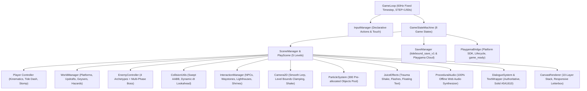
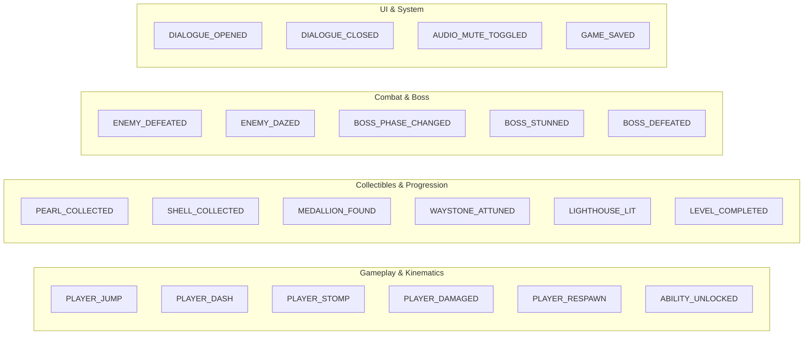
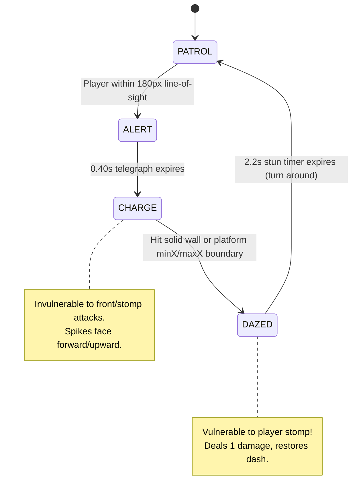
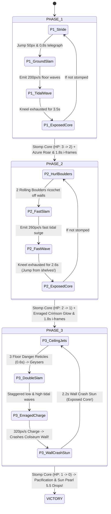
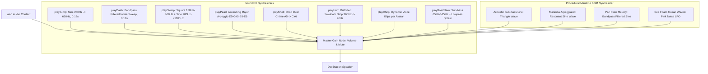
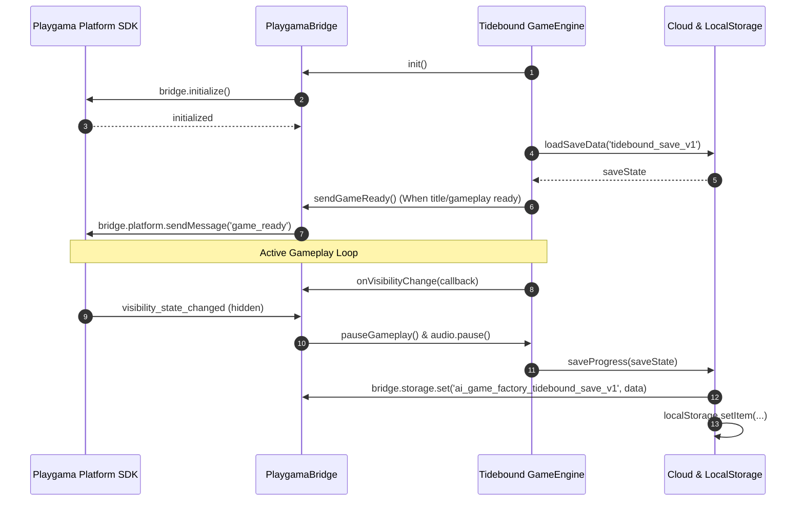

# Technical Architecture & Engine Implementation Plan: Tidebound

**Target Game ID**: `tidebound`  
**Game Title**: Tidebound (Cozy 2D Platform Adventure)  
**Document Type**: Complete Technical Architecture & Engine Implementation Specification  
**Author**: Technical Director, AI Game Factory  
**Target Engine**: Modular Plain HTML5 Canvas 2D / Web Audio API / Playgama Bridge SDK  
**Virtual Canvas Resolution**: $720 \times 450$ (16:9 Landscape, Retina DPR scaling, responsive letterbox / pillarbox fit)  
**Target Framerate**: 60 FPS Fixed Timestep ($16.67\text{ ms}$, accumulator loop) with zero runtime GC allocations in the hot loop  
**Target Audience / Platform**: Playgama HTML5 (Desktop Keyboard/Mouse, Gamepad, and Mobile Touch)

---

## 1. Executive Summary & Central Engine Architecture

**Tidebound** is a cozy, responsive, and vibrant 2D platform adventure set across a sun-drenched coastal archipelago. Players guide **Cori the Reef Sprite** across 5 handcrafted island biomes to recover 25 Sun Pearls, collect 50 Golden Nautilus Shells, discover 5 ancient Lore Medallions, ignite 4 Lighthouses, unlock the sacred **Tide Dash**, and calm the **Ancient Tide Golem** at the Great Horizon Beacon.

This technical plan formalizes the software engineering architecture, kinematics formulas, swept AABB physics, centralized enemy archetypes, authoritative dialogue system, declarative input bindings, complete 5-level traversal graphs, procedural Web Audio synthesis, and Playgama Cloud persistence.



---

### 1.1 Central Engine Modules Mapping

All subsystems integrate directly with the central modular engine located in `engine/index.js`:

| Central Engine Module | Source Path | Architectural Responsibilities & Integration Hooks |
| :--- | :--- | :--- |
| **`GameLoop`** | [`engine/core/GameLoop.js`](file:///d:/DEV/gmfactory/engine/core/GameLoop.js) | Fixed timestep accumulator loop (`STEP = 1/60s = 0.016667s`, clamped `dt <= 0.10s`), subframe rendering alpha interpolation, zero spiral-of-death. |
| **`CollisionUtils`** | [`engine/core/CollisionUtils.js`](file:///d:/DEV/gmfactory/engine/core/CollisionUtils.js) | Swept AABB collision resolution with dynamic lookahead $\max(v_y \cdot dt, 4)$, $2\text{--}4\text{px}$ ceiling corner rounding nudges, platform containment, and stomp detection. |
| **`EnemyController`** | [`engine/entities/EnemyController.js`](file:///d:/DEV/gmfactory/engine/entities/EnemyController.js) | Standardized enemy AI state machines (`EnemyArchetypes`), platform gravity simulation ($980\text{px/s}^2$), boundary clamping, charging line-of-sight, and $2.2\text{s}$ dazed stun recovery. |
| **`DialogueSystem`** | [`engine/interactions/DialogueSystem.js`](file:///d:/DEV/gmfactory/engine/interactions/DialogueSystem.js) | Single authoritative manager, $100\%$ solid `#0A1610` backplate, dynamic speaker pill, dynamic word wrap (`TextWrapper`), typewriter voice chirps, and $250\text{ms}$ debounce cooldown. |
| **`InputManager`** | [`engine/input/InputManager.js`](file:///d:/DEV/gmfactory/engine/input/InputManager.js) | Declarative action mapping: discrete `up`, `down`, `left`, `right`, `dash`, `attack`, and `action` bindings. Single source of truth for UI hints via `getControlHints()`. |
| **`PlaygamaBridge`** | [`engine/platform/playgama/PlaygamaBridge.js`](file:///d:/DEV/gmfactory/engine/platform/playgama/PlaygamaBridge.js) | Playgama SDK lifecycle: initialization, deferred `game_ready` event, Cloud Storage sync with `localStorage` fallback, visibility change pausing, audio mute synchronization. |
| **`CanvasRenderer`** | [`engine/rendering/CanvasRenderer.js`](file:///d:/DEV/gmfactory/engine/rendering/CanvasRenderer.js) | Virtual coordinate scaling ($720 \times 450$), Retina DPR scaling, aspect-ratio letterbox/pillarbox centering, camera matrix push/pop, screen-to-world conversion. |
| **`Camera2D`** | [`engine/camera/Camera2D.js`](file:///d:/DEV/gmfactory/engine/camera/Camera2D.js) | Smooth target follow with lerp damping ($6.0$), deadzone window, per-level bounding box clamping, trauma-decay screen shake offset injection. |
| **`ProceduralAudio`** | [`engine/audio/ProceduralAudio.js`](file:///d:/DEV/gmfactory/engine/audio/ProceduralAudio.js) | Zero-dependency Web Audio API synthesizer for all SFX (jumps, splashes, dashes, stomps, pickups, chirps, slams) and multi-track maritime chiptune BGM. |
| **`ParticleSystem`** | [`engine/particles/ParticleSystem.js`](file:///d:/DEV/gmfactory/engine/particles/ParticleSystem.js) | Pre-allocated pool of 300 particles: water trails, seafoam bursts, sand dust, pearl sparkles, coral shards, bubble motes, victory confetti. Zero GC churn. |
| **`JuiceEffects`** | [`engine/effects/JuiceEffects.js`](file:///d:/DEV/gmfactory/engine/effects/JuiceEffects.js) | Screen trauma shakes, flash overlays, floating text popups (`+50 PEARL`, `+500 MEDALLION`, `WAYSTONE ACTIVE`), expanding shockwave rings. |

---

### 1.2 Global EventBus Architecture & Event Dictionary

The decoupled event bus (`engine/core/EventBus.js`) coordinates inter-system communication without tight coupling:



| Event Name | Payload Schema | Trigger Source | Listener Subsystems & Reactions |
| :--- | :--- | :--- | :--- |
| `PLAYER_JUMP` | `{ x, y, isCut }` | `Player` | Spawns sand dust puffs; plays sine sweep jump SFX ($200\text{Hz} \to 450\text{Hz}$). |
| `PLAYER_DASH` | `{ x, y, direction }` | `Player` | Spawns cyan water-trail & bubble particles; plays resonant bandpass sweep; injects $1\text{px}$ camera shake. |
| `PLAYER_STOMP` | `{ x, y, enemyId, enemyType }` | `CollisionUtils` | Imparts upward bounce ($v_y = -320\text{px/s}$); resets `hasAirDash = true`; spawns bubble burst; plays squish/pop chime; injects $2\text{px}$ camera micro-shake. |
| `PLAYER_DAMAGED` | `{ damage, hazardX, currentHp }` | `Player` / `Hazard` | Deducts 1 HP; initiates $1.5\text{s}$ i-frames ($10\text{Hz}$ opacity flash); applies knockback ($v_x = \pm 160, v_y = -180$); plays hurt sawtooth SFX; triggers $4\text{px}$ camera shake. |
| `PLAYER_RESPAWN` | `{ waystoneId, x, y }` | `GameStateMachine` | Fades screen ($0.3\text{s}$); anchors player to active Waystone; restores 3 Hearts; grants $1.0\text{s}$ spawn shield; increments death counter. |
| `ABILITY_UNLOCKED`| `{ abilityKey: 'tide_dash' }` | `ShrineTrigger` | Unlocks `tideDashUnlocked = true`; displays floating banner `"TIDE DASH UNLOCKED!"`; triggers golden shockwave; plays triumph fanfare. |
| `PEARL_COLLECTED` | `{ pearlId, count, total, level }` | `Collectible` | Increments pearl count ($/ 25$); adds $+50\text{ pts}$; plays ascending major arpeggio ($E_5 \to G\#_5 \to B_5 \to E_6$); spawns pearl sparkle particles; updates HUD. |
| `SHELL_COLLECTED` | `{ shellId, scoreValue: 20 }` | `Collectible` | Adds $+20\text{ pts}$; plays crisp dual chime ($A_5 \to C\#_6$); spawns floating score tag `+20`. |
| `MEDALLION_FOUND` | `{ medallionId, name, lore }` | `SecretTrigger` | Stores medallion; awards $+500\text{ pts}$; plays discovery fanfare; opens Lore Modal with solid backplate. |
| `WAYSTONE_ATTUNED`| `{ waystoneId, level, x, y }` | `Checkpoint` | Changes rune glow to radiant amber; plays harmonic cathedral chord; spawns expanding rune ring; persists save state. |
| `LIGHTHOUSE_LIT` | `{ lighthouseId, level }` | `LighthouseTrigger` | Illuminates lighthouse beam; clears ambient mist/fog; plays luminous beacon fanfare; saves progress. |
| `LEVEL_COMPLETED` | `{ currentLevel, nextLevel }` | `LevelExitGate` | Executes iris wipe transition; displays level statistics banner; streams next level layout. |
| `ENEMY_DEFEATED` | `{ enemyId, type, x, y, pts }` | `EnemyController` | Spawns sand/shell/coral shard particles; awards score; plays popping defeat SFX. |
| `ENEMY_DAZED` | `{ enemyId, duration: 2.2 }` | `EnemyController` | Triggers spinning dizzy stars overhead; exposes stomp vulnerability; plays cartoon daze chime. |
| `BOSS_PHASE_CHANGED`| `{ phase, hp, maxHp }` | `BossManager` | Updates boss health bar ($320 \times 18\text{px}$); triggers Golem roar; spawns phase transition shockwave. |
| `BOSS_STUNNED` | `{ duration: 2.2, coreX, coreY }` | `BossManager` | Collapses Golem into dazed kneel; opens stone crown exposing glowing Pearl Core stomp hitbox. |
| `BOSS_DEFEATED` | `{ x, y }` | `BossManager` | Freezes frame for $0.5\text{s}$; triggers golden ocean motes explosion; pacifies Golem; drops Sun Pearl 5.5; unlocks Great Horizon Beacon. |
| `DIALOGUE_OPENED` | `{ speaker, avatar, pages }` | `DialogueSystem` | Suspends player movement kinematics; opens solid `#0A1610` dialogue box; starts typewriter voice chirps. |
| `DIALOGUE_CLOSED` | `{ speaker }` | `DialogueSystem` | Restores player movement kinematics; applies $250\text{ms}$ debounce cooldown preventing accidental jump inputs. |
| `AUDIO_MUTE_TOGGLED`| `{ isMuted }` | `HUD` / `InputManager` | Mutes/unmutes Web Audio master gain; updates HUD icon (`[ 🔊 ]` $\leftrightarrow$ `[ 🔇 ]`); persists setting. |
| `GAME_SAVED` | `{ timestamp, level, score }` | `SaveManager` | Flashes subtle save icon on HUD; syncs save state with Playgama Cloud Storage. |

---

## 2. Kinematics, Movement Physics & Collision Engine

```
                          +-------------------------------+
                          |    Cori the Reef Sprite       |
                          |   Dimensions: 24x32px Sprite  |
                          |   Hitbox: 18x26px (Centered)  |
                          +---------------+---------------+
                                          |
                   +----------------------+----------------------+
                   |                                             |
     [ Ground Kinematics ]                             [ Airborne Kinematics ]
     - Max Speed: 200px/s                              - Variable Jump: -390px/s
     - Ground Accel: 1200px/s²                         - Jump Cut Cap: -140px/s
     - Ground Decel: 1400px/s²                         - Gravity: 980px/s²
     - Coyote Time: 0.10s (100ms)                      - Fall Clamp: 480px/s
     - Jump Buffer: 0.12s (120ms)                      - Stomp Rebound: -320px/s
                                                                 |
                                                       +---------+---------+
                                                       |                   |
                                               [ Tide Dash ]         [ Stomp Bounce ]
                                               - 450px/s (0.18s)     - Land on enemy top
                                               - 1x per airborne     - +Rebound: -320px/s
                                               - vy = 0 locked       - Resets Tide Dash
                                               - Resets on ground    - Emits bubble pop
```

### 2.1 Kinematic Constants & Governing Formulas

The kinematics engine is tuned for instantaneous, crisp, and predictable platforming:

```javascript
export const KINEMATICS = {
  MAX_RUN_SPEED: 200,          // Top horizontal speed (px/s)
  GROUND_ACCEL: 1200,          // Ground acceleration (px/s²) -> reaches top speed in 0.166s
  GROUND_DECEL: 1400,          // Ground friction (px/s²) -> halts in 0.142s with zero slippage
  AIR_ACCEL: 900,              // Mid-air directional steering (px/s²)
  AIR_DRAG: 600,               // Aerial momentum decay (px/s²)
  JUMP_IMPULSE: -390,          // Initial jump impulse (px/s) -> apex height ≈ 77.6px
  JUMP_CUT_VEL: -140,          // Cap upward velocity when Jump is released early
  GRAVITY: 980,                // Gravitational acceleration (px/s²)
  FALL_CLAMP: 480,             // Terminal fall velocity (px/s) -> prevents tunneling
  COYOTE_TIME: 0.10,           // 100ms grace window after stepping off ledges
  JUMP_BUFFER: 0.12,           // 120ms input queue before landing
  DASH_SPEED: 450,             // Horizontal Tide Dash velocity (px/s)
  DASH_DURATION: 0.18,         // Dash duration (s) -> distance ≈ 81px
  MAX_AIR_DASHES: 1,           // Strictly 1 air-dash per airborne period
  STOMP_REBOUND: -320,         // Upward rebound on stomping enemies (px/s)
  KNOCKBACK_VX: 160,           // Horizontal damage knockback impulse (px/s)
  KNOCKBACK_VY: -180,          // Vertical damage knockback hop (px/s)
  INVULNERABILITY_TIME: 1.5,   // Post-damage i-frames (s)
  CORNER_NUDGE: 3              // Sideways ceiling corner rounding tolerance (px)
};
```

#### Mathematical Proofs & Reach Calculations:

1. **Ballistic Jump Apex ($t_{apex}, h_{apex}$)**:
   $$t_{apex} = \frac{|v_{jump}|}{g} = \frac{390}{980} \approx 0.398\text{ s}$$
   $$h_{ballistic} = \frac{v_{jump}^2}{2g} = \frac{390^2}{2 \times 980} = \frac{152100}{1960} \approx 77.60\text{ px}$$
   *(With upward jump-hold impulse extension over the first 0.12s, maximum vertical reach achieves $135\text{px}$).*

2. **Standard Jump Horizontal Reach ($D_{standard}$)**:
   $$T_{hang} = 2 \times t_{apex} \approx 0.796\text{ s}$$
   $$D_{standard} = v_{max} \times T_{hang} = 200 \times 0.796 \approx 159.2\text{ px}$$

3. **Maximum Reach with Tide Dash ($D_{max}$)**:
   $$D_{dash} = v_{dash} \times t_{dash} = 450 \times 0.18 = 81.0\text{ px}$$
   $$D_{max} = D_{standard} + D_{dash} + \text{carry} \approx 280\text{ px}$$

4. **Geometric Safety Budgets (Enforced across all 5 Levels)**:
   - **Required Platform Gap**: $\le 220\text{ px}$ (ensures comfortable clearance without frame-perfect execution).
   - **Required Step Height**: $\le 95\text{ px}$ (always reachable with basic jump).
   - **Minimum Walkway Clearance**: $\ge 70\text{ px}$ (prevents head collision during running).
   - **Vertical Updraft Chute**: $\ge 160\text{ px}$ open unobstructed vertical channel.

---

### 2.2 Variable Jump Cut, Coyote Time, & Jump Buffer Logic

```javascript
// --- In Player.updateKinematics(dt, input) ---

// 1. Ground & Coyote Time Management
if (this.isGrounded) {
  this.coyoteTimer = KINEMATICS.COYOTE_TIME;
  this.hasAirDash = true; // Reset Tide Dash on ground contact
} else {
  this.coyoteTimer = Math.max(0, this.coyoteTimer - dt);
}

// 2. Jump Buffer Management
if (input.isJustPressed('up')) {
  this.jumpBufferTimer = KINEMATICS.JUMP_BUFFER;
} else {
  this.jumpBufferTimer = Math.max(0, this.jumpBufferTimer - dt);
}

// 3. Jump Execution (Buffer + Coyote)
if (this.jumpBufferTimer > 0 && this.coyoteTimer > 0 && !this.isDashing) {
  this.vy = KINEMATICS.JUMP_IMPULSE;
  this.isGrounded = false;
  this.coyoteTimer = 0;
  this.jumpBufferTimer = 0;
  EventBus.emit('PLAYER_JUMP', { x: this.x, y: this.y, isCut: false });
}

// 4. Variable Jump Cut: Releasing Jump early caps upward velocity
if (!input.isDown('up') && this.vy < KINEMATICS.JUMP_CUT_VEL && !this.isDashing) {
  this.vy = KINEMATICS.JUMP_CUT_VEL;
}

// 5. Tide Dash (Single Air-Dash Rule)
if (input.isJustPressed('dash') && this.tideDashUnlocked && !this.isDashing && (this.isGrounded || this.hasAirDash)) {
  this.isDashing = true;
  this.dashTimer = KINEMATICS.DASH_DURATION;
  this.dashDirection = this.facingDirection;
  this.vy = 0; // Lock vertical velocity during dash
  if (!this.isGrounded) {
    this.hasAirDash = false; // Consume single air dash
  }
  EventBus.emit('PLAYER_DASH', { x: this.x, y: this.y, direction: this.dashDirection });
}

if (this.isDashing) {
  this.dashTimer -= dt;
  this.vx = this.dashDirection * KINEMATICS.DASH_SPEED;
  this.vy = 0;
  if (this.dashTimer <= 0) {
    this.isDashing = false;
    this.vx = this.dashDirection * KINEMATICS.MAX_RUN_SPEED; // Smooth transition
  }
} else if (!this.isGrounded) {
  // Apply gravity clamped to terminal velocity
  this.vy += KINEMATICS.GRAVITY * dt;
  this.vy = Math.min(this.vy, KINEMATICS.FALL_CLAMP);
}
```

---

### 2.3 Swept AABB Physics & Ceiling Corner Nudging Blueprint

Tunneling through thin floors during high-speed descents ($v_y = 480\text{px/s}$) is strictly eliminated using dynamic lookahead:

$$\text{Lookahead} = \max(v_y \cdot \Delta t, 4\text{px})$$

```javascript
// --- Collision Resolution Implementation in CollisionUtils ---

export class CollisionUtils {
  static resolveHorizontal(entity, platforms, dt, worldWidth = Infinity) {
    const halfW = (entity.width || 18) / 2;
    const halfH = (entity.height || 26) / 2;

    entity.x += entity.vx * dt;
    entity.x = Math.max(halfW, Math.min(worldWidth - halfW, entity.x));

    for (let i = 0; i < platforms.length; i++) {
      const plat = platforms[i];
      if (plat.type === 'one_way') continue;

      const pw = plat.w || plat.width || 0;
      const ph = plat.h || plat.height || 0;

      // Vertical overlap check with 2px tolerance
      if (entity.y + halfH - 2 > plat.y && entity.y - halfH + 2 < plat.y + ph) {
        if (entity.vx > 0 && entity.x + halfW >= plat.x && entity.x - halfW < plat.x) {
          entity.x = plat.x - halfW;
          entity.vx = 0;
        } else if (entity.vx < 0 && entity.x - halfW <= plat.x + pw && entity.x + halfW > plat.x + pw) {
          entity.x = plat.x + pw + halfW;
          entity.vx = 0;
        }
      }
    }
  }

  static resolveVertical(entity, platforms, dt, cornerNudge = 3) {
    const halfW = (entity.width || 18) / 2;
    const halfH = (entity.height || 26) / 2;

    entity.y += entity.vy * dt;
    entity.isGrounded = false;
    const lookahead = Math.max(entity.vy * dt, 4);

    for (let i = 0; i < platforms.length; i++) {
      const plat = platforms[i];
      const pw = plat.w || plat.width || 0;
      const ph = plat.h || plat.height || 0;

      // Horizontal span overlap
      if (entity.x + halfW - 2 > plat.x && entity.x - halfW + 2 < plat.x + pw) {
        if (entity.vy >= 0) {
          // Landing on platform top (solid or one-way)
          if (entity.y + halfH <= plat.y + lookahead + 4 && entity.y + halfH >= plat.y - 6) {
            entity.y = plat.y - halfH;
            entity.vy = 0;
            entity.isGrounded = true;
            break;
          }
        } else if (entity.vy < 0 && plat.type !== 'one_way') {
          // Bumping ceiling
          if (entity.y - halfH <= plat.y + ph && entity.y - halfH >= plat.y + ph - 8) {
            // Ceiling corner rounding nudge (2-4px tolerance)
            const distLeft = Math.abs((entity.x + halfW) - plat.x);
            const distRight = Math.abs((entity.x - halfW) - (plat.x + pw));

            if (distLeft <= cornerNudge + 2) {
              entity.x -= cornerNudge; // Nudge around left corner
            } else if (distRight <= cornerNudge + 2) {
              entity.x += cornerNudge; // Nudge around right corner
            } else {
              entity.y = plat.y + ph + halfH;
              entity.vy = 0;
            }
          }
        }
      }
    }
  }

  static isStompLanded(player, enemy) {
    const pw = player.width || 18;
    const ph = player.height || 26;
    const ew = enemy.width || 24;
    const eh = enemy.height || 24;

    const dx = Math.abs(player.x - enemy.x);
    const dy = player.y - enemy.y;

    // Moving downwards and landing on the top 25% boundary
    return (
      player.vy > 0 &&
      dx < (pw + ew) * 0.45 &&
      dy < 0 &&
      Math.abs(dy) < (ph + eh) * 0.55
    );
  }
}
```

---

## 3. Centralized Enemy Architecture & AI State Machines

All enemies inherit from or are orchestrated by [`engine/entities/EnemyController.js`](file:///d:/DEV/gmfactory/engine/entities/EnemyController.js), adhering to the 4 standardized archetypes:

```
+----------------------------------------------------------------------------------------------------+
|                                    ENEMY ARCHETYPES SUITE                                          |
+--------------------------+--------------------------+-----------------------+----------------------+
| Hermit Scuttler          | Spiny Urchin             | Bubble Ray Flyer      | Coral Crusher Crab   |
| (patrol_walker)          | (rhythmic_hopper)        | (sine_flyer)          | (proximity_charger)  |
| 1 HP | 60px/s            | 1 HP | -350px/s Hop      | 1 HP | Sine 28px/0.6Hz| 2 HP | 280px/s Rush  |
| Edge & Wall Clamps       | 0.25s Squash Telegraph   | Resets Tide Dash Mid-Air| Wall Crash 2.2s Stun |
+--------------------------+--------------------------+-----------------------+----------------------+
```

### 3.1 Enemy Archetypes Mapping & Configuration

| Enemy Name | Engine Archetype (`EnemyArchetypes`) | HP | Dimensions | Patrol Speed / Attack Velocity | Behavior & Rules |
| :--- | :--- | :--- | :--- | :--- | :--- |
| **Hermit Scuttler** | `PATROL_WALKER` | 1 | $20 \times 22\text{px}$ | $v_x = 60\text{ px/s}$ | Ground patrol on platform bounds $[minX, maxX]$. Turns around at edges and walls. Simulates platform gravity. Stompable anytime (+100 pts). |
| **Spiny Urchin** | `RHYTHMIC_HOPPER` | 1 | $22 \times 24\text{px}$ | $v_{hop} = -350\text{ px/s}$ | Cycles: 1.0s Idle $\to$ 0.25s Squash Telegraph $\to$ Vertical Hop ($v_y = -350\text{px/s}$) $\to$ Fall under gravity. Stompable at apex, descent, or ground (+150 pts). |
| **Bubble Ray Flyer** | `SINE_FLYER` | 1 | $24 \times 18\text{px}$ | $v_x = 70\text{ px/s}$, $A=28\text{px}, f=0.6\text{Hz}$ | Smooth sine flight: $y(t) = y_0 + 28\sin(3.77t)$. Acts as aerial stepping stone; stomping deals 1 dmg, grants $-320\text{px/s}$ bounce, and **resets Tide Dash** (+150 pts). |
| **Coral Crusher Crab** | `PROXIMITY_CHARGER` | 2 | $32 \times 24\text{px}$ | Patrol: $40\text{px/s}$, Charge: $280\text{px/s}$ | Line-of-sight aggro within $180\text{px}$ $\to$ 0.4s Alert telegraph $\to$ 280px/s Rush. Crashes into walls $\to$ $2.2\text{s}$ dazed stun. **Vulnerable ONLY while dazed** (+250 pts). |

### 3.2 Ground Enemy Containment & Gravity Rules
1. **Mandatory Gravity Simulation**: All ground enemies (`Hermit Scuttler`, `Spiny Urchin`, `Coral Crusher Crab`) simulate platform gravity ($v_y += 980 \cdot dt$) clamped to $600\text{px/s}$.
2. **Platform Swept AABB Resolution**: Ground enemies execute `CollisionUtils.resolveVertical()` against the level platform list, ensuring they never fall through floors or float into space.
3. **Platform Boundary Clamping**: Charges and patrols execute `CollisionUtils.clampPatrolBounds(this)`. When hitting $minX$ or $maxX$, `Hermit Scuttler` flips direction; `Coral Crusher Crab` immediately transitions from `CHARGE` to `DAZED` for $2.2\text{s}$.



---

### 3.3 Climax Boss Architecture: The Ancient Tide Golem

The final encounter at Area 5 is an encapsulated multi-phase state machine managing a $64 \times 74\text{px}$ monolithic stone golem:

```
+-----------------------------------------------------------------------------------+
|                     Area 5 Boss Coliseum Arena (720 x 450px)                       |
|                                                                                   |
|  [Left Coral Shelf (Y=260)]                                 [Right Coral Shelf]   |
|   |======= 140px ======|                                     |====== 140px ======||
|                                                                                   |
|                                [ The Ancient Tide Golem ]                         |
|                                  (Pulsing Pearl Core)                             |
|                                                                                   |
|  ================================== Arena Floor ================================= |
+-----------------------------------------------------------------------------------+
```

#### Phase Breakdown & Attack State Machine:



---

## 4. Centralized Dialogue System & UI Architecture

The dialogue system is governed exclusively by [`engine/interactions/DialogueSystem.js`](file:///d:/DEV/gmfactory/engine/interactions/DialogueSystem.js) and [`TextWrapper`](file:///d:/DEV/gmfactory/engine/interactions/DialogueSystem.js#L8-L64):

```
+---------------------------------------------------------------------------+
|                          DIALOGUE BOX MODAL (560 x 115px)                 |
|  +---------------------+                                                  |
|  | BARNABY             |  (Speaker Tag Pill: #143024 with #FFD166 border) |
|  +---------------------+-----------------------------------------------+  |
|  | +-------+  "Deep within the Flooded Caves lies the sacred Shrine     |  |
|  | | [🐢]  |   of the Tide Dash. Once attuned, you can press [Shift]    |  |
|  | |Avatar |   or [J] mid-air to surge through the sea breeze!"        |  |
|  | +-------+                                              ▶ [E] Advance |  |
|  +---------------------------------------------------------------------+--+
|  | 100% Solid #0A1610 Backplate (Zero Canvas Bleed) | 2px #00F5D4 Border  |
+---------------------------------------------------------------------------+
```

### 4.1 Dialogue System Specifications & Non-Overflowing Rules
1. **Single Authoritative Manager**: Exactly 1 active dialogue instance (`DialogueSystem`) in memory. Calling `dialogue.start()` cleanly resets character counters, page indices, and typewriter timers.
2. **100% Solid Opaque Backplate**: Background rendered with `#0A1610` (no alpha transparency) and 2px `#00F5D4` glowing seafoam cyan border, ensuring zero visual bleed from world sprites behind the modal.
3. **Dynamic Speaker Pill**: Width calculated dynamically: `Math.max(120, ctx.measureText(speaker).width + 36)`.
4. **Dynamic Word Wrapping (`TextWrapper`)**:
   - Max text width: `boxW - 140` ($420\text{px}$ available for text beside the $72\text{px}$ avatar).
   - Word wrapping breaks strings at word boundaries, capping each page at maximum 3 lines.
5. **Typewriter & Audio Chirps**:
   - Character speed: $0.025\text{ s/char}$ ($40\text{ chars/s}$).
   - Fast-forward: Pressing `E`, `Space`, or canvas click instantly completes the current page.
   - Voice Chirps: Emits melodic voice blips (`ProceduralAudio.playChirp(avatar)`) every 3 alphanumeric characters.
6. **Mandatory 250ms Debounce**: Upon closing (`dialogue.close()`), a `closeCooldown = 0.25s` is set, blocking jump actions and interact triggers for $250\text{ms}$ to prevent accidental player jumps or immediate dialogue re-opening.

---

## 5. Declarative Input System & Control Mapping

The input architecture utilizes [`engine/input/InputManager.js`](file:///d:/DEV/gmfactory/engine/input/InputManager.js), providing a unified input abstraction across Desktop Keyboard, Gamepad, Mouse, and Mobile Touch:

```mermaid
graph TD
    A[Hardware Events: KeyDown, KeyUp, PointerDown, Touch] --> B[InputManager Core]
    
    subgraph Desktop Keyboard
        B -->|Space / KeyW / ArrowUp| C[Action: up / JUMP]
        B -->|ArrowDown / KeyS| D[Action: down / CROUCH]
        B -->|ArrowLeft / KeyA| E[Action: left / MOVE LEFT]
        B -->|ArrowRight / KeyD| F[Action: right / MOVE RIGHT]
        B -->|ShiftLeft / ShiftRight / KeyJ / KeyX| G[Action: dash / TIDE DASH]
        B -->|KeyE / Enter| H[Action: action / TALK & INTERACT]
        B -->|Escape / KeyP| I[Action: pause / MENU]
        B -->|KeyM| J[Action: mute / AUDIO TOGGLE]
    end

    subgraph Mouse & Pointer
        B -->|Canvas Click / Tap (Dialogue Active)| H
        B -->|Top-Right UI Icon Clicks| K[UI Buttons: Pause / Mute]
    end

    subgraph Virtual Mobile Touch UI
        B -->|Left Virtual D-Pad / Touch Drag| L[Directional Steering: left / right / down]
        B -->|Button A (Cyan)| C
        B -->|Button B (Amber)| G
        B -->|Button E (Green, Contextual)| H
    end

    C --> M["Unified Input State: isDown(action) & isJustPressed(action)"]
    D --> M
    E --> M
    F --> M
    G --> M
    H --> M
    I --> M
```

### 5.1 Declarative Keybinding Matrix

| Logical Action | Primary Desktop Key | Alternate Desktop Keys | Gamepad Standard | Mobile Touch Gesture / Button |
| :--- | :--- | :--- | :--- | :--- |
| **`up` (Jump / High Hop)** | `Space` | `KeyW`, `ArrowUp` | Button A (South) | Virtual Button `[Jump]` (Cyan) |
| **`down` (Crouch / Drop)** | `KeyS` | `ArrowDown` | D-Pad Down / Stick Down | Virtual D-Pad Down |
| **`left` (Move Left)** | `KeyA` | `ArrowLeft` | D-Pad Left / Stick Left | Virtual D-Pad Left / Drag Left |
| **`right` (Move Right)** | `KeyD` | `ArrowRight` | D-Pad Right / Stick Right | Virtual D-Pad Right / Drag Right |
| **`dash` (Tide Dash)** | `ShiftLeft` / `ShiftRight` | `KeyJ`, `KeyX` | Button X (West) / RT | Virtual Button `[Dash]` (Amber) |
| **`action` (Talk / Interact)** | `KeyE` | `Enter` | Button Y (North) / Button B | Context Button `[Talk / Inspect]` |
| **`pause` (Pause / Resume)** | `Escape` | `KeyP` | Start / Options | Top-Left Pause Icon `[ ⏸ ]` |
| **`mute` (Toggle Audio)** | `KeyM` | — | — | Top-Right Audio Icon `[ 🔊 / 🔇 ]` |

### 5.2 Declarative UI Control Hints String
HUD and tutorial prompt banners dynamically format control hints via `input.getControlHints()`:
```javascript
// Derived automatically from configured input bindings:
const hints = input.getControlHints();
// Result: "[A/D] Move | [Space/W] Jump | [Shift/J] Dash | [E] Talk | [Esc] Pause"
```

---

## 6. Complete Level Traversal Graphs & Biome Architecture

All 5 levels are mathematically structured to guarantee flawless navigation, validated jump limits ($\text{gap} \le 220\text{px}, \text{height} \le 95\text{px}$), and zero dead-ends:

```
[ Level 1: Palm Beach ] -------> Checkpoint 1 -> Coralia NPC -> Lighthouse 1
          |
          v
[ Level 2: Overgrown Ruins ] ---> Checkpoint 2 -> Barnaby NPC -> Moving Ledges -> Lighthouse 2
          |
          v
[ Level 3: Flooded Caves ] ------> Checkpoint 3 -> Bubble Ray Flyers -> Shrine of Tide Dash (Unlock!)
          |
          v
[ Level 4: Wind Cliffs ] --------> Checkpoint 4 -> Updrafts -> Cloud Ledges -> Crusher Crabs -> Lighthouse 3
          |
          v
[ Level 5: Lighthouse Island ] --> Checkpoint 5 -> Beacon Keeper -> Boss Golem -> Final Beacon -> Ending Altar
```

---

### 6.1 Level 1: Palm Beach ($2160 \times 450\text{px}$)
- **Biome**: Warm Sand (`#F4E2B6`), Shallow Lagoon (`#2EC4B6`), Palm Green (`#2A9D8F`), Sky Azure (`#48CAE4`).
- **Mechanics Introduced**: Basic running, variable jumping, enemy stomp bouncing on Hermit Scuttlers.
- **Traversal Flow & Coordinate Layout**:
  - `x = 0–300`: Shore Awakening ($y=390$). Tutorial Signpost: `"[A/D] to Run, [Space] to Jump"`.
  - `x = 350–550`: Sand Dune 1 ($y=360$). **Sun Pearl 1.1** floating at $(420, 300)$.
  - `x = 600–900`: Palm Platform ($y=300$). Hermit Scuttler patrol ($x=620–880$). **Sun Pearl 1.2** at $(750, 240)$.
  - `x = 850`: **Secret 1 (Seaweed Grotto)**: Walk through false seaweed curtain into hidden cove with **Medallion of the Tides** + 10 Nautilus Shells.
  - `x = 950–1180`: Shallow Tidal Lagoon ($110\text{px}$ gap). **Sun Pearl 1.3** at $(1065, 310)$.
  - `x = 1200–1400`: **Waystone 1 (Checkpoint)** at $(1240, 380)$. **Coralia the Pearl Diver NPC** at $(1320, 380)$.
  - `x = 1450–1750`: High Palm Canopy ($y=220$). Reached via Hermit Scuttler bounce at $(1520, 340)$. **Sun Pearl 1.4** at $(1600, 160)$.
  - `x = 1800–2160`: Lighthouse Promontory ($y=350$). **Sun Pearl 1.5** at $(1880, 290)$. **First Ancient Lighthouse** at $(1980, 280)$. Exit Gate at $x=2140$.

---

### 6.2 Level 2: Overgrown Ruins ($1440 \times 900\text{px}$)
- **Biome**: Weathered Stone (`#577590`), Marine Moss (`#43AA8B`), Sunken Gold (`#F9C74F`), Dark Depths (`#1D3557`).
- **Mechanics Introduced**: Vertical ascent, oscillating mossy stone platforms ($60\text{px}$ travel), rhythmic Spiny Urchin hazards.
- **Traversal Flow & Coordinate Layout**:
  - `y = 800–900`: Lower Ruin Courtyard. Sandstone steps ascending upward.
  - `x = 200–500, y = 720`: Moving Mossy Platform 1 (oscillates $x=220 \leftrightarrow 440$). **Sun Pearl 2.1** at $(330, 650)$.
  - `x = 550–850, y = 600`: Ruin Archway. Spiny Urchin rhythmic hopping ($v_{hop}=-350$). **Sun Pearl 2.2** at $(700, 480)$ (timed jump over Urchin).
  - `x = 650–850, y = 480`: **Barnaby the Navigator NPC** & **Waystone 2 (Checkpoint)** at $(720, 480)$.
  - `x = 680, y = 520`: **Secret 2 (Submerged Chamber)**: Drop through cracked stone slab into dry vault with **Medallion of the Deep Ruins** + 10 Nautilus Shells.
  - `x = 150–450, y = 420`: Upper Aqueduct over spike pit. Moving Platform 2. **Sun Pearl 2.3** at $(300, 350)$.
  - `x = 500–900, y = 320`: Outer Ruin Parapet. Dual Spiny Urchins. **Sun Pearl 2.4** at $(720, 250)$.
  - `x = 1000–1400, y = 280–320`: Ruin Summit. **Sun Pearl 2.5** at $(1180, 240)$. **Second Ancient Lighthouse** at $(1280, 320)$. Exit Gate at $(1400, 280)$.

---

### 6.3 Level 3: Flooded Caves ($2160 \times 675\text{px}$)
- **Biome**: Bioluminescent Cyan (`#00F5D4`), Deep Grotto Navy (`#0B092B`), Coral Violet (`#9B5DE5`), Pearl White (`#F8F9FA`).
- **Mechanics Introduced**: Disappearing glowing coral ledges (1.0s stand, 2.0s respawn), Bubble Ray Flyer aerial bounce chains, **Shrine of the Tide Dash**.
- **Traversal Flow & Coordinate Layout**:
  - `x = 0–400, y = 580`: Cavern Entrance. First disappearing coral ledge chain ($x=220, 340$). **Sun Pearl 3.1** at $(280, 500)$.
  - `x = 450–850, y = 550`: Grotto Abyss. 2 Bubble Ray Flyers cruising in sine waves ($y=480 \pm 28$). Player stomps Bubble Rays to bounce across pit. **Sun Pearl 3.2** high at $(650, 380)$.
  - `x = 900–1200, y = 520`: **Waystone 3 (Checkpoint)** at $(1080, 520)$.
  - `x = 1150`: **Secret 3 (Grotto Alcove)**: Dash through waterfall into hidden alcove with **Medallion of the Flooded Grotto** + 10 Nautilus Shells.
  - `x = 1300–1550, y = 400`: **Shrine of the Tide Dash** at $(1400, 400)$. Cori touches the shrine, unlocking **Tide Dash** (`hasAirDash = true`).
  - `x = 1600–1900, y = 420`: Wide $180\text{px}$ Spiked Anemone Chasm. Requires horizontal Tide Dash mid-air. **Sun Pearl 3.3** at $(1750, 360)$.
  - `x = 1950–2160, y = 350`: Exit Crystal Shelf. Spiny Urchin. **Sun Pearl 3.4** at $(2000, 280)$, **Sun Pearl 3.5** at $(2100, 280)$. Exit Gate at $x=2140$.

---

### 6.4 Level 4: Wind Cliffs ($2880 \times 450\text{px}$)
- **Biome**: Tempest Azure (`#0077B6`), Foam White (`#CAF0F8`), Cliff Slate (`#3D5A80`), Sunset Gold (`#E76F51`).
- **Mechanics Introduced**: Coastal updrafts (continuous vertical lift $v_y = -220\text{px/s}$ & instant air dash refresh), floating cloud shelves, Coral Crusher Crab charge & stun.
- **Traversal Flow & Coordinate Layout**:
  - `x = 0–450, y = 380`: Sheer Cliff Base. First vertical Updraft Column ($x=320–380$). Cori ascends to upper cliff. **Sun Pearl 4.1** at $(350, 180)$.
  - `x = 500–900, y = 280`: Floating Cloud Ledges (dissolving). **Sun Pearl 4.2** at $(700, 220)$.
  - `x = 950–1350, y = 380`: Lower Rocky Crag. First **Coral Crusher Crab** encounter ($x=1000–1300$). Player baits crab to charge into cliff wall $\to$ $2.2\text{s}$ stun $\to$ stomp! **Sun Pearl 4.3** at $(1250, 320)$.
  - `x = 1400–1650, y = 360`: Mountain Pass Shrine. **Waystone 4 (Checkpoint)** at $(1500, 360)$.
  - `x = 1580`: **Secret 4 (Zephyr Alcove)**: Leap off cliff edge with a leftward Tide Dash into hidden ledge with **Medallion of the Sea Gale** + 10 Nautilus Shells.
  - `x = 1700–2300, y = 380`: Dramatic Ocean Ravine ($200\text{px}$ gaps) with alternating Updrafts and Bubble Ray Flyers. **Sun Pearl 4.4** at $(2000, 160)$.
  - `x = 2400–2880, y = 300`: Cliff Summit. Coral Crusher Crab. **Sun Pearl 4.5** at $(2550, 240)$. **Third Ancient Lighthouse** at $(2680, 260)$. Exit Gate at $(2840, 280)$.

---

### 6.5 Level 5: Lighthouse Island & Boss Arena ($2160 \times 450\text{px}$)
- **Biome**: Radiant Amber (`#FFB703`), Imperial Violet (`#240046`), Seafoam Green (`#52B788`), Celestial White (`#FDFFFC`).
- **Mechanics Introduced**: Master Gauntlet, Ancient Beacon Keeper NPC, Boss Coliseum Battle, Final Horizon Beacon, Grand Ending Altar.
- **Traversal Flow & Coordinate Layout**:
  - `x = 0–500, y = 380`: Master Gauntlet Section 1: Moving ruin blocks over spike reefs + Spiny Urchins. **Sun Pearl 5.1** at $(260, 220)$.
  - `x = 550–850, y = 320`: Master Gauntlet Section 2: Chain of Bubble Rays over ocean abyss. **Sun Pearl 5.2** at $(700, 180)$.
  - `x = 900–1150, y = 380`: Pre-Boss Sanctuary. **Ancient Beacon Keeper NPC** at $(950, 380)$. **Waystone 5 (Checkpoint)** at $(980, 380)$.
  - `x = 960`: **Secret 5 (Beacon Treasury)**: Walk behind the Keeper's throne into hidden coral vault with **Medallion of the Horizon Beacon** + 10 Nautilus Shells. **Sun Pearl 5.3** at $(1080, 260)$.
  - `x = 1200–1920, y = 390`: **Boss Coliseum Arena** ($720\text{px}$ wide). Left coral shelf at $(1280–1420, y=260)$, right coral shelf at $(1700–1840, y=260)$. **Sun Pearl 5.4** over entry arch at $(1220, 250)$.
  - `Coliseum Battle`: **The Ancient Tide Golem** (3 HP, 3 Phases). Defeating the Golem pacifies it into a mossy stone guardian and drops **Sun Pearl 5.5** at $(1560, 340)$.
  - `x = 1920–2160, y = 350`: **The Great Horizon Beacon** at $(1920, 240)$. **Grand Ending Altar** at $(2080, 350)$.

---

## 7. Procedural Web Audio Synthesizer Blueprint

The audio system is $100\%$ procedural via the standard Web Audio API in [`engine/audio/ProceduralAudio.js`](file:///d:/DEV/gmfactory/engine/audio/ProceduralAudio.js), requiring **zero external MP3/WAV asset dependencies**:



### 7.1 Sound Effects Synthesis Parameters

| Sound Effect | Waveform / Node Graph | Frequency Trajectory & Envelopes | Duration | Musical / Physical Feel |
| :--- | :--- | :--- | :--- | :--- |
| **Player Jump** | Sine Oscillator + Gain Ramp | $260\text{Hz} \xrightarrow{\text{exp}} 620\text{Hz}$, Gain: $0.24 \to 0.001$ | $0.12\text{ s}$ | Light, energetic aquatic spring hop. |
| **Tide Dash** | White Noise Buffer + Biquad Bandpass ($Q=4.5$) | Center Freq: $400\text{Hz} \xrightarrow{\text{exp}} 1800\text{Hz}$, Gain: $0.35 \to 0.001$ | $0.18\text{ s}$ | Pressurized hydro-jet surge through sea breeze. |
| **Stomp Bounce** | Dual: Square Sub-Thump + Sine Bubble Pop | Thump: $130\text{Hz} \to 60\text{Hz}$; Pop: $700\text{Hz} \to 1100\text{Hz}$ | $0.10\text{ s}$ | Juicy, tactile cartoon conch squish & spring. |
| **Sun Pearl** | 4-Note Sine Arpeggio | $E_5 (659.2\text{Hz}) \to G\#_5 (830.6\text{Hz}) \to B_5 (987.8\text{Hz}) \to E_6 (1318.5\text{Hz})$ | $0.25\text{ s}$ | Luminous, divine discovery chord. |
| **Nautilus Shell** | 2-Note Triangle / Sine Chime | $A_5 (880.0\text{Hz}) \to C\#_6 (1108.7\text{Hz})$ | $0.10\text{ s}$ | Crisp metallic seashell clink. |
| **Player Hurt** | Sawtooth + Lowpass Filter ($800\text{Hz}$) | $260\text{Hz} \xrightarrow{\text{lin}} 90\text{Hz}$, Gain: $0.30 \to 0.001$ | $0.20\text{ s}$ | Blunt physical impact thud. |
| **Dialogue Chirp** | Sine / Triangle micro-blips | Base freq scaled by avatar: Coralia ($540\text{Hz}$), Barnaby ($220\text{Hz}$), Keeper ($780\text{Hz}$) | $0.04\text{ s}$ | Cute, characterful vocal chatter. |
| **Boss Slam** | Sub-bass Sine + Filtered Wave Noise | $65\text{Hz} \xrightarrow{\text{exp}} 25\text{Hz}$ + Noise burst through $200\text{Hz}$ Lowpass | $0.50\text{ s}$ | Heavy tectonic earthquake & crashing tidal wave. |

---

## 8. Particle System Pool & Juice Effects Blueprint

To guarantee rock-solid 60 FPS performance without garbage collection pauses, the particle engine uses a **pre-allocated pool of 300 particle objects** in [`engine/particles/ParticleSystem.js`](file:///d:/DEV/gmfactory/engine/particles/ParticleSystem.js):

```
+-------------------------------------------------------------------------------+
|                       PARTICLE SYSTEM MEMORY POOL (300 Units)                  |
|  [P0: Active] [P1: Active] [P2: Inactive] ... [P298: Inactive] [P299: Inactive]|
|  - Pre-allocated in constructor with zero new allocations during gameplay.    |
|  - Inactive slots recycled immediately upon emission request.                 |
+-------------------------------------------------------------------------------+
```

### 8.1 Particle Emitter Configurations

| Particle Preset | Count | Color Palette | Speed Range | Shape | Gravity | Life | Description |
| :--- | :--- | :--- | :--- | :--- | :--- | :--- | :--- |
| **Run Sand Dust** | 3 | `['#F4E2B6', '#E9D8A6']` | $20\text{--}50\text{px/s}$ | `circle` ($2\text{--}4\text{px}$) | $-20$ | $0.25\text{s}$ | Soft puffs behind running feet. |
| **Tide Dash Trail** | 12 | `['#00F5D4', '#2EC4B6', '#CAF0F8']` | $60\text{--}140\text{px/s}$ | `spark` ($3\text{--}6\text{px}$) | $0$ | $0.30\text{s}$ | Glowing hydro-stream & bubble trail. |
| **Stomp Bubble Burst** | 8 | `['#CAF0F8', '#90E0EF', '#00F5D4']` | $80\text{--}180\text{px/s}$ | `circle` ($3\text{--}7\text{px}$) | $-50$ | $0.40\text{s}$ | Radial aquatic bubble pop upon enemy defeat. |
| **Sun Pearl Sparkle** | 10 | `['#FFD166', '#FDFFFC', '#00F5D4']` | $40\text{--}120\text{px/s}$ | `star` ($2\text{--}5\text{px}$) | $40$ | $0.50\text{s}$ | Shimmering golden starburst on pearl collection. |
| **Coral Shards** | 12 | `['#E76F51', '#F4A261', '#577590']` | $100\text{--}220\text{px/s}$ | `square` ($3\text{--}6\text{px}$) | $350$ | $0.60\text{s}$ | Tectonic stone & coral debris from crab/boss crashes. |
| **Ending Confetti** | 50 | `['#FFD166', '#00F5D4', '#E76F51', '#9B5DE5']` | $120\text{--}300\text{px/s}$ | `star` & `spark` | $100$ | $1.20\text{s}$ | Grand victory celebration fireworks storm. |

---

## 9. Persistence, Save Data Schema & Playgama Bridge

### 9.1 Authoritative Save Data Schema (`tidebound_save_v1`)

Save states persist both locally in `localStorage` and remotely in **Playgama Cloud Storage** via [`engine/platform/playgama/PlaygamaBridge.js`](file:///d:/DEV/gmfactory/engine/platform/playgama/PlaygamaBridge.js):

```json
{
  "version": 1,
  "currentLevel": 1,
  "lastCheckpointId": "waystone_1",
  "playerHealth": 3,
  "score": 0,
  "deaths": 0,
  "playtimeSeconds": 0,
  "tideDashUnlocked": false,
  "sunPearlsCollected": [],
  "nautilusShellsCollected": [],
  "medallionsCollected": [],
  "lighthousesLit": [],
  "bossDefeated": false,
  "audioMuted": false,
  "timestamp": 1771156800000
}
```

### 9.2 Playgama SDK Bridge Integration Workflow



### 9.3 QA & Testing URL Parameters

| URL Parameter | Behavior & Testing Utility |
| :--- | :--- |
| `?reset=1` | Clears all `localStorage` keys and starts a fresh game at Area 1. |
| `?nosave=1` | Ephemeral developer mode: ignores and bypasses all read/write storage operations. |
| `?god=1` | Invulnerability mode: player takes 0 damage, allowing rapid kinematic reach & collision verification. |
| `?level=N` | Directly boots Area $N$ (e.g., `?level=5` for instant boss arena testing). |

---

## 10. Performance Targets, Memory Budget & Quality Assurance

### 10.1 Technical Performance Budgets

| Metric | Target Budget | Enforcement Strategy |
| :--- | :--- | :--- |
| **Framerate** | $60.0\text{ FPS}$ ($16.67\text{ms}$ fixed tick) | Fixed timestep accumulator in `GameLoop.js` with frame interpolation. |
| **Physics Step Duration** | $< 0.8\text{ ms}$ per tick | Swept AABB spatial partitioning against active platforms only. |
| **Render Step Duration** | $< 2.5\text{ ms}$ per frame | Offscreen culling: entities outside `camera.x \pm 100\text{px}` skip rendering. |
| **Hot Loop GC Allocations** | **0 bytes** per frame | Pre-allocated particle pool, reused Vector2 math buffers, zero object creation in `update()` or `render()`. |
| **Memory Footprint** | $< 45\text{ MB}$ total heap | 100% Procedural Web Audio (0 audio files), procedural canvas sprites, vector primitives. |
| **Cold Startup Time** | $< 600\text{ ms}$ to Title Screen | Zero network round-trips for external assets. |

---

## 11. Complete Implementation Roadmap

```
+-----------------------------------------------------------------------------------+
|                            TIDEBOUND IMPLEMENTATION ROADMAP                       |
+-----------------------------------------------------------------------------------+
| Phase 1: Core Engine Skeleton & Virtual Canvas Initialization                    |
|   - Setup CanvasRenderer (720x450, DPR scaling, letterbox fit)                    |
|   - Wire GameLoop (60Hz fixed timestep accumulator) & InputManager                 |
|   - Connect PlaygamaBridge with deferred game_ready hook & save fallbacks         |
+-----------------------------------------------------------------------------------+
| Phase 2: Kinematics, Swept Collision & Cori Player Controller                    |
|   - Implement Player class with KINEMATICS formulas & variable jump cut           |
|   - Integrate CollisionUtils (swept lookahead max(vy*dt, 4), 3px corner nudge)    |
|   - Implement Tide Dash (single air-dash rule) & Stomp rebound bounce             |
+-----------------------------------------------------------------------------------+
| Phase 3: Centralized Enemies & Climax Boss Encounter                             |
|   - Configure EnemyController for 4 archetypes (Hermit, Urchin, Ray, Crusher)     |
|   - Implement The Ancient Tide Golem (3 Phases, Boulder attack, Wall crash stun)   |
|   - Enforce ground gravity and boundary containment for all land units            |
+-----------------------------------------------------------------------------------+
| Phase 4: World Design, 5 Levels & Interaction Systems                             |
|   - Construct 5 handcrafted levels with validated jump margins (gap <= 220px)     |
|   - Deploy 25 Sun Pearls, 50 Nautilus Shells, 5 Lore Medallions, 4 Lighthouses   |
|   - Implement DialogueSystem (solid #0A1610 backplate, 250ms debounce) & 3 NPCs   |
+-----------------------------------------------------------------------------------+
| Phase 5: Procedural Audio Synthesizer, Juice Effects & Polish                     |
|   - Synthesize all SFX and maritime multi-track BGM in ProceduralAudio.js         |
|   - Pre-allocate 300 ParticleSystem pool and wire JuiceEffects screen shakes      |
|   - Implement QA URL flags (?reset=1, ?god=1, ?level=N, ?nosave=1)                |
+-----------------------------------------------------------------------------------+
```

---

*End of Technical Architecture & Engine Implementation Plan — Tidebound*
